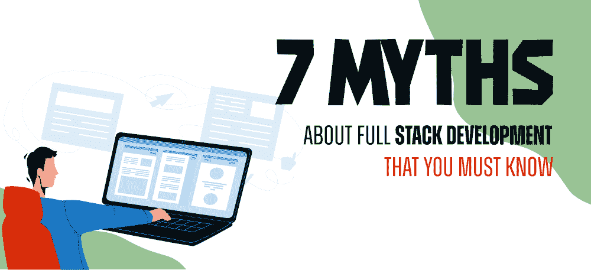

# 7 个你必须知道的关于全栈开发的神话

> 原文:[https://www . geesforgeks . org/7-神话-关于-全栈-开发-你必须知道/](https://www.geeksforgeeks.org/7-myths-about-full-stack-development-that-you-must-know/)

已经没有足够的开发人员具备全栈开发的技能了。全栈不是一个放之四海而皆准的解决方案。全栈开发人员是同时处理前端和后端代码的人。无头 web 应用程序是一个没有用户界面的软件。这些术语经常被当作时髦词来使用，但是当你谈论这个行业的时候，记住它们是很有用的。每项技术都有自己的一套神话，其中一些比另一些更具破坏性。例如，全栈开发复杂且困难的神话不仅是不正确的，而且也是危险的。没有你想象的那么难。它与任何其他编码角色一样——你只需要学习许多不同的技能就能正确地完成它。

很多人认为他们想自己学习所有这些，但对初学者来说通常太多了。最好的学习方法是和一个知道自己在做什么的专家一起工作。以下是我们听到的关于全栈开发的一些最常见的神话:

### 1.你应该从前端技能开始

前端技能需求很高的事实并不意味着你应该把它们作为你的起点。随着经验的积累，您应该专注于您缺乏知识和专业技能的领域，例如后端或数据管理。

### 2.全栈开发人员只需要技术知识

认为全栈开发人员只需要技术知识是错误的。还有其他需要考虑的事情，比如项目管理。全栈开发人员应该对营销、销售和运营等业务方面有所了解。全栈开发人员应该能够为他/她正在开发的产品编写文档。此外，全栈开发人员应该有处理从需求收集到部署的所有开发阶段的经验。他们还应该熟悉每个阶段使用的不同技术和工艺。

### 3.全栈开发人员应该能够用任何语言编写代码

最流行的一种说法是，全栈开发人员应该能够用他们想要或需要的任何语言编写代码。在某些情况下，这可能是真的，但并非所有语言都是如此。许多程序员不知道如何用每种语言编写代码，所以他们选择他们认为最容易或最熟悉的语言。你应该一直学习。即使你已经做了五年的开发人员，总会有新的东西需要学习。你对编程了解得越多，你就有越多的工具可以为你的客户开发出优秀的产品。你无法超越自己，这意味着利用你所拥有的一切来制造最好的产品。

### 4.一个全栈开发人员应该是一个专业的程序员

全栈开发人员是团队中非常重要的一员。但他们不一定是专业的程序员，甚至不是程序员。全栈开发人员可以负责对前端(网页和用户界面)、后端(数据库和服务器端)甚至营销、设计和支持进行编码。他们应该能够做的最重要的事情是编写好代码。诚然，许多编程语言正在被抽象成所谓的“服务器端”或“前端”语言，这些语言不需要用户了解任何编程知识——但知道如何编写好代码仍然有很大的价值。

### 5.所有全栈开发人员都是一样的

全栈开发人员是最令人垂涎的开发人员。在某些方面，他们也是最被误解的。有一种感觉，所有全栈开发人员都做同样的事情，拥有同样的技能。现实情况是，根据技术方法和项目要求，有许多不同的方法来构建全栈应用程序。这并不是说一种方法比另一种好；只是每个选择都有自己的利弊。

### 6.只有学习 JavaScript 才能让你成为全栈开发者

前端开发人员可能会将 JavaScript 用作他们的主要编程语言或辅助语言，但这并不是他们唯一使用的语言。他们还使用 Python、PHP 等语言与后端系统进行交互。全栈开发人员可以用多种语言编写代码，甚至完全用不同的语言开发应用程序。

### 7.编码就是一切

写代码的能力是不够的。初级开发人员可能能够编写一些非常基本的代码，但是如果他们没有能力通过设计文档与客户沟通，他们将无法交付产品。如果没有前端或后端的文档，您如何知道自己在构建什么？

关于全栈开发的其他几个流行的神话是:全栈开发人员应该是所有方面的专家，全栈开发人员更聪明，全栈开发人员应该了解应用程序的所有部分，等等。关于全栈开发的神话层出不穷；没有尽头。所以，从基础做起，永不停止学习！