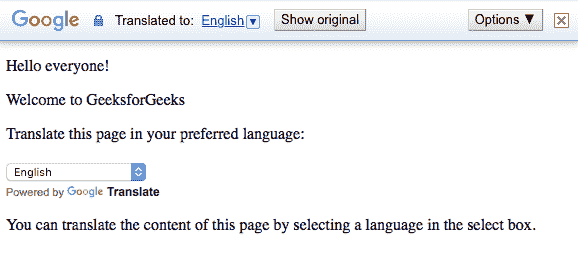
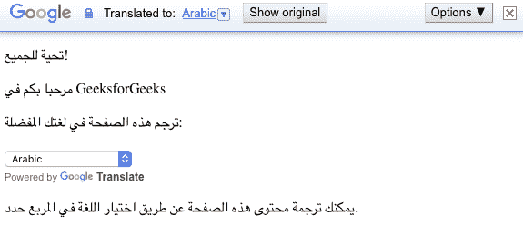

# 如何在网页上添加谷歌翻译按钮？

> 原文:[https://www . geesforgeks . org/add-Google-translate-button-网页/](https://www.geeksforgeeks.org/add-google-translate-button-webpage/)

谷歌翻译是一项由谷歌开发的免费多语言机器翻译服务，用于将文本从一种语言翻译成另一种语言。它提供了一个网站界面、安卓和 iOS 的移动应用程序，以及一个帮助开发人员构建浏览器扩展和软件应用程序的应用编程接口。谷歌翻译支持 100 多种不同级别的语言。

按照以下步骤在您的网站上添加谷歌翻译按钮:

**第一步:从一个基本的网页开始，添加一个“div”元素。**
在下面的代码中，创建了一个 id 为“google_translate_element”的“div”元素。


**第二步:添加谷歌翻译 api 引用。**


**第三步:添加 Javascript 函数..**


**示例:**

```
<!DOCTYPE html> 
<html lang="en-US"> 

<head>
    <title>
        How To Add Google Translate
        Button On Your Webpage ?
    </title>
</head>

<body> 
    <p>Hello everyone!</p> 
    <p>Welcome to GeeksforGeeks</p> 

    <p>
        Translate this page in
        your preferred language:
    </p> 

    <div id="google_translate_element"></div> 

    <script type="text/javascript"> 
        function googleTranslateElementInit() { 
            new google.translate.TranslateElement(
                {pageLanguage: 'en'}, 
                'google_translate_element'
            ); 
        } 
    </script> 

    <script type="text/javascript" src=
"https://translate.google.com/translate_a/element.js?
        cb=googleTranslateElementInit">
    </script> 

    <p>
        You can translate the content of this
        page by selecting a language in the
        select box.
    </p> 
</body> 

</html> 
```

**输出:**

**翻译成阿拉伯语后输出:**
