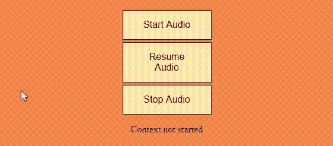

# 网络应用程序接口

中的音频上下文关闭()

> 原文:[https://www . geesforgeks . org/audio-context-close-in-web-API/](https://www.geeksforgeeks.org/audio-context-close-in-web-apis/)

网络音频应用程序接口有助于使网站应用程序的音频听起来正确。声音使网站更加有趣和吸引人。使用音频应用程序接口，可以构建许多音乐或声音应用程序。在本文中，我们将了解 **audiocontext.close()** 以及一些关于 Audio APIs 的基本信息。

音频上下文是一个对象，用于对网站或应用程序的音频进行各种操作。这是一个预建的功能，可以在谷歌和火狐等各种浏览器上使用。在对任何音频进行更改之前，必须存储音频源。有 3 种主要类型的音频源。

*   **振荡器:**它用来产生一种数学计算的声音
*   **音频样本:**从各种文件中获取音频
*   **音频流:**从网络摄像头或麦克风获取音频

在通过使用任一源对音频进行流式传输之后，可以通过使用不同的节点来强调或衰减音频部分。执行节点功能后，音频连接到目的地，然后播放声音。一些不同的节点是过滤器、通道模式节点、音频工作节点等…

**音频上下文关闭():**该音频上下文功能可以关闭**音频上下文**，从而分离与**音频内容**相关的任何硬件资源。即该功能不进一步接受/给予声音设备任何输入。但是在使用 close()之前已经存储的音频是可以操作的。这在移动等低功耗设备中非常有意义。如果**音频上下文**保留在设备上，设备的资源将保留，从而导致断电。

**语法:**

```html
// Declaring audiocontext constructor
var audioContext=new AudioContext();
audioContext.close().then(function()
     {.
      .
      . });
await audioContext.close()
```

**示例:**在下面的代码中，用 3 个按钮创建了一个小的 HTML 页面。点击每个按钮执行与音频相关的相应功能。在本例中，音频可以开始，也可以停止，即恢复。请注意，恢复不同于停止，因为恢复音频意味着暂时暂停音频并从停止的地方重新开始。而使用 close()停止音频会将音频从声音设备中完全移除，并将状态设置为开始状态。

## java 描述语言

```html
<!DOCTYPE html>
<html>
    <head>
        <meta charset="utf-8" />

        <title>states</title>

        <link rel="stylesheet" href="" />
        <style>
            body {
                background: lightcoral;
                color: #323232;
                font-weight: 300;
                height: 100vh;
                margin: 0;
                display: flex;
                align-items: center;
                justify-content: center;
                text-align: center;
                font-family: Helvetica neue, roboto;
            }
            .button:hover {
                background-color: aquamarine;
            }
            .btn-group .button {
                background-color: bisque;
                border: 1px solid black;
                color: black;
                padding: 15px 32px;
                text-align: center;
                text-decoration: none;
                font-size: 16px;
                cursor: pointer;
                width: 150px;
                display: block;
                margin: 4px 2px;
            }
            .button:hover {
                background-color: whitesmoke;
            }

            h1 {
                font-weight: 200;
                font-style: 26px;
                margin: 10px;
            }
        </style>
    </head>

    <body>
        <div class="btn-group">
            <button id="start" class="button">
              Start Audio
            </button>
            <button id="sus" class="button">
              Suspend Audio
            </button>
            <button id="stop" class="button">
              Stop Audio
            </button>

<p>Current context time: No context exists.</p>

        </div>

        <script>
            let AudioContext;

            const start = document.getElementById("start");
            const susres = document.getElementById("sus");
            const stop = document.getElementById("stop");

            const timeDisplay = document.querySelector("p");

            susres.setAttribute("disabled", "disabled");
            stop.setAttribute("disabled", "disabled");

            start.onclick = function () {
                start.setAttribute("disabled", "disabled");
                susres.removeAttribute("disabled");
                stop.removeAttribute("disabled");

                // Create web audio api context
                AudioContext = window.AudioContext
                      || window.webkitAudioContext;
                AudioContext = new AudioContext();

                // Create Oscillator and filter
                const oscillator = AudioContext.createOscillator();
                const filter = AudioContext.createBiquadFilter();

                // Connect oscillator to filter to speakers
                oscillator.connect(filter);
                filter.connect(AudioContext.destination);

                // Make audio/noise
                oscillator.type = "sine";

                // hertz frequency
                oscillator.frequency.value = 100;
                oscillator.start(0);
            };

            // Suspend/resume the audiocontext,i.e,
            // the audio can be played back
            susres.onclick = function () {
                if (AudioContext.state === "running") {
                    AudioContext.suspend().then(function () {
                        susres.textContent = "Resume Audio";
                    });
                } else if (AudioContext.state === "suspended") {
                    AudioContext.resume().then(function () {
                        susres.textContent = "Suspend Audio";
                    });
                }
            };

            // Close the audiocontext,i.e, the audio is
            // completely stopped after the stop button
            // is clicked by promise the audio resets
            // the response to beginning state(Create Audio)
            stop.onclick = function () {
                AudioContext.close().then(function () {
                    start.removeAttribute("disabled");
                    susres.setAttribute("disabled", "disabled");
                    stop.setAttribute("disabled", "disabled");
                });
            };

            function displayTime() {
                if (AudioContext && AudioContext.state !== "closed")
                {
                    timeDisplay.textContent = "audio time "
                    + AudioContext.currentTime.toFixed(3);
                }
                else
                {
                    timeDisplay.textContent = "Context not started";
                }
                requestAnimationFrame(displayTime);
            }

            displayTime();
        </script>
    </body>
</html>
```

**输出:**通过点击“创建音频”开始音频，音频可以通过“暂停音频”暂时停止，然后再次开始，没有时间间隔“恢复音频”。通过使用音频上下文“停止音频”来停止音频。关闭()

