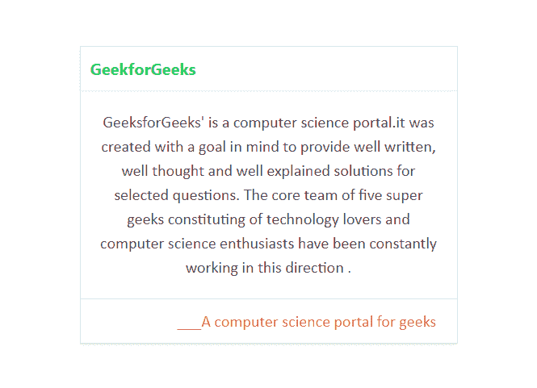

# 茶壶|卡

> 哎哎哎:# t0]https://www . geeksforgeeks . org/bulma-card/

**布尔玛**是一个基于 Flexbox 的免费开源 CSS 框架。它是组件丰富的，兼容的，并且有很好的文档记录。它本质上是高度反应的。它使用类来实现它的设计。

卡片是一个灵活的组件，可以由所需的内容组成。它包括几个其他组件，我们必须专门添加这些组件才能很好地设计我们的内容。这些组件如下所示:

*   **卡头:**是一个带阴影的水平箱式组件。
    *   **卡片-表头-标题:**左对齐加粗，用于表示卡片的表头。
    *   **卡片-表头-图标:**是添加到卡片表头部分的图标占位符。
*   **卡片图像:**它是包含响应图像的容器。
*   **卡片内容:**它是一个容器，人们可以在其中插入任何元素，如段落、图标、按钮或图像。
*   **页脚:**是用来存放卡片页脚元素的容器。
    *   **卡片-页脚-项目:**为页脚项目列表预留了空间。

**示例 1:** 这个示例表示如何使用布尔玛创建一张简单的卡片。

## 超文本标记语言

```html
<!DOCTYPE html>
<html>

<head>
  <title>Bulma Card</title>

  <!-- Include Bulma CSS -->
  <link rel='stylesheet' href=
'https://cdnjs.cloudflare.com/ajax/libs/bulma/0.7.5/css/bulma.css'>

  <!-- Custom CSS -->
  <style>
    div.columns {
      margin-top: 80px;
    }

    p {
      font-family: calibri;
      font-size: 20px;
    }

    p.has-text-danger {
      margin-left: 95px;
    }
  </style>
</head>

<body>
  <div class='container has-text-centered'>
    <div class='columns is-mobile is-centered'>
      <div class='column is-5'>
        <div class="card">
          <div class="card-content">
            <p class='is-success'>
              GeeksforGeeks' is a computer 
              science portal.it was created
              with a goal in mind to provide
              well written, well thought and
              well explained solutions for
              selected questions. The core
              team of five super geeks 
              constituting of technology lovers
              and computer science enthusiasts
              have been constantly working
              in this direction .
            </p>

            <p class='has-text-danger'>
              ___A computer science portal for geeks
            </p>

          </div>
        </div>
      </div>
    </div>
  </div>
</body>
</html>
```

**输出:**


**示例 2:** 本示例使用布尔玛创建一张带有标题的卡片。

## 超文本标记语言

```html
<!DOCTYPE html>
<html>

<head>
  <title>Bulma Card</title>

  <!-- Include Bulma CSS -->
  <link rel='stylesheet' href=
'https://cdnjs.cloudflare.com/ajax/libs/bulma/0.7.5/css/bulma.css'>

  <!-- Custom CSS -->
  <style>
    div.columns {
      margin-top: 80px;
    }

    p {
      font-family: calibri;
      font-size: 20px;
    }

    p.has-text-danger {
      margin-left: 90px;
    }

    .card-header-title {
      font-size: 20px;
    }
  </style>
</head>

<body>
  <div class='container has-text-centered'>
    <div class='columns is-mobile is-centered'>
      <div class='column is-5'>
        <div class="card">
          <div class='card-header'>
            <div class="card-header-title
                        has-text-success">
              GeekforGeeks
            </div>
          </div>
          <div class="card-content">
            <p class='is-success'>
              GeeksforGeeks' is a computer
              science portal.it was created with
              a goal in mind to provide well
              written, well thought and
              well explained solutions for
              selected questions. The core team
              of five super geeks constituting
              of technology lovers and computer
              science enthusiasts have been 
              constantly working in this
              direction .
            </p>

            <p class='has-text-danger'>
              ___A computer science portal for geeks
            </p>

          </div>
        </div>
      </div>
    </div>
  </div>
</body>
</html>
```

**输出:**


**示例 3:** 本示例使用布尔玛创建带有页眉和页脚的卡片。

## 超文本标记语言

```html
<!DOCTYPE html>
<html>

<head>
  <title>Bulma Card</title>

  <!-- Include Bulma CSS -->
  <link rel='stylesheet' href=
'https://cdnjs.cloudflare.com/ajax/libs/bulma/0.7.5/css/bulma.css'>

  <!-- Custom CSS -->
  <style>
    div.columns {
      margin-top: 80px;
    }

    p {
      font-family: calibri;
      font-size: 20px;
    }

    .card-header-title {
      font-size: 20px;
    }

    span {
      margin-left: 95px;
    }
  </style>
</head>

<body>
  <div class='container has-text-centered'>
    <div class='columns is-mobile is-centered'>
      <div class='column is-5'>
        <div class="card">
          <div class='card-header'>
            <div class="card-header-title has-text-success">
              GeekforGeeks
            </div>
          </div>
          <div class="card-content">
            <p class='is-success'>
              GeeksforGeeks' is a computer
              science portal.it was created with
              a goal in mind to provide well 
              written, well thought and
              well explained solutions for 
              selected questions. The core team
              of five super geeks constituting
              of technology lovers and
              computer science enthusiasts have
              been constantly working
              in this direction .
            </p>

          </div>
          <div>
            <footer class="card-footer">
              <p class='card-footer-item'>
                <span class='has-text-danger'>
                  ___A computer science portal for geeks
                </span>
              </p>

            </footer>
          </div>
        </div>
      </div>
    </div>
  </div>
</body>
</html>
```

**输出:**



**示例 4:** 本示例使用布尔玛创建带有图像的卡片。

## 超文本标记语言

```html
<!DOCTYPE html>
<html>

<head>
  <title>Bulma Card</title>

  <!-- Include Bulma CSS -->
  <link rel='stylesheet' href=
'https://cdnjs.cloudflare.com/ajax/libs/bulma/0.7.5/css/bulma.css'>

  <!-- Custom CSS -->
  <style>
    div.columns {
      margin-top: 20px;
    }

    p {
      font-family: calibri;
      font-size: 20px;
    }

    .card-header-title {
      font-size: 20px;
    }
  </style>
</head>

<body>
  <div class='container has-text-centered'>
    <div class='columns is-mobile is-centered'>
      <div class='column is-5'>
        <div class="card">
          <div class="card-image">
            <figure class="image is-2by1">
              
            </figure>
          </div>
          <div class="card-content">
            <div class="media">
              <div class="media-left">
                <figure class="image is-48x48">
                  
                </figure>
              </div>

              <div class="media-content">
                <p class="title is-5">
                  GeekforGeeks
                </p>

                <p class="subtitle is-6">
                  @geeksforgeeks
                </p>
              </div>
            </div>

            <div class='content'>
              <div class="media-content">
                <p class='is-success'>
                  GeeksforGeeks' is a computer
                  science portal.it was created with
                  a goal in mind to provide well 
                  written, well thought and
                  well explained solutions for 
                  selected questions. The core
                  team of five super geeks 
                  constituting of technology 
                  lovers and computer science 
                  enthusiasts have been constantly
                  working in this direction .
                </p>
              </div>
            </div>
          </div>
        </div>
      </div>
    </div>
  </div>
</body>
</html>
```

**输出:**


**示例 5:** 本示例使用布尔玛创建带有图像的彩色卡片。

## 超文本标记语言

```html
<!DOCTYPE html>
<html>

<head>
  <title>Bulma Card</title>

  <!-- Include Bulma CSS -->
  <link rel='stylesheet' href=
'https://cdnjs.cloudflare.com/ajax/libs/bulma/0.7.5/css/bulma.css'>

  <!-- Custom CSS -->
  <style>
    div.columns {
      margin-top: 80px;
    }

    p {
      font-family: calibri;
      font-size: 20px;
    }

    .card-header-title {
      font-size: 20px;
    }
  </style>
</head>

<body>
  <div class='container 
              has-text-centered'>
    <div class='columns 
                is-mobile is-centered'>
      <div class='column is-5'>
        <div class="card 
                    has-background-primary">

          <div class="card-content">
            <div class="media">
              <div class="media-left">
                <figure class="image is-48x48">
                  
                </figure>
              </div>

              <div class="media-content">
                <p class="title is-5">
                  GeekforGeeks
                </p>

                <p class="subtitle is-6">
                  @geeksforgeeks
                </p>
              </div>
            </div>

            <div class='content'>
              <div class="media-content">
                <p class='is-success'>
                  GeeksforGeeks' is a computer 
                  science portal.it was created 
                  with a goal in mind to provide 
                  well written, well thought and
                  well explained solutions for 
                  selected questions. The core team
                  of five super geeks constituting 
                  of technology lovers and
                  computer science enthusiasts
                  have been constantly working
                  in this direction .
                </p>
              </div>
            </div>
          </div>
        </div>
      </div>
    </div>
  </div>
</body>
</html>
```

**输出:**

