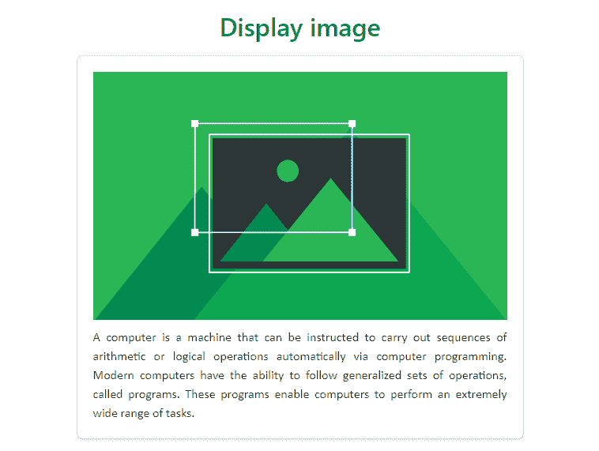
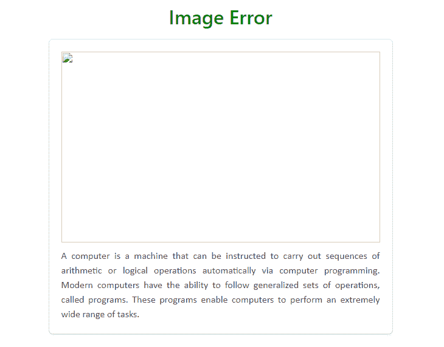
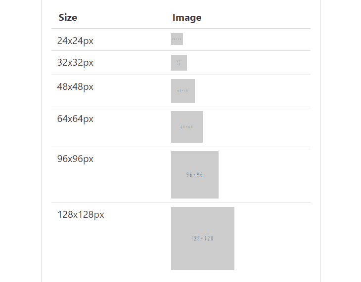
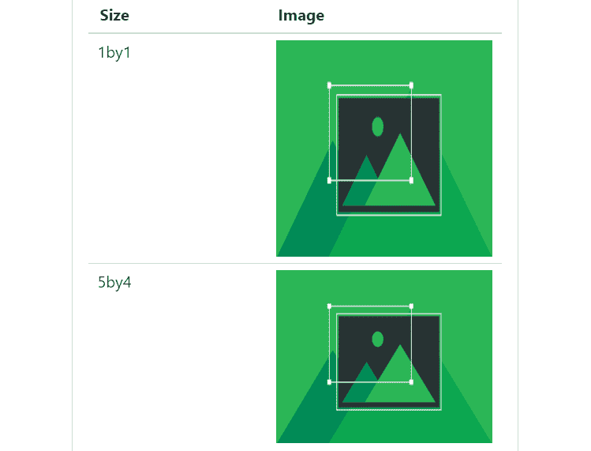
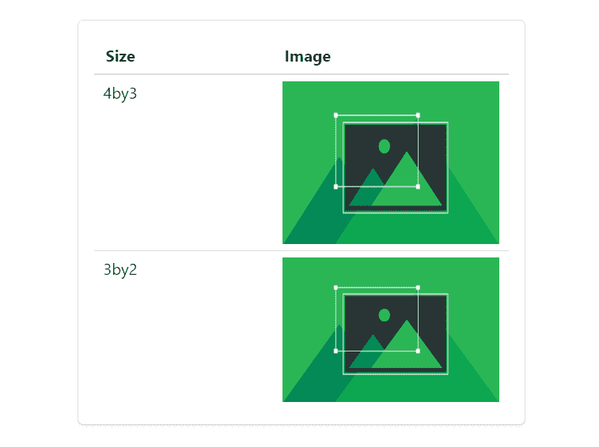
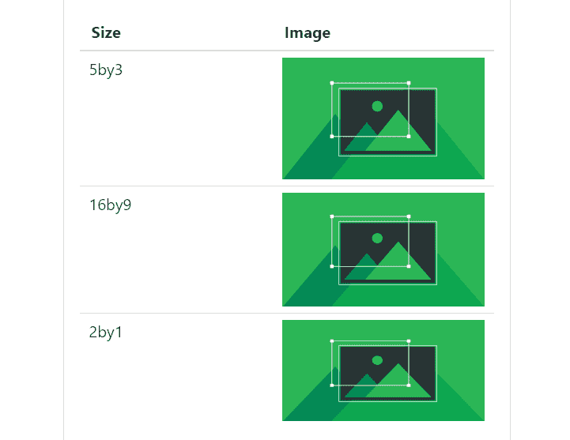

# Bulma | Image

> 哎哎哎:# t0]https://www . geeksforgeeks . org/bulma-image/

**布尔玛**是一个基于 Flexbox 的免费开源 CSS 框架。它是组件丰富的，兼容的，并且有很好的文档记录。它本质上是高度反应的。它使用类来实现它的设计。
图像类是一种容器，因为加载图像需要几分钟时间，所以图像容器会为该图像保留空间，以便网站布局不会在图像加载时中断，甚至不会出现图像错误。

**示例 1:** 本示例使用布尔玛显示图像。

```
<!DOCTYPE html>
<html>

<head>
  <title>Bulma Image</title>
  <link rel='stylesheet' href=
'https://cdnjs.cloudflare.com/ajax/libs/bulma/0.7.5/css/bulma.css'>

  <!-- font-awesome cdn -->
  <script src=
'https://cdnjs.cloudflare.com/ajax/libs/font-awesome/5.12.0-2/js/all.min.js'>
  </script>

  <!-- custom css -->
  <style>
    div.columns {
      margin-top: 20px;
    }

    h1 {
      margin-top: 10px;
      margin-bottom: 20px;
      color: green !important
    }

    p {
      font-family: calibri;
      font-size: 16px;
      text-align: justify;
    }

    div p {
      margin-top: 10px;
    }
  </style>
</head>

<body>
  <div class='container has-text-centered'>
    <div class='columns is-mobile is-centered'>
      <div class='column is-6'>
        <div>
          <h1 class='title has-text-centered'>
            Display image
          </h1>
        </div>
        <div class='box'>
          <div>
            <figure class="image is-5by3">
              
            </figure>
          </div>
          <div>
            <p>
              A computer is a machine that can be
              instructed to carry out sequences 
              of arithmetic or logical operations
              automatically via computer 
              programming. Modern computers have 
              the ability to follow generalized 
              sets of operations, called programs.
              These programs enable computers to 
              perform an extremely wide range of 
              tasks.
            </p>
          </div>
        </div>
      </div>
    </div>
  </div>
</body>

</html>
```

**输出:**


**示例 2:** 本示例使用布尔玛显示加载错误或图像错误。

```
<html>

<head>
  <title>Bulma Image</title>
  <link rel='stylesheet' href=
'https://cdnjs.cloudflare.com/ajax/libs/bulma/0.7.5/css/bulma.css'>

  <!-- font-awesome cdn -->
  <script src=
'https://cdnjs.cloudflare.com/ajax/libs/font-awesome/5.12.0-2/js/all.min.js'>
  </script>

  <!-- custom css -->
  <style>
    div.columns {
      margin-top: 20px;
    }

    h1 {
      margin-top: 10px;
      margin-bottom: 20px;
      color: green !important
    }

    p {
      font-family: calibri;
      font-size: 16px;
      text-align: justify;
    }

    div p {
      margin-top: 10px;
    }
  </style>
</head>

<body>
  <div class='container has-text-centered'>
    <div class='columns is-mobile is-centered'>
      <div class='column is-6'>
        <div>
          <h1 class='title has-text-centered'>
            Image Error
          </h1>
        </div>
        <div class='box'>
          <div>
            <figure class="image is-5by3">

              <!-- image url does not exist -->
              
            </figure>
          </div>
          <div>
            <p>
              A computer is a machine that can be 
              instructed to carry out sequences 
              of arithmetic or logical operations
              automatically via computer programming. 
              Modern computers have the ability to 
              follow generalized sets of operations,
              called programs. These programs enable 
              computers to perform an extremely wide 
              range of tasks.
            </p>
          </div>
        </div>
      </div>
    </div>
  </div>
</body>

</html>
```

**输出:**


**说明:**布尔玛图像类充当为图像预留空间的容器，这样即使出现图像错误，网站布局也不会中断。在这里，我们提供了一个错误的图像网址，但是尽管如此，还是为加载图像保留了空间。

**示例 3:** 本示例使用布尔玛创建圆形图像。

```
<html>

<head>
  <title>Bulma Image</title>
  <link rel='stylesheet' href=
'https://cdnjs.cloudflare.com/ajax/libs/bulma/0.7.5/css/bulma.css'>

  <!-- font-awesome cdn -->
  <script src=
'https://cdnjs.cloudflare.com/ajax/libs/font-awesome/5.12.0-2/js/all.min.js'>
  </script>

  <!-- custom css -->
  <style>
    div.columns {
      margin-top: 80px;
    }

    .buttons {
      margin-top: 15px;
    }
  </style>
</head>

<body>
  <div class='container has-text-centered'>
    <div class='columns is-mobile is-centered'>
      <div class='column is-5'>
        <div class="box">
          <article class="media">
            <div class="media-left">
              <figure class="image is-128x128">
                
              </figure>
            </div>
            <div class="media-content">
              <div class="content">
                <p>
                  <strong>Bill Gates</strong> 
                  <small>@BillGates</small> 
                  <small>36m</small>
                  <br>
                  The horrifying killings of 
                  George Floyd, Ahmaud Arbery, 
                  Breonna Taylor and far too 
                  many other Black people—and 
                  the protests they sparked—are
                  shining a light on the brutal 
                  injustices that Black people 
                  experience every day...
                </p>
              </div>
              <nav class="level is-mobile">
                <div class="level-left">
                  <a class="level-item">
                    <span class="icon is-small">
                      <i class="fas fa-reply"></i>
                    </span>
                  </a>
                  <a class="level-item">
                    <span class="icon is-small">
                      <i class="fas fa-retweet"></i>
                    </span>
                  </a>
                  <a class="level-item">
                    <span class="icon is-small">
                      <i class="fas fa-heart"></i>
                    </span>
                  </a>
                </div>
              </nav>
            </div>
          </article>
        </div>
      </div>
    </div>
  </div>
</body>

</html>
```

**输出:**


**示例 4:** 本示例使用布尔玛创建不同大小的图像。

```
<html>

<head>
  <title>Bulma Image</title>
  <link rel='stylesheet' href=
'https://cdnjs.cloudflare.com/ajax/libs/bulma/0.7.5/css/bulma.css'>

  <!-- custom css -->
  <style>
    div.columns {
      margin-top: 80px;
    }

    p {
      font-size: 20px
    }

    th {
      font-size: 20px;
    }
  </style>
</head>

<body>
  <div class='container has-text-centered'>
    <div class='columns is-mobile is-centered'>
      <div class='column is-6'>
        <div class="box">
          <table class='table is-fullwidth'>
            <thead>
              <tr>
                <th>Size</th>
                <th>Image</th>
              </tr>
            </thead>

            <tbody>
              <tr>
                <td>
                  <p>24x24px</p>
                </td>

                <td>
                  <figure class='image is-24x24'>
                    
                  </figure>
                </td>
              </tr>

              <tr>
                <td>
                  <p>32x32px</p>
                </td>

                <td>
                  <figure class='image is-32x32'>
                    
                  </figure>
                </td>
              </tr>

              <tr>
                <td>
                  <p>48x48px</p>
                </td>

                <td>
                  <figure class='image is-48x48'>
                    
                  </figure>
                </td>
              </tr>

              <tr>
                <td>
                  <p>64x64px</p>
                </td>

                <td>
                  <figure class='image is-64x64'>
                    
                  </figure>
                </td>
              </tr>

              <tr>
                <td>
                  <p>96x96px</p>
                </td>

                <td>
                  <figure class='image is-96x96'>
                    
                  </figure>
                </td>
              </tr>

              <tr>
                <td>
                  <p>128x128px</p>
                </td>

                <td>
                  <figure class='image is-128x128'>
                    
                  </figure>
                </td>
              </tr>
            </tbody>
          </table>
        </div>
      </div>
    </div>
  </div>
</body>

</html>
```

**输出:**


**示例 5:** 本示例使用布尔玛创建具有纵横比的响应图像。

```
<!DOCTYPE html>
<html>

<head>
  <title>Bulma Image</title>
  <link rel='stylesheet' href=
'https://cdnjs.cloudflare.com/ajax/libs/bulma/0.7.5/css/bulma.css'>

  <!-- custom css -->
  <style>
    div.columns {
      margin-top: 20px;
    }

    p {
      font-size: 20px
    }

    th {
      font-size: 20px;
    }
  </style>
</head>

<body>
  <div class='container has-text-centered'>
    <div class='columns is-mobile is-centered'>
      <div class='column is-6'>
        <div class="box">
          <table class='table is-fullwidth'>
            <thead>
              <tr>
                <th>Size</th>
                <th>Image</th>
              </tr>
            </thead>

            <tbody>
              <tr>
                <td>
                  <p>1by1</p>
                </td>

                <td>
                  <figure class='image is-1by1'>
                    
                  </figure>
                </td>
              </tr>

              <tr>
                <td>
                  <p>5by4</p>
                </td>

                <td>
                  <figure class='image is-5by4'>
                    
                  </figure>
                </td>
              </tr>
            </tbody>
          </table>
        </div>
      </div>
    </div>
  </div>
</body>

</html>
```

**输出:**


**示例 6:** 本示例使用布尔玛创建具有纵横比的响应图像。

```
<!DOCTYPE html>
<html>

<head>
  <title>Bulma Image</title>
  <link rel='stylesheet' href=
'https://cdnjs.cloudflare.com/ajax/libs/bulma/0.7.5/css/bulma.css'>

  <!-- custom css -->
  <style>
    div.columns {
      margin-top: 20px;
    }

    p {
      font-size: 20px
    }

    th {
      font-size: 20px;
    }
  </style>
</head>

<body>
  <div class='container has-text-centered'>
    <div class='columns is-mobile is-centered'>
      <div class='column is-6'>
        <div class="box">
          <table class='table is-fullwidth'>
            <thead>
              <tr>
                <th>Size</th>
                <th>Image</th>
              </tr>
            </thead>

            <tbody>
              <tr>
                <td>
                  <p>4by3</p>
                </td>

                <td>
                  <figure class='image is-4by3'>
                    
                  </figure>
                </td>
              </tr>

              <tr>
                <td>
                  <p>3by2</p>
                </td>

                <td>
                  <figure class='image is-3by2'>
                    
                  </figure>
                </td>
              </tr>
            </tbody>
          </table>
        </div>
      </div>
    </div>
  </div>
</body>

</html>
```

**输出:**


**示例 7:** 本示例使用布尔玛创建具有纵横比的响应图像。

```
<!DOCTYPE html>
<html>

<head>
  <title>Bulma Image</title>
  <link rel='stylesheet' href=
'https://cdnjs.cloudflare.com/ajax/libs/bulma/0.7.5/css/bulma.css'>

  <!-- custom css -->
  <style>
    div.columns {
      margin-top: 5px;
    }

    p {
      font-size: 20px
    }

    th {
      font-size: 20px;
    }
  </style>
</head>

<body>
  <div class='container has-text-centered'>
    <div class='columns is-mobile is-centered'>
      <div class='column is-6'>
        <div class="box">
          <table class='table is-fullwidth'>
            <thead>
              <tr>
                <th>Size</th>
                <th>Image</th>
              </tr>
            </thead>

            <tbody>
              <tr>
                <td>
                  <p>5by3</p>
                </td>

                <td>
                  <figure class='image is-5by3'>
                    
                  </figure>
                </td>
              </tr>

              <tr>
                <td>
                  <p>16by9</p>
                </td>
                <td>
                  <figure class='image is-16by9'>
                    
                  </figure>
                </td>
              </tr>

              <tr>
                <td>
                  <p>2by1</p>
                </td>

                <td>
                  <figure class='image is-2by1'>
                    
                  </figure>
                </td>
              </tr>
            </tbody>
          </table>
        </div>
      </div>
    </div>
  </div>
</body>

</html>
```

**输出:**


**注意:**在上面所有的例子中，我们使用了一些额外的布尔玛类，如容器、列、标题、表等。设计好内容。