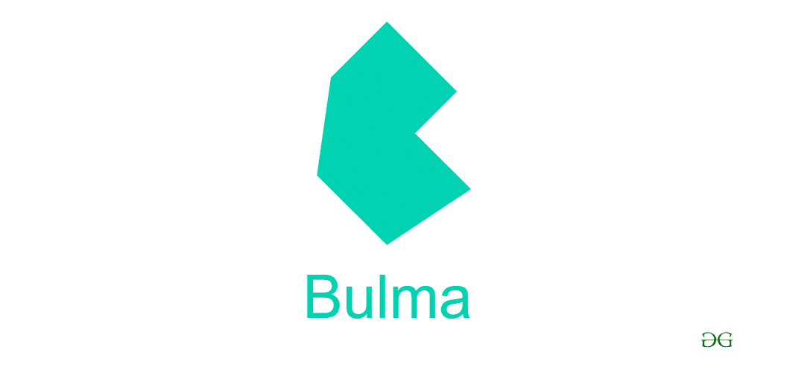
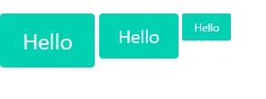

# bulma | introduction

> 哎哎哎:# t0]https://www . geeksforgeeks . org/bulma-introduction/



布尔玛是杰瑞米·托马斯开发的开源 CSS 框架。该框架基于 CSS Flexbox 属性。它具有高度的响应性，最大限度地减少了使用媒体查询进行响应的行为。
与布尔玛的另一个优势是，您只需要对 HTML 和 CSS 有所了解就可以实现这个框架(尽管了解 JavaScript 可以根据您的需求帮助现有的功能)。
布尔玛还允许我们添加自己的 CSS 样式，但是建议使用外部样式表而不是内嵌样式。

**使用布尔玛:**如果你是一个初学 web 开发的人，最简单的方法就是使用链接标签在 HTML 文件的头部使用一个 jsDelivr CDN 链接。

```html
<html>
<head>
     <link rel="stylesheet" 
           href=
"https://cdn.jsdelivr.net/npm/bulma@0.8.0/css/bulma.min.css">
</head>
<body>
      <h1>Hello world!!</h1>
</html>
```

**输出:**

```html
Hello world!!
```

布尔玛的另一个很酷的特性是，它可以简单地导入您需要的 SASS 文件，用于您想要应用布尔玛风格的特定元素。例如，如果您想要表单元素的布尔玛样式，则只能导入该 sass 文件。否则，您可以使用 npm 安装布尔玛软件包。

**示例:**布尔玛语法极其简单，有预定义的类名帮助我们根据名称创建元素。

```html
<!DOCTYPE html>
<html>
  <head>
    <meta charset="utf-8">
    <meta name="viewport" 
          content="width=device-width, initial-scale=1">
    <title>Hello Bulma!</title>
    <link rel="stylesheet" 
href="https://cdn.jsdelivr.net/npm/bulma@0.8.0/css/bulma.min.css">
  </head>
  <body>
<a class="button">Hello</a>
</body>
```

它创建了一个带有“你好”字样的风格化按钮。


创建的按钮不像普通的 HTML 按钮。

每个布尔玛元素都有多个可选样式可用，这些样式可以通过使用 **is-** 或**is-**类修改器来应用。

**示例:**

```html
<!DOCTYPE html>
<html>

<head>
    <meta charset="utf-8">
    <meta name="viewport"
        content="width=device-width,
                initial-scale=1">
    <title>Hello Bulma!</title>
    <link rel="stylesheet"
        href=
"https://cdn.jsdelivr.net/npm/bulma@0.8.0/css/bulma.min.css">
</head>

<body>
    <a class="button is-large">Hello</a>
    <a class="button is-medium">Hello</a>
    <a class="button is-small">Hello</a>
</body>

</html>
```

这些修改器构成了在布尔玛操作对象的基础。布尔玛提供的一些颜色修饰剂包括:

*   is-primary
*   信息
*   是成功
*   危险
*   警告


尺寸修饰符的范围从 **is-size-1** 到 **is-size-6** 。这些有助于改变字体大小。在布尔玛尝试使用 *h1* 到 *h6* 标签，但是你会注意到可见字体大小没有变化。这是因为布尔玛只使用修饰符来改变文本的大小，而不是用标准的 HTML 方式。尝试运行以下代码来了解 h1 到 h6 标签如何不影响文本的大小:

```html
<!DOCTYPE html>
<html>

<head>
    <meta charset="utf-8">
    <meta name="viewport"
        content="width=device-width,
                   initial-scale=1">
    <title>Hello Bulma!</title>
    <link rel="stylesheet"
          href=
"https://cdn.jsdelivr.net/npm/bulma@0.8.0/css/bulma.min.css">
 </head>

<body>
    <h1>hello world</h1>
    <h2>hello world</h2>
    <h3>hello world</h3>
</body>

</html>
```

**输出:**

```html
hello world
hello world
hello world
```

在元素类属性中添加多个变体。尝试这个代码，并观察到我们使用了两个修改器，一个用于颜色，另一个用于大小。

```html
<!DOCTYPE html>
<html>
<head>
    <meta charset="utf-8">
    <meta name="viewport"
        content="width=device-width, 
                initial-scale=1">
    <title>Hello Bulma!</title>
    <link rel="stylesheet"
        href=
"https://cdn.jsdelivr.net/npm/bulma@0.8.0/css/bulma.min.css">
</head>

<body>
    <a class="button is-primary is-large">Hello</a>
    <a class="button is-primary is-medium">Hello</a>
    <a class="button is-primary is-small">Hello</a>
</body>

</html>
```

**输出:**


**优势:**

*   适用于所有设备(台式机、平板电脑和手机)的灵敏设计。
*   易于读写的代码。
*   它可以与任何 JavaScript 框架(AngularJS、ReactJS)相结合。

**缺点:**

*   处于发展阶段。
*   需要小的改进。
*   net 框架