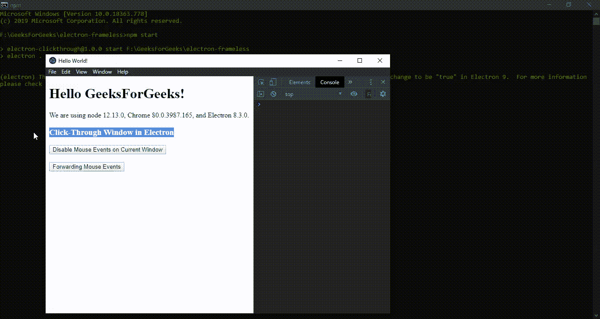

# 电子表格中的点击窗口

> 原文:[https://www . geesforgeks . org/click-through-window-in-electronijs/](https://www.geeksforgeeks.org/click-through-window-in-electronjs/)

[**electronijs**](https://www.geeksforgeeks.org/introduction-to-electronjs/)是一个开源框架，用于使用能够在 Windows、macOS 和 Linux 操作系统上运行的 HTML、CSS 和 JavaScript 等网络技术构建跨平台的本机桌面应用程序。它将铬引擎和[T5 节点 T7】结合成一个单一的运行时。](https://www.geeksforgeeks.org/introduction-to-nodejs/)

在复杂的桌面应用程序中，可能会出现开发人员不得不冻结当前窗口或正在向用户显示的当前窗口区域的情况。在这种情况下，窗口变成静态的，用户将不能在窗口上执行任何窗口操作，例如关闭、最小化、最大化等，并且它将在屏幕上保持打开。这意味着窗口或窗口区域对可能发生在其上的任何鼠标事件变得浑然不觉。这种行为对于使用 HTML、CSS 和 JavaScript 禁用按钮点击来说似乎很熟悉，但这里的关键区别是窗口或窗口区域对所有**鼠标事件(包括鼠标在该区域上的移动)变得无响应。这样的窗口被称为**点进窗口**。Electron 为我们提供了一种方法，通过这种方法，我们可以使用**浏览器窗口**对象的实例方法来创建现有窗口或使其成为点进式窗口。本教程将演示如何创建一个电子点击窗口。**

我们假设您熟悉上述链接中介绍的先决条件。电子要工作， [**节点**](https://www.geeksforgeeks.org/introduction-to-nodejs/) 和 [**npm**](https://www.geeksforgeeks.org/node-js-npm-node-package-manager/) 需要预装在系统中。

*   **项目结构:**


**示例:**按照 [**中给出的步骤，如何在电子表格中找到页面上的文本？**](https://www.geeksforgeeks.org/how-to-find-text-on-page-in-electronjs/) 设置基础电子应用。复制文章中提供的 **main.js** 文件和**index.html**文件的样板代码。此外，对**包进行必要的更改，以启动电子应用程序。我们将继续使用相同的代码库构建我们的应用程序。设置电子应用程序所需的基本步骤保持不变。
**package.json:****

```htmlhtml
{
  "name": "electron-clickthrough",
  "version": "1.0.0",
  "description": "Click-Through Window in Electron",
  "main": "main.js",
  "scripts": {
    "start": "electron ."
  },
  "keywords": [
    "electron"
  ],
  "author": "Radhesh Khanna",
  "license": "ISC",
  "dependencies": {
    "electron": "^8.3.0"
  }
}

```

**输出:**

[](https://media.geeksforgeeks.org/wp-content/uploads/20200512225834/Output-1105.png)

**电子点击窗口:****浏览器窗口**实例是**主进程**的一部分。要在**渲染器进程**中导入和使用**浏览器窗口**，我们将使用电子**远程**模块。如上所述，点击窗口会忽略其上发生的所有鼠标事件。为了退出点击窗口，我们需要终止**浏览器窗口**实例或关闭任务。

*   **index.html**:在该文件中添加以下片段。

## 超文本标记语言

```htmlhtml
<h3>Click-Through Window in Electron</h3>
  <button id="disable">
      Disable Mouse Events on Current Window
  </button>
  <br><br>
  <button id="forward">
      Forwarding Mouse Events
  </button>
<!-- Adding Individual Renderer Process Script File  -->   
<script src="index.js"></script>
```

*   **index . js**:**禁用当前窗口上的鼠标事件**和**转发鼠标事件**按钮还没有任何相关功能。要进行更改，请在 **index.js** 文件中添加以下代码

## java 描述语言

```htmlhtml
const electron = require('electron')
// Import BrowserWindow using Electron remote
const BrowserWindow = electron.remote.BrowserWindow;

const win = BrowserWindow.getFocusedWindow();
// let win = BrowserWindow.getAllWindows()[0];

var disable = document.getElementById('disable')
disable.addEventListener('click', (event) => {
    win.setIgnoreMouseEvents(true);
});

var forward = document.getElementById('forward');
forward.addEventListener('mouseenter', () => {
    console.log('Mouse Entered the Region...Disabling Click')
    win.setIgnoreMouseEvents(true, { forward: true });
});

forward.addEventListener('mouseleave', () => {
    console.log('Mouse Left the Region...Event Emitted')
    win.setIgnoreMouseEvents(false);
});
```

**解释:**为了在 electronic 中创建一个简单的点击窗口，我们使用了**浏览器窗口**对象的[**win . setignoremousevents(忽略，选项)**](https://www.electronjs.org/docs/api/browser-window#winsetignoremouseeventsignore-options) 实例方法。在**浏览器窗口**对象上调用这个实例方法会使窗口忽略所有鼠标**事件发射器**。此方法没有返回类型。该窗口中发生的所有鼠标事件现在都将传递到该窗口或位于该窗口下方的内容，但是如果该点击窗口有焦点，它仍将接收发生在其上的键盘事件。在我们研究传递给这个实例方法的参数之前，点击窗口还有一个额外的特性，它只在 Windows 操作系统中受支持。
如上所述，点击窗口不会注意到所有鼠标事件，包括鼠标在该窗口或该窗口区域上的移动。在*窗口*操作系统中，我们可以给这个实例方法传递一个额外的**选项:对象**参数，该参数可以用来**将**鼠标消息转发到网页，从而允许**鼠标离开**和**鼠标进入**等鼠标移动事件在**浏览器窗口**实例上发出。这个概念被称为**转发**，它在我们只想让窗口的一部分**点进**而不是整个**浏览器窗口**实例的情况下变得有用。这有助于开发人员对窗口或窗口区域进行更精细的控制。在本教程中，我们将**转发**应用到了**转发鼠标事件**按钮。因此，鼠标移动事件将适用于此按钮，但按钮本身仍然对鼠标点击没有反应。换句话说，这使得网页在点击按钮时点进，但在按钮之外恢复正常。请参考输出以获得更好的理解。单击**禁用当前窗口上的鼠标事件**按钮，当前**浏览器窗口**实例变为点击窗口。
**浏览器窗口**对象的**win . setignoremuseevents(忽略，选项)**实例方法采用以下参数。

*   **忽略:布尔型**该参数使窗口成为点进窗口。
*   **选项:对象(可选)**此参数仅在*窗口*支持。该参数为可选参数，如上所述负责**转发**。它接受以下参数。
    *   **转发:布尔型(可选)**此参数设置为**真**，将鼠标移动消息转发给 Chromium，使鼠标移动相关事件如**鼠标进入**和**鼠标离开**能够发出。该参数只有在**忽略**参数设置为**真**时才能使用。如果**忽略**参数为**假**，无论该值如何，转发总是被禁用。

要在**渲染器进程**中获取当前**浏览器窗口**实例，我们可以使用**浏览器窗口**对象提供的一些静态方法。

*   **BrowserWindow . getallwindow():**此方法返回一个活动/打开的 BrowserWindow 实例数组。在这个应用程序中，我们只有一个活动的**浏览器窗口**实例，它可以直接从数组中引用，如代码所示。
*   **浏览器窗口. getFocusedWindow():** 此方法返回在应用程序中聚焦的**浏览器窗口**实例。如果没有找到当前浏览器窗口实例，则返回**空值**。在这个应用程序中，我们只有一个活动的**浏览器窗口**实例，可以使用这个方法直接引用它，如代码所示。

**输出:**

[](https://media.geeksforgeeks.org/wp-content/uploads/20200720120226/Output-1-GIF15.gif)