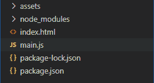

# 电子表格中的命令行参数

> 原文:[https://www . geesforgeks . org/命令行参数 in-electronijs/](https://www.geeksforgeeks.org/command-line-arguments-in-electronjs/)

[**electronijs**](https://www.geeksforgeeks.org/introduction-to-electronjs/)是一个开源框架，用于使用能够在**Windows****macOS**和 **Linux** 操作系统上运行的 HTML、CSS 和 JavaScript 等 web 技术构建跨平台原生桌面应用。它将 Chromium 引擎和 [**NodeJS**](https://www.geeksforgeeks.org/introduction-to-nodejs/) 结合成一个单一的运行时。

命令行参数是调用程序时传递给程序的参数。不同的编程语言和框架使用不同的方法来解析这些参数。命令行参数很重要，因为它们可以用来控制应用程序的行为。这些参数被传递给任何应用程序的**主**函数。电子还支持命令行参数。我们可以在调用应用程序时将命令行参数从应用程序外部传递给电子，或者我们可以简单地使用电子的**应用程序**模块的内置**命令行**属性的实例方法对这些值进行硬编码。本教程将演示如何在 electronic 中添加命令行参数。

我们假设您熟悉上述链接中介绍的先决条件。电子要工作， [**节点**](https://www.geeksforgeeks.org/introduction-to-nodejs/) 和 [**npm**](https://www.geeksforgeeks.org/node-js-npm-node-package-manager/) 需要预装在系统中。

*   **项目结构:**



电子设备中的命令行参数**应用程序**模块和**命令行**属性是**主进程**的一部分。在**应用程序**模块的**就绪**事件发出之前，我们需要将命令行参数附加到应用程序**主进程**中。在电子中，**命令行**属性用于读取和操作**铬**读取和使用的命令行参数。它们可以用来控制和覆盖铬的默认行为。有关支持的命令行标志和开关的详细列表，可以在 electronic 中使用。我们还将使用其中一些标志和开关进行演示。**命令行**属性只支持实例方法。它没有任何关联的实例事件和属性。

**示例:**按照给出的步骤在 electronic 中传递命令行参数。

*   **步骤 1:** 按照 [**中给出的步骤，在电子 JS**](https://www.geeksforgeeks.org/drag-and-drop-files-in-electronjs/) 中拖放文件，设置基本的电子应用程序。复制文章中提供的 **main.js** 文件和**index.html**文件的样板代码。还要对**包. json** 文件进行必要的更改，以启动电子应用程序。我们将继续使用相同的代码库构建我们的应用程序。
    **package.json:**

```htmlhtml
{
  "name": "electron-command",
  "version": "1.0.0",
  "description": "Command Line Switches in Electron",
  "main": "main.js",
  "scripts": {
    "start": "electron ."
  },
  "keywords": [
    "electron"
  ],
  "author": "Radhesh Khanna",
  "license": "ISC",
  "dependencies": {
    "electron": "^8.3.0"
  }
}
```

*   根据项目结构创建**资产**文件夹。我们将使用此文件夹存储**日志**。
    **输出:**此时，我们的基本电子应用程序设置完毕。启动应用程序后，我们应该会看到以下结果。

[](https://media.geeksforgeeks.org/wp-content/uploads/20200512225834/Output-1105.png)

*   **步骤 2:** 现在我们将使用两种方法中的任何一种将命令行参数传递给电子应用程序。
    *   **方法 1:** 在启动应用程序时传递命令行参数。我们将使用**-log-net-log = path**命令行开关。此开关允许记录网络日志事件，并将生成的日志写入**路径**文件。我们已经对 **package.json** 文件进行了必要的更改，以便使用 **start** 脚本启动应用程序。我们将修改这个脚本来传递这个命令行开关。
        **package.json:** 更改该文件中的以下片段。
    *   **输出:**应用启动后，Chromium 将启用网络日志，并在带有初始网络日志条目的资产文件夹中自动生成一个 **log.txt** 文件。
    *   **方法 2:** 使用**应用程序**模块的**命令行**属性传递命令行参数。
        **main.js** 在导入 **app** 模块之后，在 **ready** 事件发出之前，在文件的开头添加以下代码片段。

## java 描述语言

```htmlhtml
const { app, BrowserWindow } = require("electron");
app.commandLine.appendSwitch("log-net-log", "assets/log.txt");
console.log(app.commandLine.hasSwitch("log-net-log"));
console.log(app.commandLine.getSwitchValue("log-net-log"));
```

下面详细解释了代码中使用的**命令行**属性的所有实例方法。有关**命令行**属性的更多详细信息。

*   **命令行.追加开关(开关，值)**该方法在调用应用程序时，将带有可选**值**参数的开关追加到 Chromium 的命令行。此方法没有任何返回类型。它接受以下参数。在我们的代码中，我们使用了这个实例方法来追加**–log-net-log = path**命令行开关。
    *   **开关:字符串**一个命令行开关，没有前导的 **—** ，用于在调用应用程序时附加到 Chromium 的命令行。该值不能为空。
    *   **值:字符串(可选)**给定交换机的字符串值(如果支持)。如果开关接受布尔值，我们将把布尔值包装在字符串中，以便通过这个方法传递。在我们的代码中，我们指定了**路径**到**资产**文件夹。默认情况下，它将采用 CWD(当前工作目录)。
*   **命令行开关**此方法用于检查从外部调用应用程序时命令行开关是否存在，如 **package.json** 文件中的 **start** 脚本或已使用**命令行开关**方法追加的命令行开关。它返回一个**布尔**值，说明命令行开关是否存在。它接受以下参数。
    *   **开关:字符串**一个命令行开关，不带前导 **—** 用于检查铬的命令行。该值不能为空。
*   **命令行开关值(开关)**此方法用于返回命令行开关**值**(如果有)。它返回一个**字符串**值。如果命令行开关不存在或没有值，它将返回一个空的**字符串。它接受以下参数。**
    *   **开关:字符串**一个命令行开关，不带前导 **—** 用于检查铬的命令行。该值不能为空。
*   **commandLine.appendArgument(参数)**这个方法用于在调用应用程序时向 Chromium 的命令行追加一个参数。应用程序将适当引用该参数。此方法没有任何返回类型。这个方法类似于**命令行开关()**方法，但是命令行开关总是在参数之前，不管追加顺序如何。如果我们想要将命令行开关作为整个参数追加，例如，**'–log-net-log = assets/log . txt '**那么我们就不应该使用这个方法。我们应该使用**command line . appendswitch()**方法来代替。它接受以下参数。
    *   **参数:字符串**要附加到 Chromium 命令行的字符串参数。该值不能为空。