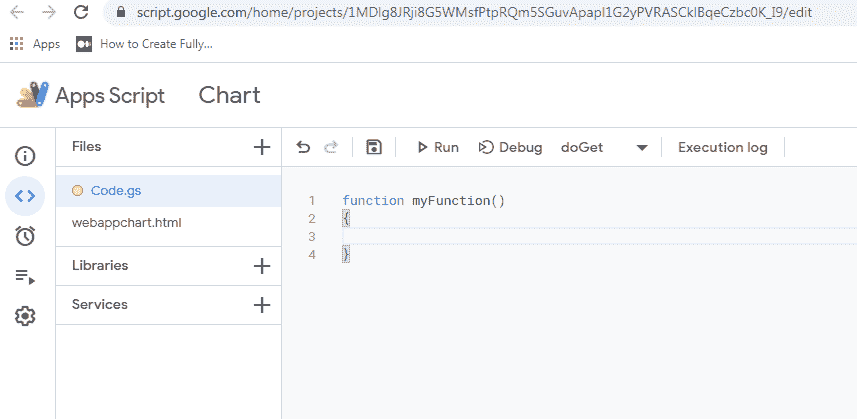
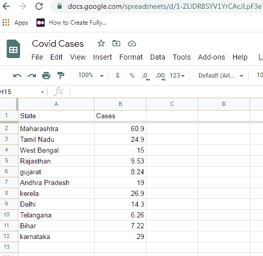

# 使用谷歌应用脚本从谷歌表单创建图表

> 原文:[https://www . geeksforgeeks . org/create-charts-from-Google-sheets-use-Google-apps-script/](https://www.geeksforgeeks.org/create-charts-from-google-sheets-using-google-apps-script/)

谷歌应用程序脚本是一个基于云的工具，用于自动化基本任务。你可以用现代的 JavaScript 编写代码。使用应用程序脚本，您可以添加自定义菜单，为谷歌表单编写自定义函数和宏，并可以发布您的网络应用程序。你可以在谷歌表单、谷歌文档、gmail 等中自动完成任务。使用这个，你需要一个谷歌帐户和谷歌浏览器安装在你的系统中。它是用谷歌 Chrome 中的脚本编辑器编写的。

在本文中，我们将编写一个脚本，从谷歌工作表中的数据创建一个图表。这里，我们将使用 **Chart.js** ，这是一个 JavaScript 库。我们基本上是通过发布脚本来开发一个网络应用程序。

**Web App:** 脚本如果包含函数 **doGet(e)** 或者 **doPost(e** )且函数必须返回 HTML Service **HtmlOutput** 对象，则可以作为 Web App 发布。您将在下面讨论的步骤中学习如何将 HTML 文件链接到脚本。

**在脚本编辑器中编写代码的过程:**

*   首先创建一个新的谷歌表单。
*   然后点击菜单中的工具选项卡作为**工具>脚本编辑器**
*   将打开一个新窗口，如下所示:



*   您可以在函数 myFunction 块的大括号之间插入代码。

让我们看看一步一步的实现。

**第一步:**准备好你的谷歌表单数据。我们有印度不同邦的 Covid 病例数的数据，如下所示。所以，第一步是准备你的数据。



**第二步:**将标准的 Google Apps Script 函数 doGet(e)添加到 code.gs 文件中。下一步是转到工具并选择脚本编辑器。将其保存为“图表”或任何其他名称。这里我们保存为 code.gs。同时创建一个新的 HTML 文件，并将其保存为“webappchart.html”。

在 code.gs 文件中添加下面的代码。

## code.gs

```html
function doGet(e) {
  return HtmlService.createHtmlOutputFromFile('webappchart');

}
```

上述功能是标准的谷歌应用脚本功能，用于发布/部署您的网络应用。这个函数返回一个输出文件，它只是你的 HTML 文件。

现在让我们了解一下 HTML 文件和 code.gs 文件之间的关系:

*   HtmlService:
*   此类用作从脚本返回 HTML 和其他文本内容的服务
*   createHtmlOutputFromFile（文件名）：
*   上述函数从代码编辑器中的一个文件创建一个新的 HtmlOutput 对象。在我们的案例中，我们将文件命名为 webappchart.html。所以我们使用 doGet(e)函数，该函数将一个 HtmlOutput 对象返回到我们的 HTML 页面。文件名应以字符串形式给出。如果找不到文件，函数将返回一个错误。

**第三步:**在你的 HTML 文件中添加需要的 CDN。接下来打开你的 HTML 文件，即 webappchart.html，我们将包括 jQuery 和 Chartjs 的 cdn，我们将使用它们来制作我们的图表。

> <src = " https://cdnjs . cloudflare . com/Ajax/libs/chart . js/3 . 4 . 1/chart . js " integrity = " sha 512-lusn 5 teogpe 12 qev 8 nf 4 cxljjjjjjjjjxaz 12 jnx 9 wkfxoy 7y buhuwyrtjmctwbrizphv+lpvy 7cm 9 或 8t9e+9 pty

**步骤 4:** 为渲染图表创建画布。在下一步中，我们通过在 body 标签的 div 元素中添加画布来显示图表，从而完成 html 代码，如下所示:

## 超文本标记语言

```html
<div style='width:800px height:400px'>
    <canvas id='barchart' class='chartjs-render-monitor'></canvas>
</div>
```

HTML 代码在这里完成，现在我们添加脚本代码。

**第五步:**添加 jQuery 脚本代码。我们最初编写标准的 jQuery 方法，当屏幕完全加载 html 代码时调用该方法，并在其中调用 getCases()方法，我们将在下一步中定义该方法。

## java 描述语言

```html
$(document).ready(function(){
      getcases();
    });
```

然后，我们将 getCases()函数定义如下:

## java 描述语言

```html
function getCases(){
  google.script.run.withSuccessHandler(function(ar){
    console.log(ar);
    var data=[];
    var label=[];
    ar.forEach(function(item,index){
      data.push(item[1]);
      label.push(item[0]);
    });
  });
}
```