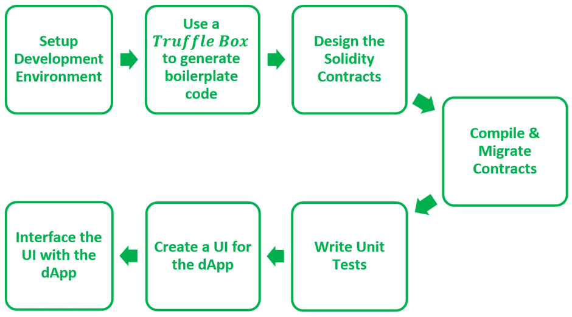
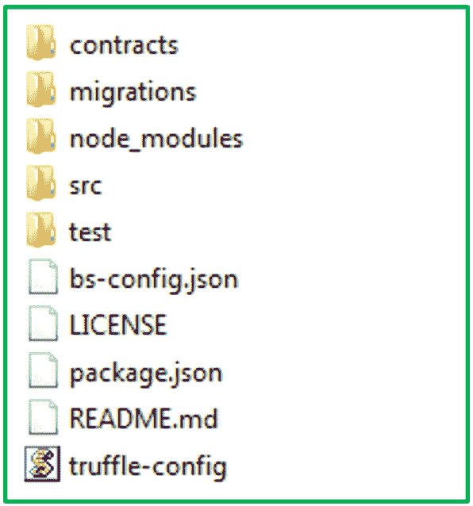
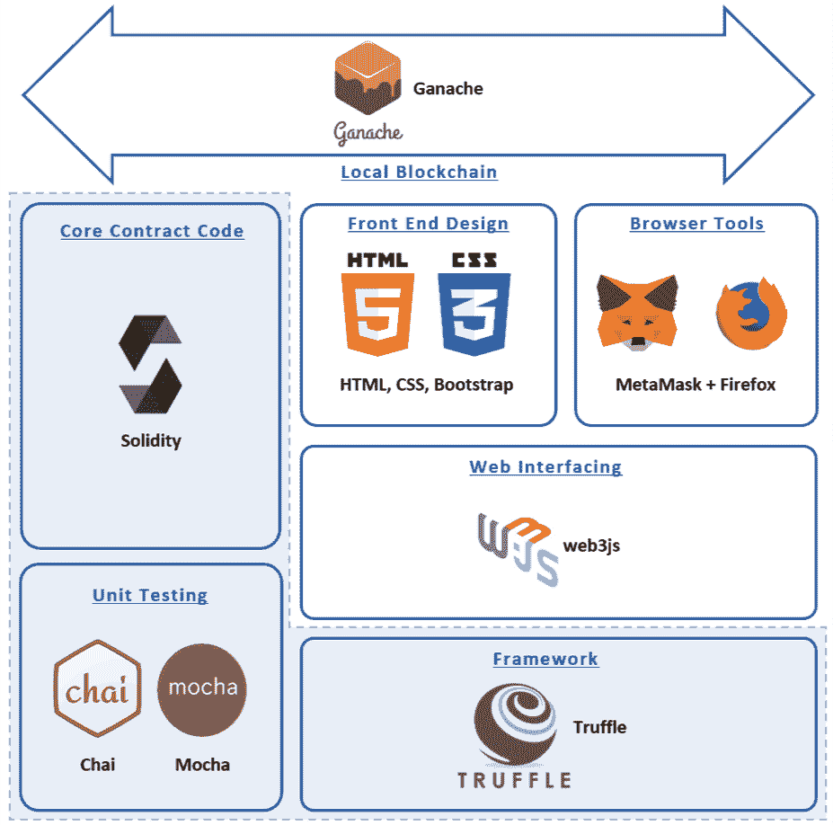

# 使用块菌框架创建 dApps】

> 原文:[https://www . geeksforgeeks . org/creating-dapps-use-the-truffle-framework/](https://www.geeksforgeeks.org/creating-dapps-using-the-truffle-framework/)

**dapp**(*分散应用*)是不依赖传统服务器的应用。相反，dApps 利用区块链来托管传统上存储在服务器上的数据。数据存储在连接到区块链的节点网络中。各种工具和框架被用来编写全栈、分散的应用程序。使用 Solidity 编程语言编写 dApps 的一个流行框架是 **Truffle** 。块菌为设计 dApp 项目提供了一个基本的脚手架。使用 Truffle，我们可以创建创建区块链功能所需的智能合约，编写功能的单元测试，并设计 dApp 的前端设计。
设计全栈 dApp 的基本步骤如下:

[](https://media.geeksforgeeks.org/wp-content/uploads/20200619204816/dapp-process.png)

图 01:编写 dApps 通常遵循的一系列步骤

**第一步:设置开发环境:**启动块菌项目前的要求如下:

*   Node.js
*   Ganache 用于在本地模拟区块链。
*   元掩码—用于通过浏览器处理区块链事务。

要设置块菌框架，请运行以下命令:

```html
npm install -g truffle

```

出于开发的目的，我们依赖于测试网络或本地私有区块链的使用，而不是使用真正的区块链以太网。要在计算机上本地模拟以太网区块链，可以使用 **Ganache** 。Ganache 一旦安装，就可以通过命令行或使用提供的图形用户界面来使用。使用 Ganache，您可以获得一组测试帐户，默认情况下每个帐户最多有 100 个 Ether，用于开发过程。

**第二步:使用块菌盒子生成样板代码:**为了简化在块菌中创建 dApp 的过程，您可以使用**块菌盒子**来代替手动创建文件和包含依赖关系。块菌盒子提供了有用的样板代码，你可以用它直接开始设计你的 dApp。这些“盒子”还包含其他有用的组件，例如常用的 Solidity Contracts、库、前端视图等。根据您项目的要求，您可以从他们的[官方网站](https://www.trufflesuite.com/boxes)
中选择一个松露盒子

```html
truffle unbox pet-shop
truffle unbox react

```

**第三步:编写稳固智能契约:**一旦块菌盒子被下载并解包，它就会创建一个块菌特定的目录结构。块菌项目的总体结构如下图所示:

[](https://media.geeksforgeeks.org/wp-content/uploads/20200619210658/Truffle-Directory-Structure1.png)

图 02:块菌目录结构

*   合同目录，所有的 Solidity 智能合同都被编写并存储为。索尔文件。
*   迁移目录包含迁移和部署设计好的合同的代码。
*   node_modules 目录存储了运行项目所需的所有节点依赖关系。
*   src 目录用于存储项目的前端组件，如 HTML 和 CSS 文件。
*   测试目录存储开发人员编写的单元测试。

一般来说，第一步是设计合同并将其保存为*。合同目录中的 sol* 文件。稳固智能合约的一个简单示例如下所示:

## java 描述语言

```html
pragma solidity ^0.4.4;

contract TestContract {
  uint my_id;

  function setId(uint x) public {
    my_id = x;
  }

  function getId() public view returns (uint) {
    return my_id;
  }
}
```

**第 4 步:编译并迁移合同:**一旦合同写好了，我们就可以编译然后迁移，将它们存储在我们的区块链上。要在 Truffle 中编译一个 Solidity 契约，请运行命令

```html
truffle compile

```

一旦成功编译，契约就被转换成字节码，由以太网虚拟机(EVM)执行。成功编译后，需要将合同保存在区块链上，以便用户可以访问合同提供的功能。一旦迁移到区块链，每个已部署的合同都将被分配一个唯一的地址，以引用其在区块链上的位置。当用户希望从某个已部署的合同中调用函数时，他们需要调用与区块链上已部署的合同地址相对应的函数。
要指定必须迁移哪些合同，我们需要在新文件内的迁移目录中指定它们的引用。文件名为“2_deploy_contracts.js”，结构如下

## java 描述语言

```html
// Instantiating the compiled contract to be deployed
var TestContract = artifacts.require("TestContract ");

module.exports = function(deployer) {

  // Deploying the contract to the blockchain
  deployer.deploy(TestContract);
};
```

接下来执行命令:

```html
truffle migrate

```

**注意:**由于我们在 Ganache 上本地模拟区块链，因此在执行迁移之前，Ganache 服务应该运行。

**第五步:编写单元测试:**虽然测试驱动开发在软件开发的所有领域都是一种非常推荐的方法。对于 dApps 来说，这是至关重要的。根据区块链的设计，一旦对区块链进行了更改，这些更改将永久地、不可更改地存储在链上。因此，如果开发人员在区块链部署了一个有问题的合同，那么一旦迁移，该合同将变得不可修改。修复 bug 的唯一方法是创建一个新的合同，在一个新的地址上部署和迁移它，并请求所有用户使用新的地址，而不是旧的、有问题的合同地址。因此，在 dApp 开发中必须进行一致的测试。
所有测试文件都被写入并存储在测试目录中。块菌中的单元测试可以在柴和摩卡库的帮助下完成，它们提供了一系列断言和其他工具来执行测试。一旦编写完成，测试就通过执行来运行

```html
truffle test

```

[](https://media.geeksforgeeks.org/wp-content/uploads/20200619214524/Tech-Stack-used-for-developing-dApps.png)

图 03:用于开发带有块菌和 web3js 的 dApps 的技术堆栈

**第 6、7 步:创建 UI 并与合同集成:**dApp 的 UI 设计像往常一样使用 HTML、CSS、Bootstrap、JavaScript 等工具和语言完成。为了将前端与部署的合同对接，我们依赖于 web3 JavaScript 库。使用 web3js，我们可以在前端 js 文件中实例化部署的 Ethereum 契约，随后调用函数并与区块链交换数据。初始化 web3js 和实例化部署的协定的代码如下:

## java 描述语言

```html
App = {
  web3Provider: null,
  contracts: {},
  init: async function() {
    return await App.initWeb3();
  },

  initWeb3: async function() {
    if (window.ethereum) {
      App.web3Provider = window.ethereum;
      try {
        await window.ethereum.enable();
      } catch (error) {
        console.error("User denied account access")
      }
    }
    else if (window.web3) {
      App.web3Provider = window.web3.currentProvider;
    }
    else {
      App.web3Provider = new Web3.providers
        .HttpProvider('http://localhost:7545');
    }
    web3 = new Web3(App.web3Provider);
    return App.initContract();
  },

  initContract: function() {
    $.getJSON("TestContract.json", function(data) {
      var TestContractArtifact = data;
      App.contracts.TestContract = 
        TruffleContract(TestContractArtifact);

      App.contracts.TestContract
        .setProvider(App.web3Provider);
    });
    return App.callFunctionFromContract();
  },

  callFunctionFromContract: function() {
    App.contracts.TestContract.deployed()
      .then(function(instance) {
      console.log(instance.getId());
    }
  }
};
```

为了与区块链互动并通过网络浏览器进行交易，我们需要一个能够处理此类交易的浏览器扩展。为此，一个流行的选择是**元蒙版**。一旦设置了元掩码帐户，每次在区块链上进行交易时，元掩码都会显示一个提示，详细说明所请求的交易，以及天然气价格以及可能必须发送的任何其他以太量
有了这个提示，我们就可以在本地 Ganache 区块链上设置一个运行的 dApp。