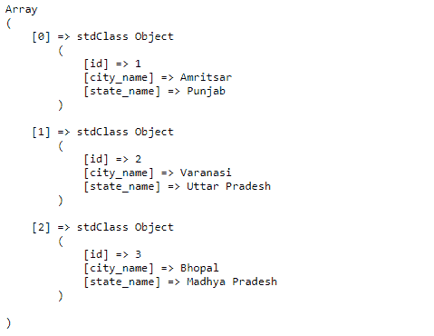
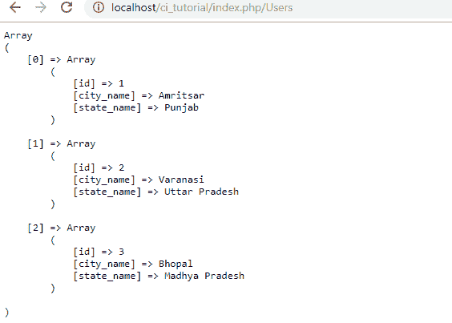

# Codeigniter 中的数据库连接和查询

> 原文:[https://www . geesforgeks . org/database-connection-and-query-in-codeigniter/](https://www.geeksforgeeks.org/database-connection-and-queries-in-codeigniter/)

为了从数据库中检索数据，我们总是需要将我们的项目与数据库连接起来。我们将看到如何在 codeignitor 中连接数据库以及如何在其中运行查询。在配置文件夹中我们可以找到**database.php**文件来连接数据库。请按照下图说明细节。
T3【database.php】T4
T6】

在上图中，我们需要定义用户名、密码和数据库名称。我们可以指定像 mysql 或 SQLite 这样的 dbdriver，无论我们使用什么，这就是它与我们的数据库连接的方式，我们将运行我们的查询。在 localhost 中创建一个数据库，在那里定义一个表，并插入一些虚拟数据。现在我们需要将这个数据库加载到模型文件中，然后我们就可以访问查询了。
**车型:**

```
<?php 
class Usermodel extends CI_Model {
        public function __construct(){
             parent::__construct();
             $this->load->database(); 
         }

        public function getUsers() {          
               $data = $this->db->query('SELECT * FROM city') ;
               print_r($data);
         }    

}

?>
```

根据上面的查询，输出将以对象形式显示。
**输出:**


现在使用上面相同的代码，但是这次在模型中使用下面的函数来查看输出。

```
print_r($data->result());
```

现在输出将类似于下面的对象数组。
**输出:**


现在使用上面相同的代码，但是这次在模型中使用下面的函数来查看输出。

```
print_r($data->result_array());
```

这次输出将是数组形式。
**输出:**


当我们试图从数据库中获取数据时，上面提到的所有问题都会造成混乱。所以我们需要了解以上三种输出结果的区别。
要在视图中获得数组结果，我们需要做的就是使用 foreach 循环来访问数据。

**如何使用活动记录:**活动记录基本上是 CI 中用来处理数据库查询的设计模式。在上面的所有例子中，我们编写了查询来获取数据，但是非活动记录使用内置的类或库，并传递我们自己的参数来处理数据库。使用活动记录的好处是代码将会减少，并且如果我们需要在另一个数据库(如 PostgreSQL 或 SQLite)上部署我们的项目，那么我们不需要更改模型中的查询。综上所述，所有将项目迁移到另一个数据库的示例都需要更改模型中的查询，这需要时间。现在让我们看看如何使用活动记录来处理数据库。

**型号:**

```
<?php 
class Usermodel extends CI_Model {
      public function __construct(){
      parent::__construct();
      $this->load->database(); 
  }

      public function getUsers() {    
      //SELECT * FROM `city` WHERE id = 1  
      $data = $this->db->select('city_name', 'state_name')
                       ->where('id', 1)
                       ->get('city');               
      print_r($data->result_array());
   }

}
?>
```

**输出:**


因此，我们将得到与前面示例相同的结果。有这么多可用的活动记录查询，可以根据需要使用。请点击[活动记录](https://www.codeigniter.com/userguide2/database/active_record.html)链接阅读所有活动记录。