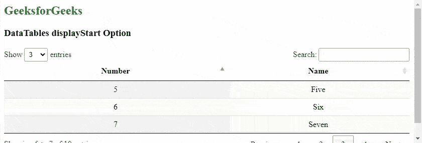
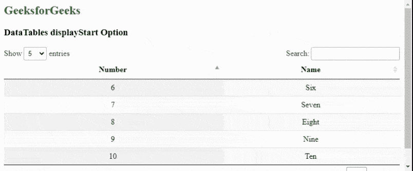

# 数据表显示器启动选项

> 原文:[https://www . geesforgeks . org/datatables-display start-option/](https://www.geeksforgeeks.org/datatables-displaystart-option/)

**DataTables** 是一个 jQuery 插件，可以用来为网页的 HTML 表格添加交互和高级控件。这也允许根据用户的需要搜索、排序和过滤表中的数据。数据表还公开了一个强大的应用编程接口，可以进一步用来修改数据的显示方式。

***显示开始*** 选项用于指定数据表开始显示其行的行。当启用分页并且表必须从某一行开始时使用。指定一行将从该行对应页的表开始。

**语法:**

```
{ displayStart: value }
```

**参数:**该选项有一个如上所述的单一值，如下所述。

*   **值:**这是一个数字，表示数据表开始显示表格的行。

以下示例说明了该选项的使用。

**示例 1:** 在该示例中，指定该值，使其从给定的行及其对应的页面开始。

## 超文本标记语言

```
<html>
<head>
  <!-- jQuery -->
  <script type="text/javascript" 
          src="https://code.jquery.com/jquery-3.5.1.js">
  </script>

  <!-- DataTables CSS -->
  <link rel="stylesheet"
        href=
"https://cdn.datatables.net/1.10.23/css/jquery.dataTables.min.css">

  <!-- DataTables JS -->
  <script src=
"https://cdn.datatables.net/1.10.23/js/jquery.dataTables.min.js">
  </script>
  <style>
    td{
     text-align:center;
    }
  </style>
</head>
<body>
  <h2 style="color:green;">
    GeeksforGeeks
  </h2>
  <h3>DataTables displayStart Option</h3>

  <!-- HTML table with random data -->
  <table id="tableID" class="display nowrap">
    <thead>
      <tr>
        <th>Number</th>
        <th>Name</th>
      </tr>
    </thead>
    <tbody>
      <tr>
        <td>1</td>
        <td>One</td>
      </tr>
      <tr>
        <td>2</td>
        <td>Two</td>
      </tr>
      <tr>
        <td>3</td>
        <td>Three</td>
      </tr>
      <tr>
        <td>4</td>
        <td>Four</td>
      </tr>
      <tr>
        <td>5</td>
        <td>Five</td>
      </tr>
      <tr>
        <td>6</td>
        <td>Six</td>
      </tr>
      <tr>
        <td>7</td>
        <td>Seven</td>
      </tr>
      <tr>
        <td>8</td>
        <td>Eight</td>
      </tr>
      <tr>
        <td>9</td>
        <td>Nine</td>
      </tr>
      <tr>
        <td>10</td>
        <td>Ten</td>
      </tr>
    </tbody>
  </table>
  <script>

    // Initialize the DataTable
    $(document).ready(function () {
      $('#tableID').DataTable({

        lengthMenu: [ 3, 5, 10 ],

        // Set the starting row
        // of the DataTable
        displayStart: 4
      });
    }); 
  </script>
</body>
</html>
```

**输出:**



显示开始

**示例 2:** 与上面的示例类似，该值被指定为从给定的行及其对应的页面开始。

## 超文本标记语言

```
<html>
<head>
  <!-- jQuery -->
  <script type="text/javascript" 
          src="https://code.jquery.com/jquery-3.5.1.js">
  </script>

  <!-- DataTables CSS -->
  <link rel="stylesheet"
        href=
"https://cdn.datatables.net/1.10.23/css/jquery.dataTables.min.css">

  <!-- DataTables JS -->
  <script src=
"https://cdn.datatables.net/1.10.23/js/jquery.dataTables.min.js">
  </script>
  <style>
    td
    {
       text-align:center;
    }
  </style>
</head>
<body>
  <h2 style="color:green;">
    GeeksForGeeks
  </h2>
  <h3>DataTables displayStart Option</h3>

  <!-- HTML table with random data -->
  <table id="tableID" class="display nowrap">
    <thead>
      <tr>
        <th>Number</th>
        <th>Name</th>
      </tr>
    </thead>
    <tbody>
      <tr>
        <td>1</td>
        <td>One</td>
      </tr>
      <tr>
        <td>2</td>
        <td>Two</td>
      </tr>
      <tr>
        <td>3</td>
        <td>Three</td>
      </tr>
      <tr>
        <td>4</td>
        <td>Four</td>
      </tr>
      <tr>
        <td>5</td>
        <td>Five</td>
      </tr>
      <tr>
        <td>6</td>
        <td>Six</td>
      </tr>
      <tr>
        <td>7</td>
        <td>Seven</td>
      </tr>
      <tr>
        <td>8</td>
        <td>Eight</td>
      </tr>
      <tr>
        <td>9</td>
        <td>Nine</td>
      </tr>
      <tr>
        <td>10</td>
        <td>Ten</td>
      </tr>
    </tbody>
  </table>
  <script>

    // Initialize the DataTable
    $(document).ready(function () {
      $('#tableID').DataTable({

        lengthMenu: [ 5, 10 ],

        // Set the starting row
        // of the DataTable
        displayStart: 5
      });
    }); 
  </script>
</body>
</html>
```

**输出:**



**参考链接:**[**https://datatables.net/reference/option/displayStart**](https://datatables.net/reference/option/displayStart)