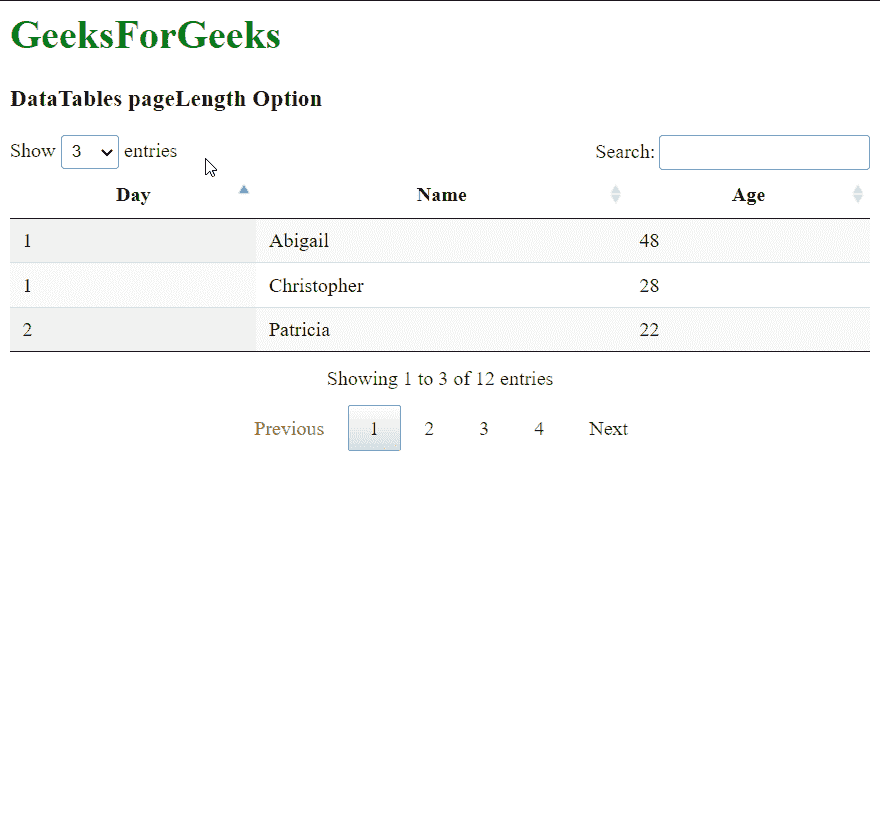
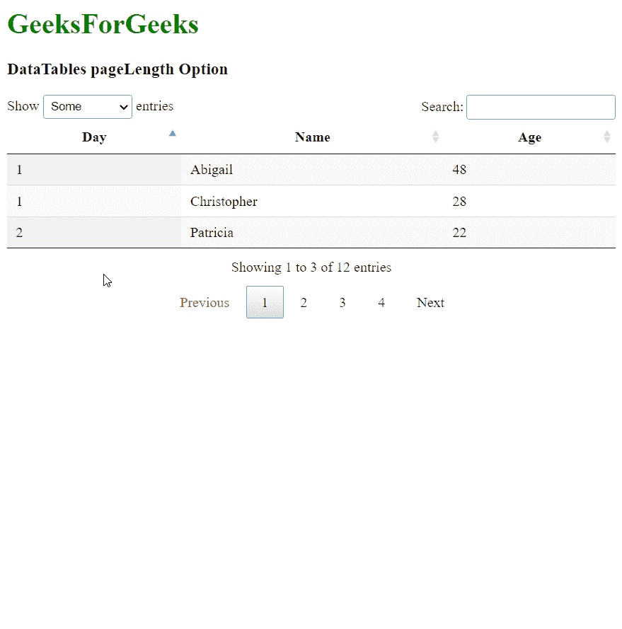

# 可约会语言选项

> 原文:[https://www.geeksforgeeks.org/datatables-lengthmenu-option/](https://www.geeksforgeeks.org/datatables-lengthmenu-option/)

**DataTables** 是 jQuery 插件，可用于为网页的 HTML 表格添加交互和高级控件。这也允许根据用户的需要搜索、排序和过滤表中的数据。数据表还公开了一个强大的应用编程接口，可以进一步用来修改数据的显示方式。

**长度菜单**选项用于指定下拉列表中可用的选项，该下拉列表控制启用分页时单页的行数。既可以用只允许指定行数的一维列表来指定，也可以用既允许指定行数又允许指定下拉列表中实际显示的文本的二维列表来指定。

指定的长度值必须是正数。指定的任何负值都将显示表中所有可用的行，并禁用分页。

**语法:**

```html
{ lengthMenu: value }
```

**参数:**该选项具有如上所述的单一值，如下所述:

*   **值:**这可以是一维或二维数组，用于确定分页长度菜单以及将显示的文本。

以下示例说明了该选项的使用。

**示例 1:** 在此示例中，一维数组用于指定选项下拉长度。

## 超文本标记语言

```html
<!DOCTYPE html>
<html>

<head>
  <!-- jQuery -->
  <script type="text/javascript" 
          src="https://code.jquery.com/jquery-3.5.1.js">
  </script>

  <!-- DataTables CSS -->
  <link rel="stylesheet"
        href=
"https://cdn.datatables.net/1.10.23/css/jquery.dataTables.min.css">

  <!-- DataTables JS -->
  <script src=
"https://cdn.datatables.net/1.10.23/js/jquery.dataTables.min.js">
  </script>
</head>

<body>
  <h1 style="color: green;">
    GeeksForGeeks
  </h1>
  <h3>DataTables pageLength Option</h3>

  <!-- HTML table with random data -->
  <table id="tableID" class="display nowrap">
    <thead>
      <tr>
        <th>Day</th>
        <th>Name</th>
        <th>Age</th>
      </tr>
    </thead>
    <tbody>
      <tr>
        <td>2</td>
        <td>Patricia</td>
        <td>22</td>
      </tr>
      <tr>
        <td>2</td>
        <td>Caleb</td>
        <td>47</td>
      </tr>
      <tr>
        <td>1</td>
        <td>Abigail</td>
        <td>48</td>
      </tr>
      <tr>
        <td>5</td>
        <td>Rahim</td>
        <td>44</td>
      </tr>
      <tr>
        <td>5</td>
        <td>Sheila</td>
        <td>22</td>
      </tr>
      <tr>
        <td>2</td>
        <td>Lance</td>
        <td>48</td>
      </tr>
      <tr>
        <td>5</td>
        <td>Erin</td>
        <td>48</td>
      </tr>
      <tr>
        <td>1</td>
        <td>Christopher</td>
        <td>28</td>
      </tr>
      <tr>
        <td>2</td>
        <td>Roary</td>
        <td>35</td>
      </tr>
      <tr>
        <td>4</td>
        <td>Mikasa</td>
        <td>48</td>
      </tr>
      <tr>
        <td>2</td>
        <td>Astra</td>
        <td>37</td>
      </tr>
      <tr>
        <td>5</td>
        <td>Eren</td>
        <td>48</td>
      </tr>
    </tbody>
  </table>

  <script>

    // Initialize the DataTable
    $(document).ready(function () {
      $('#tableID').DataTable({

        // Set the pagination length menu
        // to the given allowed sizes
        lengthMenu: [ 3, 5, 10 ]
      });
    }); 
  </script>
</body>

</html>
```

**输出:**



**示例 2:** 在此示例中，二维数组用于指定选项下拉长度和将用于选项的文本。

## 超文本标记语言

```html
<!DOCTYPE html>
<html>

<head>
  <!-- jQuery -->
  <script type="text/javascript" 
          src="https://code.jquery.com/jquery-3.5.1.js">
  </script>

  <!-- DataTables CSS -->
  <link rel="stylesheet"
        href=
"https://cdn.datatables.net/1.10.23/css/jquery.dataTables.min.css">

  <!-- DataTables JS -->
  <script src=
"https://cdn.datatables.net/1.10.23/js/jquery.dataTables.min.js">
  </script>
</head>

<body>
  <h1 style="color: green;">
    GeeksForGeeks
  </h1>
  <h3>DataTables pageLength Option</h3>

  <!-- HTML table with random data -->
  <table id="tableID" class="display nowrap">
    <thead>
      <tr>
        <th>Day</th>
        <th>Name</th>
        <th>Age</th>
      </tr>
    </thead>
    <tbody>
      <tr>
        <td>2</td>
        <td>Patricia</td>
        <td>22</td>
      </tr>
      <tr>
        <td>2</td>
        <td>Caleb</td>
        <td>47</td>
      </tr>
      <tr>
        <td>1</td>
        <td>Abigail</td>
        <td>48</td>
      </tr>
      <tr>
        <td>5</td>
        <td>Rahim</td>
        <td>44</td>
      </tr>
      <tr>
        <td>5</td>
        <td>Sheila</td>
        <td>22</td>
      </tr>
      <tr>
        <td>2</td>
        <td>Lance</td>
        <td>48</td>
      </tr>
      <tr>
        <td>5</td>
        <td>Erin</td>
        <td>48</td>
      </tr>
      <tr>
        <td>1</td>
        <td>Christopher</td>
        <td>28</td>
      </tr>
      <tr>
        <td>2</td>
        <td>Roary</td>
        <td>35</td>
      </tr>
      <tr>
        <td>4</td>
        <td>Mikasa</td>
        <td>48</td>
      </tr>
      <tr>
        <td>2</td>
        <td>Astra</td>
        <td>37</td>
      </tr>
      <tr>
        <td>5</td>
        <td>Eren</td>
        <td>48</td>
      </tr>
    </tbody>
  </table>

  <script>

    // Initialize the DataTable
    $(document).ready(function () {
      $('#tableID').DataTable({

        // Set the pagination length menu
        // to the given allowed sizes
        // and display the given labels
        lengthMenu: [
          [ 3, 5, 10, -1 ],
          [ "Some", "More", "Some More", "All"]
        ]
      });
    }); 
  </script>
</body>

</html>
```

**输出:**



**参考:**T2】https://datatables.net/reference/option/lengthMenu