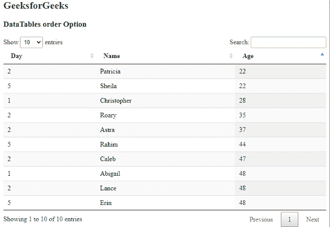
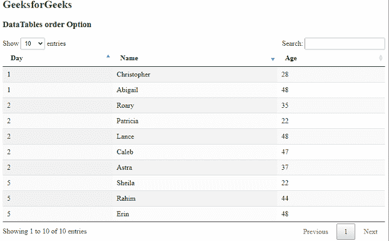

# 数据表顺序选项

> 原文:[https://www.geeksforgeeks.org/datatables-order-option/](https://www.geeksforgeeks.org/datatables-order-option/)

**DataTables** 是一个 jQuery 插件，可以用来为网页的 HTML 表格添加交互和高级控件。这也允许根据用户的需要搜索、排序和过滤表中的数据。数据表还公开了一个强大的应用编程接口，可以进一步用来修改数据的显示方式。

****选项用于指定数据表中需要排序的行及其方向。它接受一个二维数组，该数组允许同时在多列中指定排序。排序时，首先定义的列将被赋予更高的优先级。默认值为 *[[0，' asc']]* ，表示只有第一列按升序排序。****

******语法:******

```
**{ order: value }**
```

******参数:**该选项有一个如上所述的单一值，如下所述。****

*   ******值:**这是一个多维数组值，指定了要排序的行和列的方向。每个数组中的第一个值是要排序的列号，从“0”开始，第二个值是其方向，可以是值“ *asc* 或“ *desc* ”。****

******例 1:** 在本例中，第 3 列按升序排序。****

## ****超文本标记语言****

```
**<html>
<head>
  <!-- jQuery -->
  <script type="text/javascript" 
          src="https://code.jquery.com/jquery-3.5.1.js">
  </script>

  <!-- DataTables CSS -->
  <link rel="stylesheet"
        href=
"https://cdn.datatables.net/1.10.23/css/jquery.dataTables.min.css">

  <!-- DataTables JS -->
  <script src=
"https://cdn.datatables.net/1.10.23/js/jquery.dataTables.min.js">
  </script>
</head>
<body>
  <h1 style="color: green;">
    GeeksForGeeks
  </h1>
  <h3>DataTables order Option</h3>

  <!-- HTML table with random data -->
  <table id="tableID" class="display nowrap">
    <thead>
      <tr>
        <th>Day</th>
        <th>Name</th>
        <th>Age</th>
      </tr>
    </thead>
    <tbody>
      <tr>
        <td>2</td>
        <td>Patricia</td>
        <td>22</td>
      </tr>
      <tr>
        <td>2</td>
        <td>Caleb</td>
        <td>47</td>
      </tr>
      <tr>
        <td>1</td>
        <td>Abigail</td>
        <td>48</td>
      </tr>
      <tr>
        <td>5</td>
        <td>Rahim</td>
        <td>44</td>
      </tr>
      <tr>
        <td>5</td>
        <td>Sheila</td>
        <td>22</td>
      </tr>
      <tr>
        <td>2</td>
        <td>Lance</td>
        <td>48</td>
      </tr>
      <tr>
        <td>5</td>
        <td>Erin</td>
        <td>48</td>
      </tr>
      <tr>
        <td>1</td>
        <td>Christopher</td>
        <td>28</td>
      </tr>
      <tr>
        <td>2</td>
        <td>Roary</td>
        <td>35</td>
      </tr>
      <tr>
        <td>2</td>
        <td>Astra</td>
        <td>37</td>
      </tr>
    </tbody>
  </table>
  <script>

    // Initialize the DataTable
    $(document).ready(function () {
      $('#tableID').DataTable({

        // Set the 3rd column of the
        // DataTable to ascending order
        order: [[2, 'asc']]
      });
    }); 
  </script>
</body>
</html>**
```

******输出:******

********

******例 2:** 在本例中，第一列按升序排序，然后第二列按降序排序。****

## ****超文本标记语言****

```
**<html>
<head>
  <!-- jQuery -->
  <script type="text/javascript" 
          src="https://code.jquery.com/jquery-3.5.1.js">
  </script>

  <!-- DataTables CSS -->
  <link rel="stylesheet"
        href=
"https://cdn.datatables.net/1.10.23/css/jquery.dataTables.min.css">

  <!-- DataTables JS -->
  <script src=
"https://cdn.datatables.net/1.10.23/js/jquery.dataTables.min.js">
  </script>
  <style>
     th
      {
       text-align:left; 
      }
  </style>
</head>
<body>
  <h2 style="color:green;">
    GeeksForGeeks
  </h2>
  <h3>DataTables order Option</h3>

  <!-- HTML table with random data -->
  <table id="tableID" class="display nowrap">
    <thead>
      <tr>
        <th>Day</th>
        <th>Name</th>
        <th>Age</th>
      </tr>
    </thead>
    <tbody>
      <tr>
        <td>2</td>
        <td>Patricia</td>
        <td>22</td>
      </tr>
      <tr>
        <td>2</td>
        <td>Caleb</td>
        <td>47</td>
      </tr>
      <tr>
        <td>1</td>
        <td>Abigail</td>
        <td>48</td>
      </tr>
      <tr>
        <td>5</td>
        <td>Rahim</td>
        <td>44</td>
      </tr>
      <tr>
        <td>5</td>
        <td>Sheila</td>
        <td>22</td>
      </tr>
      <tr>
        <td>2</td>
        <td>Lance</td>
        <td>48</td>
      </tr>
      <tr>
        <td>5</td>
        <td>Erin</td>
        <td>48</td>
      </tr>
      <tr>
        <td>1</td>
        <td>Christopher</td>
        <td>28</td>
      </tr>
      <tr>
        <td>2</td>
        <td>Roary</td>
        <td>35</td>
      </tr>
      <tr>
        <td>2</td>
        <td>Astra</td>
        <td>37</td>
      </tr>
    </tbody>
  </table>
  <script>

    // Initialize the DataTable
    $(document).ready(function () {
      $('#tableID').DataTable({

        // Set the 1st column of the
        // DataTable to ascending order
        // and the 2nd to descending order
        order: [[0, 'asc'], [1, 'desc']]
      });
    }); 
  </script>
</body>
</html>**
```

******输出:******

****

第一列的升序和第二列的降序**** 

******参考链接:**[<u><u>https://datatables.net/reference/option/order</u></u>](https://datatables.net/reference/option/order)****