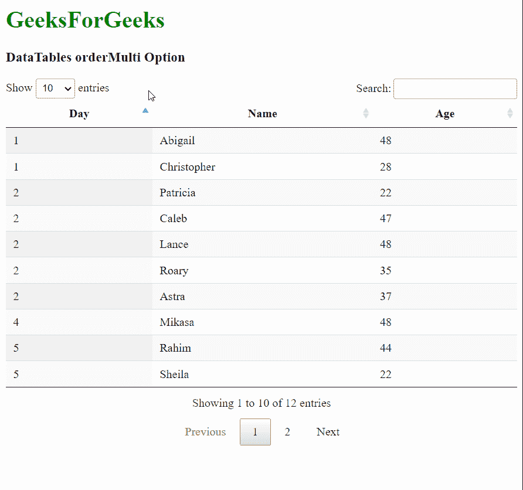
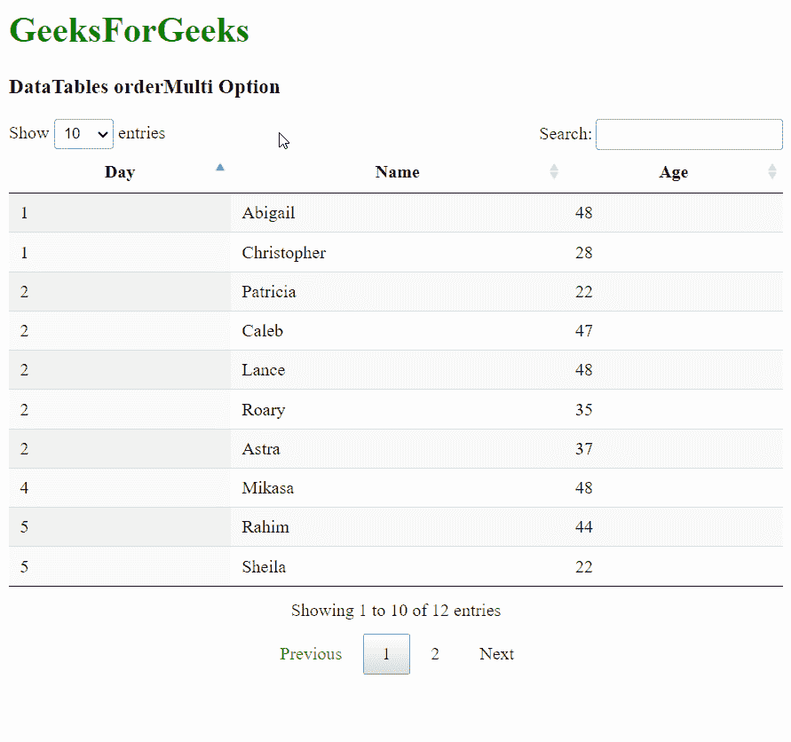

# 数据表订单多选项

> 原文:[https://www.geeksforgeeks.org/datatables-ordermulti-option/](https://www.geeksforgeeks.org/datatables-ordermulti-option/)

**DataTables** 是 jQuery 插件，可用于为网页的 HTML 表格添加交互和高级控件。这也允许根据用户的需要搜索、排序和过滤表中的数据。数据表还公开了一个强大的应用编程接口，可以进一步用来修改数据的显示方式。

**orderMulti** 选项用于指定是否可以一次对多列进行排序。数据表的默认行为允许通过按住 Shift 键并按需要排序的顺序单击标题单元格，一次对多列进行排序。但是，此功能增加了操作的复杂性，因为对多个列进行排序可能会导致旧系统或处理大型数据集时的性能问题。

请注意，此选项不阻止在表的 API 中使用其他方法，仅阻止用户这样做。

```
{ orderMulti: value }
```

**参数:**该选项具有如上所述的单一值，如下所述:

*   **值:**这是一个布尔值，用于指定用户是否允许将多列排序在一起。默认值为真。

以下示例说明了该选项的使用。

**示例 1:** 在此示例中，禁用了列的多重排序。

## 超文本标记语言

```
<!DOCTYPE html>
<html>

<head>
  <!-- jQuery -->
  <script type="text/javascript" 
          src="https://code.jquery.com/jquery-3.5.1.js">
  </script>

  <!-- DataTables CSS -->
  <link rel="stylesheet"
        href=
"https://cdn.datatables.net/1.10.23/css/jquery.dataTables.min.css">

  <!-- DataTables JS -->
  <script src=
          "https://cdn.datatables.net/1.10.23/js/jquery.dataTables.min.js">
  </script>
</head>

<body>
  <h1 style="color: green;">
    GeeksForGeeks
  </h1>
  <h3>DataTables orderMulti Option</h3>

  <!-- HTML table with random data -->
  <table id="tableID" class="display nowrap">
    <thead>
      <tr>
        <th>Day</th>
        <th>Name</th>
        <th>Age</th>
      </tr>
    </thead>
    <tbody>
      <tr>
        <td>2</td>
        <td>Patricia</td>
        <td>22</td>
      </tr>
      <tr>
        <td>2</td>
        <td>Caleb</td>
        <td>47</td>
      </tr>
      <tr>
        <td>1</td>
        <td>Abigail</td>
        <td>48</td>
      </tr>
      <tr>
        <td>5</td>
        <td>Rahim</td>
        <td>44</td>
      </tr>
      <tr>
        <td>5</td>
        <td>Sheila</td>
        <td>22</td>
      </tr>
      <tr>
        <td>2</td>
        <td>Lance</td>
        <td>48</td>
      </tr>
      <tr>
        <td>5</td>
        <td>Erin</td>
        <td>48</td>
      </tr>
      <tr>
        <td>1</td>
        <td>Christopher</td>
        <td>28</td>
      </tr>
      <tr>
        <td>2</td>
        <td>Roary</td>
        <td>35</td>
      </tr>
      <tr>
        <td>4</td>
        <td>Mikasa</td>
        <td>48</td>
      </tr>
      <tr>
        <td>2</td>
        <td>Astra</td>
        <td>37</td>
      </tr>
      <tr>
        <td>5</td>
        <td>Eren</td>
        <td>48</td>
      </tr>
    </tbody>
  </table>

  <script>

    // Initialize the DataTable
    $(document).ready(function () {
      $('#tableID').DataTable({

        // Disable the ordering of
        // multiple columns in the
        // DataTable
        orderMulti: false,
      });
    }); 
  </script>
</body>

</html>
```

**输出:**



**例 2:** 在本例中，启用了多列排序。

## 超文本标记语言

```
<!DOCTYPE html>
<html>

<head>
  <!-- jQuery -->
  <script type="text/javascript" 
          src="https://code.jquery.com/jquery-3.5.1.js">
  </script>

  <!-- DataTables CSS -->
  <link rel="stylesheet"
        href=
"https://cdn.datatables.net/1.10.23/css/jquery.dataTables.min.css">

  <!-- DataTables JS -->
  <script src=
          "https://cdn.datatables.net/1.10.23/js/jquery.dataTables.min.js">
  </script>
</head>

<body>
  <h1 style="color: green;">
    GeeksForGeeks
  </h1>
  <h3>DataTables orderMulti Option</h3>

  <!-- HTML table with random data -->
  <table id="tableID" class="display nowrap">
    <thead>
      <tr>
        <th>Day</th>
        <th>Name</th>
        <th>Age</th>
      </tr>
    </thead>
    <tbody>
      <tr>
        <td>2</td>
        <td>Patricia</td>
        <td>22</td>
      </tr>
      <tr>
        <td>2</td>
        <td>Caleb</td>
        <td>47</td>
      </tr>
      <tr>
        <td>1</td>
        <td>Abigail</td>
        <td>48</td>
      </tr>
      <tr>
        <td>5</td>
        <td>Rahim</td>
        <td>44</td>
      </tr>
      <tr>
        <td>5</td>
        <td>Sheila</td>
        <td>22</td>
      </tr>
      <tr>
        <td>2</td>
        <td>Lance</td>
        <td>48</td>
      </tr>
      <tr>
        <td>5</td>
        <td>Erin</td>
        <td>48</td>
      </tr>
      <tr>
        <td>1</td>
        <td>Christopher</td>
        <td>28</td>
      </tr>
      <tr>
        <td>2</td>
        <td>Roary</td>
        <td>35</td>
      </tr>
      <tr>
        <td>4</td>
        <td>Mikasa</td>
        <td>48</td>
      </tr>
      <tr>
        <td>2</td>
        <td>Astra</td>
        <td>37</td>
      </tr>
      <tr>
        <td>5</td>
        <td>Eren</td>
        <td>48</td>
      </tr>
    </tbody>
  </table>

  <script>

    // Initialize the DataTable
    $(document).ready(function () {
      $('#tableID').DataTable({

        // Enable the ordering of
        // multiple columns in the
        // DataTable
        orderMulti: true,
      });
    }); 
  </script>
</body>

</html>
```

**输出:**



**参考:**T2】https://datatables.net/reference/option/orderMulti