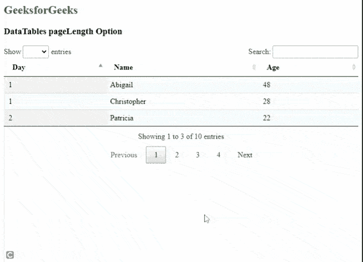
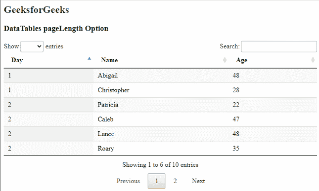

# 数据表页面长度选项

> 原文:[https://www.geeksforgeeks.org/datatables-pagelength-option/](https://www.geeksforgeeks.org/datatables-pagelength-option/)

**DataTables** 是 jQuery 插件，可用于为网页的 HTML 表格添加交互和高级控件。这也允许根据用户的需要搜索、排序和过滤表中的数据。数据表还公开了一个强大的应用编程接口，可以进一步用来修改数据的显示方式。

***【pa】*****【ge】*****【长度】*** 选项用于指定要在一页上显示的表格行数。当分页用于显示许多行时，此选项是相关的。它接受一个整数值，表示要显示的行数。

**语法:**

```html
{ pageLength: value }
```

**参数:**该选项有一个如上所述的单一值，如下所述。

*   **值:**这是一个整数值，指定要显示的行数。默认值为 10。

以下示例说明了该选项的用法。

**示例 1:** 该示例演示了将每页的行数设置为 3。

## 超文本标记语言

```html
<html>
<head>
  <!-- jQuery -->
  <script type="text/javascript" 
          src="https://code.jquery.com/jquery-3.5.1.js">
  </script>

  <!-- DataTables CSS -->
  <link rel="stylesheet"
        href=
"https://cdn.datatables.net/1.10.23/css/jquery.dataTables.min.css">

  <!-- DataTables JS -->
  <script src=
"https://cdn.datatables.net/1.10.23/js/jquery.dataTables.min.js">
  </script>
  <style>
    th
    {
       text-align:left;
    }
  </style>
</head>
<body>
  <h2 style="color:green;">
    GeeksForGeeks
  </h2>
  <h3>DataTables pageLength Option</h3>

  <!-- HTML table with random data -->
  <table id="tableID" class="display nowrap">
    <thead>
      <tr>
        <th>Day</th>
        <th>Name</th>
        <th>Age</th>
      </tr>
    </thead>
    <tbody>
      <tr>
        <td>2</td>
        <td>Patricia</td>
        <td>22</td>
      </tr>
      <tr>
        <td>2</td>
        <td>Caleb</td>
        <td>47</td>
      </tr>
      <tr>
        <td>1</td>
        <td>Abigail</td>
        <td>48</td>
      </tr>
      <tr>
        <td>5</td>
        <td>Rahim</td>
        <td>44</td>
      </tr>
      <tr>
        <td>5</td>
        <td>Sheila</td>
        <td>22</td>
      </tr>
      <tr>
        <td>2</td>
        <td>Lance</td>
        <td>48</td>
      </tr>
      <tr>
        <td>5</td>
        <td>Erin</td>
        <td>48</td>
      </tr>
      <tr>
        <td>1</td>
        <td>Christopher</td>
        <td>28</td>
      </tr>
      <tr>
        <td>2</td>
        <td>Roary</td>
        <td>35</td>
      </tr>
      <tr>
        <td>2</td>
        <td>Astra</td>
        <td>37</td>
      </tr>
    </tbody>
  </table>
  <script>

    // Initialize the DataTable
    $(document).ready(function () {
      $('#tableID').DataTable({

        // Set the number of rows to be 
        // displayed per page on the DataTable
        pageLength: 3
      });
    }); 
  </script>
</body>
</html>
```

**输出:**



**示例 2:** 该示例演示了将每页的行数设置为 6。

## 超文本标记语言

```html
<!DOCTYPE html>
<html>

<head>
  <!-- jQuery -->
  <script type="text/javascript" 
     src="https://code.jquery.com/jquery-3.5.1.js">
  </script>

  <!-- DataTables CSS -->
  <link rel="stylesheet"
        href=
"https://cdn.datatables.net/1.10.23/css/jquery.dataTables.min.css">

  <!-- DataTables JS -->
  <script src=
"https://cdn.datatables.net/1.10.23/js/jquery.dataTables.min.js">
  </script>
  <style>
    th {
      text-align:left; 
    }
  </style>
</head>

<body>
  <h2 style="color:green;">
    GeeksForGeeks
  </h2>
  <h3>DataTables pageLength Option</h3>

  <!-- HTML table with random data -->
  <table id="tableID" class="display nowrap">
    <thead>
      <tr>
        <th>Day</th>
        <th>Name</th>
        <th>Age</th>
      </tr>
    </thead>
    <tbody>
      <tr>
        <td>2</td>
        <td>Patricia</td>
        <td>22</td>
      </tr>
      <tr>
        <td>2</td>
        <td>Caleb</td>
        <td>47</td>
      </tr>
      <tr>
        <td>1</td>
        <td>Abigail</td>
        <td>48</td>
      </tr>
      <tr>
        <td>5</td>
        <td>Rahim</td>
        <td>44</td>
      </tr>
      <tr>
        <td>5</td>
        <td>Sheila</td>
        <td>22</td>
      </tr>
      <tr>
        <td>2</td>
        <td>Lance</td>
        <td>48</td>
      </tr>
      <tr>
        <td>5</td>
        <td>Erin</td>
        <td>48</td>
      </tr>
      <tr>
        <td>1</td>
        <td>Christopher</td>
        <td>28</td>
      </tr>
      <tr>
        <td>2</td>
        <td>Roary</td>
        <td>35</td>
      </tr>
      <tr>
        <td>2</td>
        <td>Astra</td>
        <td>37</td>
      </tr>
    </tbody>
  </table>
  <script>

    // Initialize the DataTable
    $(document).ready(function () {
      $('#tableID').DataTable({

        // Set the number of rows to be 
        // displayed per page on the DataTable
        pageLength: 6
      });
    }); 
  </script>
</body>

</html>
```

**输出:**



页面长度为 6

**参考链接:**[https://datatables.net/reference/option/pageLength](https://datatables.net/reference/option/pageLength)