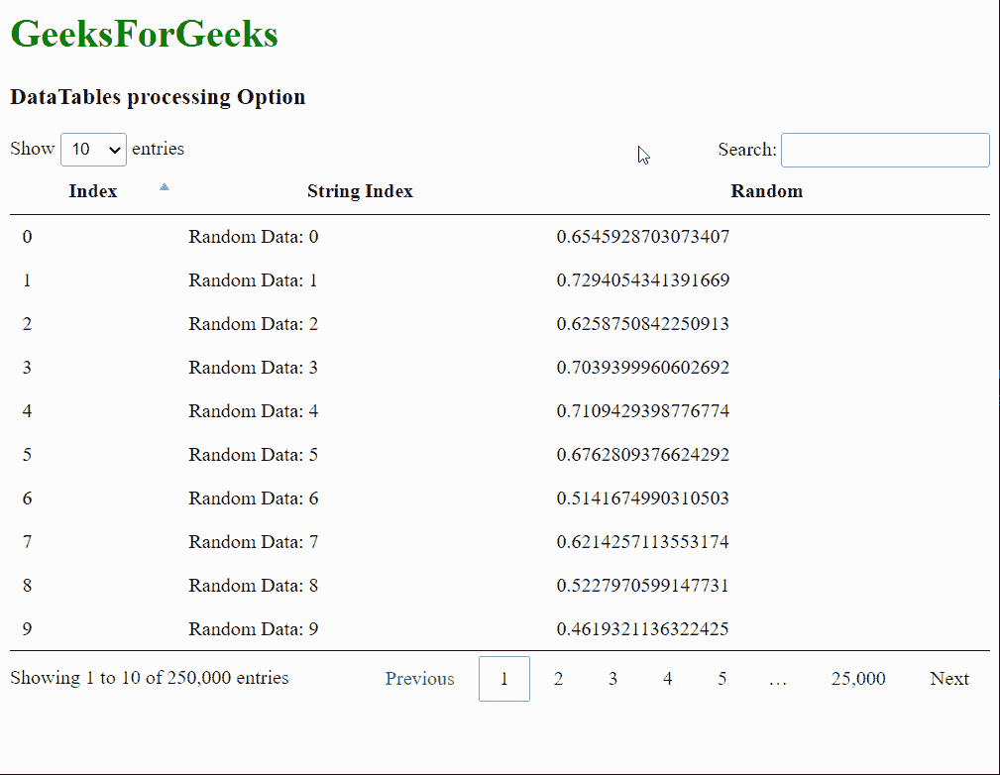

# 数据表处理选项

> 原文:[https://www.geeksforgeeks.org/datatables-processing-option/](https://www.geeksforgeeks.org/datatables-processing-option/)

**DataTables** 是 jQuery 插件，可用于为网页的 HTML 表格添加交互和高级控件。这也允许根据用户的需要搜索、排序和过滤表中的数据。数据表还公开了一个强大的应用编程接口，可以进一步用来修改数据的显示方式。

**加工**选项用于指定加工指示器是否启用。当数据表忙于执行一些需要花费一些时间的操作时，会显示此指示器。这对于具有大量数据并且需要花费大量时间来执行任何操作的表非常有用。该指示器将能够通知用户操作正在进行并且没有卡住。一个**真**值显示指示器，一个**假**值删除指示器。

**语法:**

```html
{ processing: value }
```

**选项值:**该选项具有如上所述的单一值，如下所述:

*   **值:**这是一个布尔值，指定是否启用处理指示器。默认值为假。

以下示例说明了该选项的使用。

**示例 1:** 本示例启用在对列进行排序时可以看到的处理指示器。

## 超文本标记语言

```html
<html>

<head>
    <!-- jQuery -->
    <script type="text/javascript" 
    src="https://code.jquery.com/jquery-3.5.1.js">
    </script>

    <!-- DataTables CSS -->
    <link rel="stylesheet" href=
"https://cdn.datatables.net/1.10.23/css/jquery.dataTables.min.css">

    <!-- DataTables JS -->
    <script src=
"https://cdn.datatables.net/1.10.23/js/jquery.dataTables.min.js">
    </script>
</head>

<body>
    <h1 style="color: green;">
        GeeksForGeeks
    </h1>
    <h3>DataTables processing Option</h3>

    <!-- HTML table with student data -->
    <table id="tableID" class="display" 
        style="width: 100%;">
    </table>

    <script>

        // Initialize a huge dataset to 
        // see the effects of processing
        let dataset = [];
        for (let i = 0; i < 250000; i++) {
            let newArr =
                [i, "Random Data: " + i, Math.random()];
            dataset.push(newArr);
        }

        // Initialize the DataTable
        $(document).ready(function () {
            $('#tableID').DataTable({

                // Add the data created above
                data: dataset,
                columns: [
                    { title: "Index" },
                    { title: "String Index" },
                    { title: "Random" },
                ],

                // Enable the processing indicator
                // of the DataTable
                processing: true,
            });
        });
    </script>
</body>

</html>
```

**输出:**


**示例 2:** 本示例禁用处理指示器。

## 超文本标记语言

```html
<html>

<head>
    <!-- jQuery -->
    <script type="text/javascript" 
    src="https://code.jquery.com/jquery-3.5.1.js">
    </script>

    <!-- DataTables CSS -->
    <link rel="stylesheet" href=
"https://cdn.datatables.net/1.10.23/css/jquery.dataTables.min.css">

    <!-- DataTables JS -->
    <script src=
"https://cdn.datatables.net/1.10.23/js/jquery.dataTables.min.js">
    </script>
</head>

<body>
    <h1 style="color: green;">GeeksForGeeks</h1>
    <h3>DataTables processing Option</h3>

    <!-- HTML table with student data -->
    <table id="tableID" class="display"
        style="width: 100%;">
    </table>

    <script>

        // Initialize a huge dataset to 
        // see the effects of processing
        let dataset = [];
        for (let i = 0; i < 250000; i++) {
            let newArr =
                [i, "Random Data: " + i, Math.random()];
            dataset.push(newArr);
        }

        // Initialize the DataTable
        $(document).ready(function () {
            $('#tableID').DataTable({

                // Add the data created above
                data: dataset,
                columns: [
                    { title: "Index" },
                    { title: "String Index" },
                    { title: "Random" },
                ],

                // Disable the processing indicator
                // of the DataTable
                processing: false,
            });
        });
    </script>
</body>

</html>
```

**输出:**

