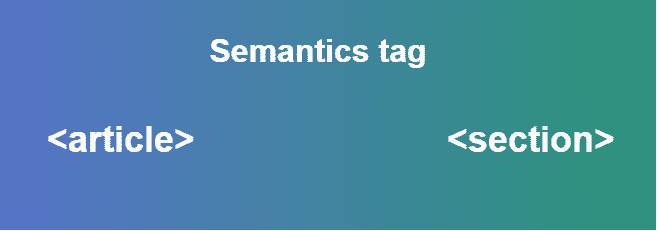
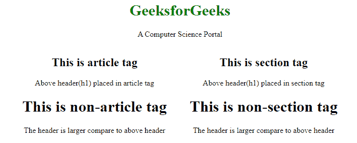

# 标记

<article>和

<section>标记</section>

</article>

T5 的区别

> 原文:[https://www . geeksforgeeks . org/文章标签和章节标签的区别/](https://www.geeksforgeeks.org/difference-between-article-tag-and-section-tag/)


这两个标签都是 HTML 5 中的[语义标签](https://www.geeksforgeeks.org/html5-semantics/)。在本文中，我们将讨论<文章>和<部分>标签的行为。<文章>和<部分>标签都以类似的方式表示，但用于某种意义，这种意义是针对浏览器和开发人员的。两个标签可以相互替换，因为输出不会有任何变化，但是开发者和浏览器很难理解如何对这些内容进行操作。

**[<文章>标签](https://www.geeksforgeeks.org/html5-article-tag/) :** 该标签包含独立内容，不需要任何其他上下文。所以<条>标签可以放在主要内容里面。但是每篇文章都包含独立的内容。就像 YouTube 过去在单个页面上包含不同种类的视频，每个视频都是独立的或者你可以看到**的课程页面 [GeeksforGeeks](https://practice.geeksforgeeks.org/courses/?source=google&medium=cpc&device=c&keyword=geeksforgeeks&matchtype=b&campaignid=6466814875&adgroup=72721078250&gclid=Cj0KCQiAjfvwBRCkARIsAIqSWlMmZnITT_okjwXx7tWfh0CDiPwgRxUtHNzazuyahl2-hIHdXB9CQLUaAo0JEALw_wcB)** 每个课程都是独立的，每个课程都可以有自己的页面。
**功能:**

*   一个项目可以有嵌套项目，并且应该引用父项目。
*   文章标签非常适合微数据信息。

**[<版块>标签](https://www.geeksforgeeks.org/html-section-tag/) :** 该标签用于将页面拆分为简介、联系信息、详细信息等版块，每个版块可以位于不同的<版块>标签中。<部分>标签的引入是为了包装特定部分的东西。<节>标签将内容分为节和子节。当需要两个页眉或页脚或文档的任何其他部分时，使用节标签。区段标签将相关内容的通用块分组。
**特征:**

*   一个节可以有嵌套节

**注意:**将<物品>标签放置在<版块>标签里面是一个很好的做法，like 版块基本上定义了类型，物品会包含该类型版块中的具体内容。

**示例:**在本例中，我们将根据标签的行为使用标签，如包含独立内容列表的文章，部分标签将包含网页上的特定部分。

```htmlhtml
<!DOCTYPE html>
<!DOCTYPE html>
<html>

<head>
    <title>
        article tag over section tag
    </title>

    <style>
        .container {
            width: 650px;
            height: auto;
        }
        .section {
            float: right;
        }
        .article {
            float: left;
        }
        h1 {
            color: green;
        }
    </style>
</head>

<body>
    <center>
        <h1>GeeksforGeeks</h1>
        <p>A Computer Science Portal</p>
        <div class="container">
            <div class="article">
                <article>
                    <h2>This is article tag</h2>
                    <p>
                        Above header(h2) placed
                        in article tag
                    </p>
                </article>
                <h2>This is non-article tag</h2>
                <p>
                    The header is larger compare
                    to above header
                </p>
            </div>

            <div class="section">
                <section>
                    <h2>This is section tag</h2>
                    <p>
                        Above header(h2) placed
                        in section tag
                    </p>
                </section>
                <h2>This is non-section tag</h2>
                <p>
                    The header is larger compare
                    to above header
                </p>
            </div>
        </div>
    </center>
</body>

</html>
```

**输出:**


**二选一:**

*   **<部分>标签:**当你只想修饰页面中的任何内容，即你想添加一些功能时，你可以使用<部分>标签，也可以用< div >标签来代替。当任何网页的内容适合内容大纲，而浏览器不关注大纲时，节标签就很好。
*   **<物品>标签:**<物品>标签是一个自行完成的标签，这可以用于其中任何一个原因，其中<部分>标签需要加上<物品>标签独立放置内容。文章标签可用于放置任何社交帖子、杂志文章、博客、相关内容列表、任何独立内容。

**标签为:**

*   如果你的内容材料包含日期、价格、作者、描述等，那就去找文章标签。基本上使用一个文章标签来包含可以共享的内容，对于实际的文章来说显然是这样的。用它们包装你的博客文章。
*   如果您的内容包含任何类型的过程来制作或创建将依赖于某个内容的内容，那么当它描述您的文档大纲将包括什么内容时，请使用像 div 这样的节标签。