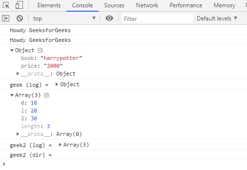

# 控制台目录和控制台日志的区别

> 原文:[https://www . geesforgeks . org/console-dir-and-console-log-2/](https://www.geeksforgeeks.org/difference-between-console-dir-and-console-log-2/)之间的差异

**控制台对象**:控制台对象提供对浏览器调试控制台的访问，使用 **F12** 或 **ctrl+shift+j** 即可看到。控制台对象包含许多方法，其中使用最多的是 log()和 dir()。

**console.log()** 方法向用户打印出控制台中对象的 toString 表示。
**语法:**

```html
console.log(object) or console.log("string", object)
```

**console.dir()** 方法将控制台中指定对象的对象属性列表输出给用户。
**语法:**

```html
console.dir(object)
```

简单来说， **console.log()** 以字符串形式返回对象， **console.dir()** 将对象识别为对象并输出其属性。log()和 dir()都将字符串作为字符串返回。

**示例:**

```html
<!DOCTYPE html>
<html>

<head>

    <script>
        var str = "Howdy GeeksforGeeks"
        var geek = {
            book: "harrypotter",
            price: "2000"
        };
        var geek2 = [10, 20, 30];
        console.log(str);
        console.dir(str);
        console.dir(geek);
        console.log("geek (log) = ", geek);
        console.dir(geek2);
        console.log("geek2 (log) = ", geek2);

        // Prints only string as dir() takes
        // only one parameter.
        console.dir("geek2 (dir) = ", geek2);
    </script>
</head>

</html>
```

**输出:**


在上面的代码中，`log()`打印对象的*到字符串表示*，而`dir()`识别对象并只打印其属性。

上面的程序是在 chrome 中运行的，所以 **log()** 会将树和字符串信息一起打印出来，但是如果在 firefox 中运行 **log()** 只会将字符串表示信息打印出来，而 **dir()** 在任何地方都是一样的。

在代码 **console.dir 中可以看到(“geek2 (dir) =”，geek 2)；**只打印字符串部分，不打印对象属性，因为 dir()只接受一个参数，并将字符串视为传递给方法的唯一参数，而 log()接受任意数量的参数。