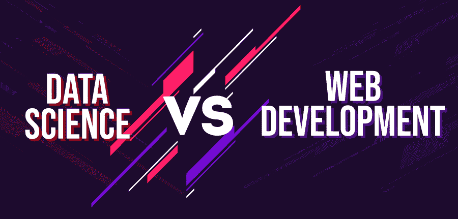

# 数据科学与 Web 开发的区别

> 原文:[https://www . geesforgeks . org/data-science-and-web-development 之间的差异/](https://www.geeksforgeeks.org/difference-between-data-science-and-web-development/)

**数据科学:**数据科学是结合领域专业知识、编程技能以及数学和统计知识，从数据中提取有意义见解的研究领域。
数据科学从业者将机器学习算法应用于数字、文本、图像、视频、音频等，以产生人工智能系统来执行通常需要人类智能的任务。反过来，这些系统产生的见解，分析师和业务用户可以转化为有形的业务价值。

**Web 开发:** Web 开发是指建立、创建和维护网站。它包括网页设计、网页发布、网页编程和数据库管理等方面。
网络开发用于创建运行在远程服务器上的网络应用程序，我们可以通过互联网浏览器访问这些应用程序。

下面是数据科学和网络开发之间的差异表:

<figure class="table">

| [Data Science] | 网络开发 |
| --- | --- |
| The term data science was first created in 2001. | The word network development first appeared in 1989. |
| At present, there are more than 3 million data scientists in the world. | At present, there are more than 23 million network developers around the world. |
| The average salary of scientists exceeds $94,000. | The average salary of network developers exceeds 75,000 dollars. |
| It is a combination of mathematics, statistics and algorithms to analyze data. | It is the creation of network applications that we see on the Internet. |
| Is the biggest premise of data science. | The design of Web application and its characteristics is the greatest premise of Web development. |
| Knowledge of statistics and mathematics is required. | No knowledge of statistics and mathematics is required. |
| Running machine learning and deep learning algorithms on large data sets requires high processing power. | Compared with data science, the processing power required to run network applications is lower. |
| The programming languages used in data science include Python, R, MATLAB, etc. | Programming languages used in Web development include HTML, CSS, JavaScript, SQL, Java, etc. |

</figure>