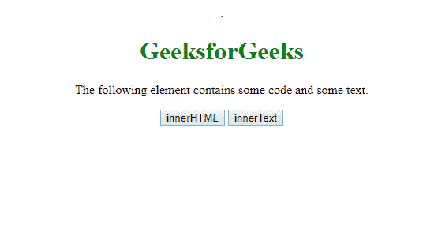
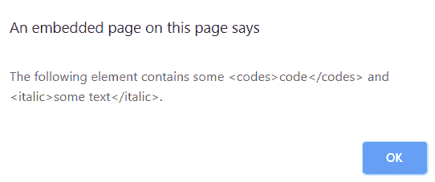

# 内部文本和内部 HTML 的区别

> 原文:[https://www . geeksforgeeks . org/inner text 和-innerhtml 之间的区别/](https://www.geeksforgeeks.org/difference-between-innertext-and-innerhtml/)

**[innerText](https://www.geeksforgeeks.org/html-dom-innertext-property/)** 和 **[innerHTML](https://www.geeksforgeeks.org/html-dom-innerhtml-property/)** 都是 JavaScript 的属性。但是，处理文本的方式有所不同。让我们检查两者的语法，然后举一个例子来看看它们的区别。

**语法:**
假设我们有一个叫做 x 的 JavaScript 变量。

```html
var x = document.getElementById('test');
```

下面是我们如何在这个变量上使用 innerText 和 innerHTML。

*   **【内文】**

    ```html
    x.innerText
    ```

*   **内部 HTML**

    ```html
    x.innerHTML
    ```

**示例:**

```html
<!DOCTYPE html>
<html>

<head>
    <title>
        Difference between 
      InnerHTML and InnerText
    </title>
</head>

<body style="text-align:center;">

  <h1 style="color:green">GeeksforGeeks</h1>

    <div id="test">
        The following element contains some
        <codes>code</codes> and
        <italic>some text</italic>.
    </div>
    <p></p>
    <button onClick="innerTextFn()">
        innerHTML
    </button>
    <button onClick="innerHTMLFn()">
        innerText
    </button>
    <p id="op"></p>

    <script>
        function innerTextFn() {
            var x = document.getElementById('test');
            alert(x.innerText);
        }

        function innerHTMLFn() {
            var x = document.getElementById('test');
            alert(x.innerHTML);
        }
    </script>
</body>

</html>
```

**输出**
**点击前:**


**之后点击 innerHTML:**


**之后点击**


**差异:**
从上面的例子中我们可以看到 **innerText** 属性**设置**或**返回**文本内容作为指定节点的纯文本，及其所有后代，而 innerHTML 属性获取并设置元素中的纯文本或 HTML 内容。与内部文本不同，内部 HTML 允许您处理 HTML 富文本，并且不会自动编码和解码文本。