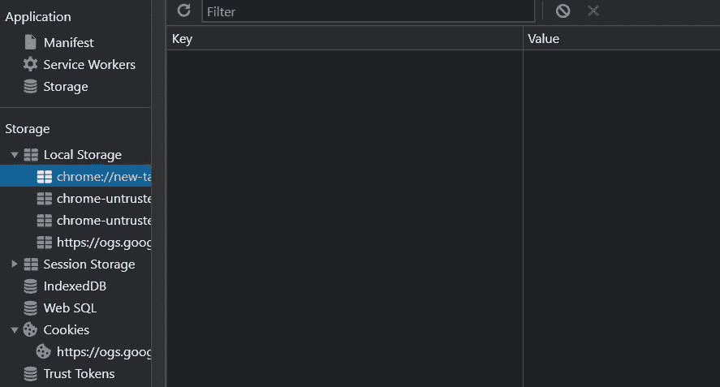
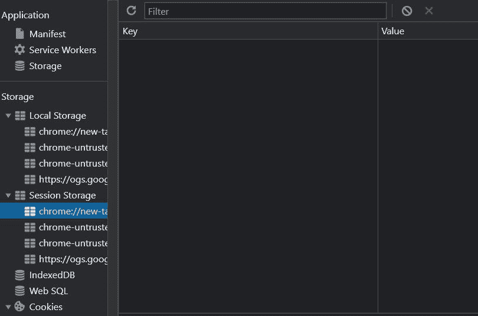

# 本地存储、会话存储和 Cookies 之间的区别

> 原文:[https://www . geeksforgeeks . org/本地存储会话存储和 cookies 之间的区别/](https://www.geeksforgeeks.org/difference-between-local-storage-session-storage-and-cookies/)

HTTP 协议是服务器和客户端之间实现流畅通信的最重要协议之一。HTTP 协议的主要缺点它是一个无状态协议，这意味着它不跟踪服务器和客户端的任何类型的响应和请求信息，因此为了解决这个问题，有三种方法来跟踪有用的信息在本文中，我们将看到本地存储、会话存储和 Cookies 之间的区别，以及为什么对网络开发人员来说了解这些术语很重要。

**本地存储:**该只读接口属性提供对文档本地存储对象的访问，存储的数据跨浏览器会话存储。与 sessionStorage 类似，只是 localStorage 数据在页面会话结束时(即页面关闭时)被清除。当浏览器的最后一个“私人”标签关闭时，它被清除(在私人浏览或匿名会话中加载的文档的本地存储数据)。

DOMStrings 是使用 UTF-16 编码数据的存储格式，每个字符使用两个字节。字符串是从整数键自动生成的，就像它们对于对象一样。存储在本地存储中的数据特定于文档中的协议。如果站点是通过 HTTP 加载的(例如 http://example.com)，localStorage 返回的对象与通过 HTTPS 加载的对象不同(例如 https://abc.com)。

如果文档是从文件:URL 加载的(也就是说，直接从用户的本地文件系统加载，而不是从服务器加载)，对行为的要求是未定义的，并且可能因不同的浏览器而异。在当前所有浏览器中，每个文件似乎都由本地存储返回一个不同的对象。本质上，这似乎是每个网址的一种情况:文件有自己独特的本地存储区域。

这种行为无法保证，因为如上所述，文件:网址的要求仍然不清楚。因此，浏览器随时都有可能改变处理文件的方式。一些浏览器处理它的方式已经发生了变化。

**本地存储有 4 种方式:**

*   **setItem()方法–**该方法采用两个参数，一个是键，另一个是值。它用于将值与键的名称一起存储在特定位置。

    ```html
    localStorage.setItem(key, value)
    ```

*   **getitem()方法–**该方法采用一个参数，该参数是用于获取以特定键名存储的值的键。

    ```html
    localStorage.getItem(key)
    ```

*   **removeItem()方法–**该方法用于移除存储在内存中的与键相关的值。

    ```html
    localStorage.removeItem(key)
    ```

*   **清除()方法–**该方法用于清除本地存储中存储的所有值。

    ```html
    localStorage.clear()
    ```



本地存储面板的图像

**什么是会话存储？**

可以使用会话存储只读属性来访问会话存储对象。sessionStorage 和 localStorage 的区别在于 localStorage 数据不会过期，而 sessionStorage 数据会在页面会话结束时清除。

一旦将文档加载到浏览器选项卡中，就会创建唯一的页面会话。页面会话一次只对一个选项卡有效。页面仅在选项卡或浏览器打开的时间内保存；它们不会在页面重新加载和恢复后持续存在。每次打开选项卡或窗口时都会创建一个新会话；这不同于会话 cookies。使用相同网址打开的每个选项卡/窗口都会创建自己的会话存储。复制选项卡时，原始选项卡中的会话存储会复制到复制的选项卡中。关闭窗口/选项卡会结束会话并清除会话存储对象。

页面的协议决定了什么数据存储在会话存储中。特别是，通过 HTTP 访问的脚本存储的数据(例如，http://abc.com)存储在与通过 HTTPS 访问的同一站点(例如，https://abc.com)不同的对象中。在 UTF-16 多字符串格式中，多字符串数字是每个字符两个字节。字符串是从整数键自动生成的，就像它们对于对象一样。

**会话存储有 4 种方式:**

*   **setItem()方法–**该方法采用两个参数，一个是键，另一个是值。它用于将值与键的名称一起存储在特定位置。

    ```html
    sessionStorage.setItem(key, value)
    ```

*   **getitem()方法–**该方法采用一个参数，该参数是用于获取以特定键名存储的值的键。

    ```html
    sessionStorage.getItem(key)
    ```

*   **removeItem()方法–**该方法用于移除存储在内存中的与键相关的值。

    ```html
    sessionStorage.removeItem(key)
    ```

*   **清除()方法–**该方法用于清除会话存储器

    ```html
    sessionStorage.clear()
    ```

    中存储的所有值



会话存储图像

**Cookie:** 术语“Cookie”仅指网站的文本信息。为了识别您并根据您的喜好向您显示结果，当您访问特定网站时，该网站会将一些信息保存在您的本地系统中。互联网的历史很早就以使用 cookies 为标志。网站访问者在访问时向服务器请求网页。对服务器的每个请求都是唯一的。同样，如果您访问一百次，服务器会认为每个请求都是唯一的。由于服务器每秒钟都会收到许多请求，因此将每个用户的信息存储在服务器上似乎是合乎逻辑且显而易见的。如果您不返回，可能不再需要相同的信息。因此，一个 cookie 被发送并存储在您的本地机器上，以唯一地识别您。下次你点击它时，你会收到来自同一台服务器的响应，因为它会识别你。几乎每台服务器都使用这个 cookie(由于广告，今天存在一些例外)。因此，尽管您的系统中可能有许多 cookie，但服务器会识别并分析这些 cookie。

当 cookies 最初被开发时，它们被用来改善开发者的体验。考虑访问一个非母语网站(比如英语)。您可以从网站的语言部分选择英语作为您的语言。如果你访问同一个网站五次，一天可能需要换五次语言。因此，这些详细信息存储在系统的 cookie 中。这可以确保服务器知道您希望在下次发送请求时查看英文网站。饼干在这方面至关重要。今天使用的刻度饼干比上面的例子小得多。


饼干的形象

**本地存储、会话存储**、**和 cookie**

<figure class="table">

| local-storage | Session storage | 甜饼干 |
| --- | --- | --- |
| The storage capacity of local storage is 5MB/10MB. | The storage capacity of the session is 5MB. | The storage capacity of cookie is 4KB. |
| This means that the data is stored only during the session, that is, until the browser (or tag) is closed. | Cookie expire according to the settings and working conditions of each tab and window. |
| Clients can only read local storage. | Clients can only read local storage. | Both client and server can read and write cookie. |
| No data was transmitted to the server | No data was transmitted to the server | Data transmission to the server exists. |
| There are fewer old browsers that support it. | There are fewer old browsers that support it. | It is supported by all browsers, including older browsers. |

</figure>