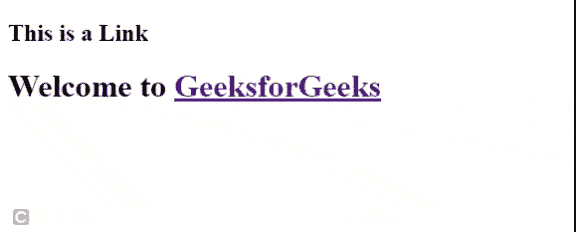
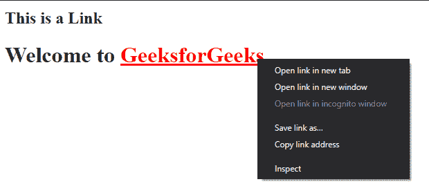

# 正常链接和活动链接的区别

> 原文:[https://www . geesforgeks . org/正常链接和活动链接之间的区别/](https://www.geeksforgeeks.org/difference-between-normal-links-and-active-links/)

网站旨在向您指出不同的资源。你可以通过链接从一个网站转到另一个网站。链接帮助您从不同的资源中获取信息。通过 [<一个>](https://www.geeksforgeeks.org/html-a-tag/) 标签在简单的 HTML 网页中建立链接。
链接分为三种类型。通常，链接会根据使用情况以三种不同的颜色显示。

*   普通链接(未访问的链接)
*   已访问的链接
*   活动链接

**示例 1:** 以下示例显示了普通链接(未访问链接)的基本示例。如果你想创建一个链接去[https://www.geeksforgeeks.org/](https://www.geeksforgeeks.org/)，你可以通过这个代码得到正常的链接。默认颜色是蓝色和下划线，但是您可以根据应用程序的需要应用自己的自定义样式。

## 超文本标记语言

```html
<!DOCTYPE html>
<html>

<body>
    <h2>This is a Link</h2>
    <h1>
        Welcome to
        <a href="https://www.geeksforgeeks.org/">
            GeeksforGeeks
        </a>
    </h1>
</body>

</html>
```

**输出:**



**已访问的链接:**在示例 1 中，如果您单击上面显示的链接并再次返回到链接页面，您现在可以看到该链接是紫色并带有下划线。它显示用户以前访问过此链接。您可以使用 [CSS **进行自定义造型:已访问**](https://www.geeksforgeeks.org/css-visited-selector/) 选择器。在上面的输出中，请注意从主页返回后的访问链接。


**活动链接:**在示例 1 中，如果您左键或右键单击任何一个已访问或未访问的链接，它将变成红色和下划线。活动链接显示浏览器正在加载新资源。您可以使用 [CSS:活动选择器](https://www.geeksforgeeks.org/css-active-selector/)进行自定义造型。在上面的输出中，请注意右键单击链接时的活动链接。



几乎所有浏览器都支持