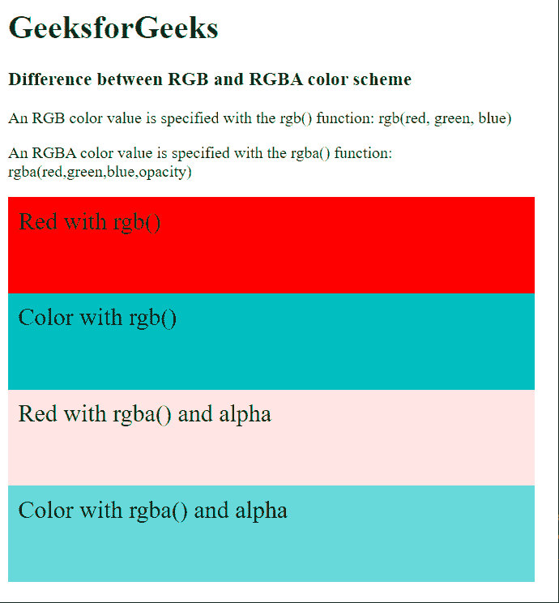

# RGB 与 RGBA 颜色格式的差异

> 原文:[https://www . geesforgeks . org/difference-RGB-vs-rgba-color-format/](https://www.geeksforgeeks.org/difference-between-rgb-vs-rgba-color-format/)

在本文中，我们将详细讨论 RGB 和 RGBA 配色方案之间的差异。我们也将看到如何在 CSS 中使用这些方案。

**RGB 配色方案:**是包含红、绿、蓝三种颜色数据的三通道格式。在 CSS 中，可以使用以下命令指定 RGB 颜色格式:

```
rgb(red, green, blue)
```

**rgb()** 函数中的每个参数定义了 0 到 255 范围内的颜色强度。值 0 不定义正在使用的颜色类型，而 255 定义正在使用的颜色的最高值。

**RGBA 配色方案:**RGBA 配色格式是 RGB 配色方案的扩展，增加了指定颜色不透明度的 alpha 通道。在 CSS 中，可以使用以下命令指定 RGBA 颜色格式:

```
rgba(red, green, blue, alpha)
```

alpha 值被声明为从 0 到 1 的十进制数，其中 0 是完全透明的，1 是完全不透明的。

下面的例子演示了这两种配色方案的区别。

**示例:**

## 超文本标记语言

```
<html>
<head>
  <style>
    div {
      height: 75px;
      width: 500px;
      padding: 10px;
      font-size: 1.5rem;
    }

    #div1 {
      background-color: rgb(255, 0, 0);
    }

    #div2 {
      background-color: rgb(0, 192, 192);
    }

    #div3 {
      background-color: rgb(255, 0, 0, 0.1);
    }

    #div4 {
      background-color: rgb(0, 192, 192, 0.6);
    }
  </style>
</head>
<body>
  <h1 style="color: green">
    GeeksforGeeks
  </h1>
  <h3>
    Difference between RGB and 
    RGBA color scheme
  </h3>

<p>An RGB color value is specified
    with the rgb() function:
    rgb(red, green, blue)
  </p>

<p>An RGBA color value is specified 
    with the rgba() function:
    rgba(red,green,blue,opacity)
  </p>

  <div id="div1">Red with rgb()</div>
  <div id="div2">Color with rgb()</div>

  <div id="div3">
    Red with rgba() 
    and alpha
  </div>
  <div id="div4">
    Color with rgba()
    and alpha
  </div>
</body>
</html>
```

**输出:**



**RGB 颜色格式与 RGBA 颜色格式的主要区别:**

<figure class="table">

| **RGB color format** | **rgba color format** |
| --- | --- |
| RGB is a three-channel format containing red, green and blue data. | RGBA is a four-channel format that contains data of red, green, blue and Alpha values. |
| The CSS function rgb () has extensive browser support. | The CSS rgba () function may have limited support in older browsers. |
| You cannot specify the opacity of a color using this color format. | The opacity of color can be easily controlled by specifying the opacity with parameters. |
| **Example:** **RGB (0,0,255)** defines blue as its highest value (255), while other colors are set to 0. | **Example:** **RGBA (255,0,0,0.3)** defines red with opacity set to 0.3. |

</figure>