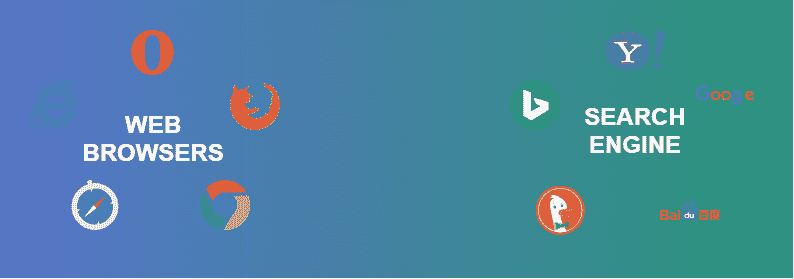

# 搜索引擎和网页浏览器的区别

> 原文:[https://www . geesforgeks . org/搜索引擎和网络浏览器的区别/](https://www.geeksforgeeks.org/difference-between-search-engine-and-web-browser/)

 **搜索引擎:**搜索引擎是一种网站，用户可以通过它搜索互联网上可用的内容。为此，用户在搜索栏中输入所需的关键词。然后，搜索引擎在索引中查找相关网页，并以列表的形式显示它们。互联网是一个巨大的信息资源来源&从互联网上获取资源有几种软件，这种软件被称为搜索引擎。比较受欢迎的有:**谷歌**、**必应**、**雅虎**、**鸭鸭走**、**百度**等。

**搜索引擎主要有三个组成部分:**

*   **爬虫**:爬虫是软件程序，有时被称为机器人。它定期自动扫描网站的网址、关键词和链接，以便发现新的更新。爬虫可以跟踪其他网页上的链接。
*   **索引**:众所周知，爬虫会持续扫描网站，它会开发一个 URL、链接和关键词的索引，让搜索结果更加有效。
*   **搜索算法:**搜索算法是整个搜索过程背后的完整机制。它的工作原理是搜索索引，并通过匹配用户搜索的关键词来找到最合适的网页。

**网络浏览器:**网络浏览器是应用软件的一个例子，开发该应用软件是为了从网络服务器上存在的网页或 HTML 文件中检索和查看信息。第一个网络浏览器是蒂姆·伯纳斯·李爵士在 1990 年发明的，第一个图形网络浏览器是在 1993 年开发的，名为马赛克。之后，各种网络浏览器被开发出来。其中有网景通信开发的航海家、**微软的互联网浏览器**、**谷歌 Chrome** 、 **Mozilla Firefox** 、 **Opera** 、**苹果 safari** 。

**网页浏览器的主要特点是:**

*   它由图形用户界面组成。
*   它包含搜索框，用户可以在其中键入地址或网址。
*   页面样式可以是静态的也可以是动态的。这取决于交互性和格式。
*   网络浏览器使用 TCP/IP 和 HTTP 协议。

**搜索引擎与网页浏览器的区别:**

| 搜索引擎 | 网络浏览器 |
| --- | --- |
| 搜索引擎用于在万维网上查找信息，并在一个地方显示结果。 | 网络浏览器使用搜索引擎从网络服务器上的网页中检索和查看信息。 |
| 搜索引擎旨在收集和维护关于几个网址的信息。 | 网络浏览器旨在显示服务器上可用的当前网址的网页。 |
| 搜索引擎包含自己的数据库 | 网络浏览器不需要数据库。它只包含用于存储 cookies 的缓存。 |
| 著名搜索引擎的例子有:谷歌、雅虎、必应、DuckDuckgo、百度互联网浏览器。 | 一些广泛使用的网络浏览器是:Mozilla Firefox、网景导航器和谷歌 Chrome。 |