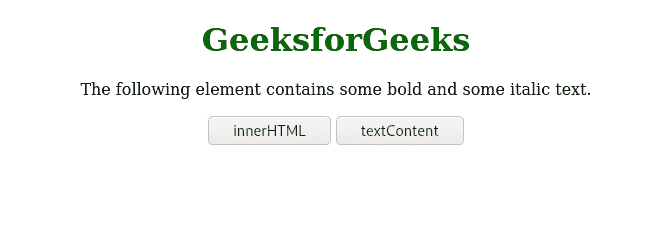
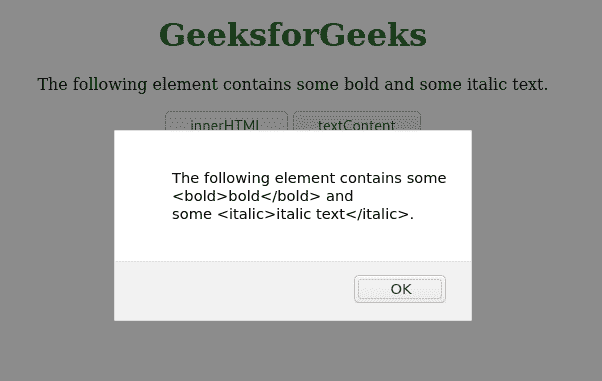
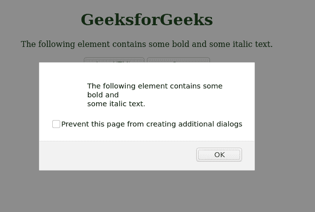

# 文本内容和内部 HTML 的区别

> 原文:[https://www . geeksforgeeks . org/text content 和-innerhtml 之间的区别/](https://www.geeksforgeeks.org/difference-between-textcontent-and-innerhtml/)

[文本内容](https://www.geeksforgeeks.org/html-dom-textcontent-property/)和[内部 HTML](https://www.geeksforgeeks.org/html-dom-innerhtml-property/) 是 JavaScript 的属性。但是，在 JavaScript 中处理指定文本的方式有所不同。让我们看看这两个属性的语法。

**语法:**

让 *elem* 成为一个 JavaScript 变量，保存从页面中选择的元素。

```html
let elem = document.getElementById('test-btn');
```

*文本内容*和*内部 HTML* 属性可以如下使用:

*   **text content 属性:**此属性用于获取或设置指定节点及其后代的文本内容。

    ```html
    elem.textContent
    ```

*   **innerHTML 属性:**这个属性用来获取或者设置元素的 HTML 内容。

    ```html
    elem.innerHTML
    ```

## 超文本标记语言

```html
<!DOCTYPE html>
<html>

<body style="text-align:center;">
    <h1 style="color:#006600">
        GeeksforGeeks
    </h1>

    <div id="test-btn">
        The following element contains some
        <bold>bold</bold> and
        some <italic>italic text</italic>.
    </div>

    <p></p>

    <button onClick="innerHTMLfn()">
        innerHTML
    </button>

    <button onClick="textContentfn()">
        textContent
    </button>

    <p id="demo-para"></p>

    <script>
        function textContentfn() {
            var elem =
                document.getElementById('test-btn');
            alert(elem.textContent);
        }

        function innerHTMLfn() {
            var elem =
                document.getElementById('test-btn');
            alert(elem.innerHTML);
        } 
    </script>
</body>

</html>
```

**输出:**

*   点击任何按钮前:

*   点击 innerHTML 按钮后:

*   点击文本内容按钮后:

**差异:**从上面的例子中我们可以看到， *innerHTML* 属性获取或设置元素的 HTML 内容。*文本内容*不会自动编码和解码文本，因此允许我们只处理元素的内容部分。