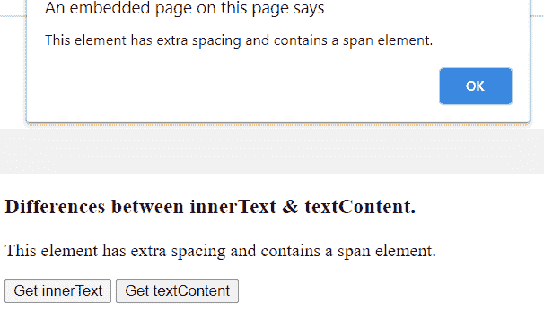
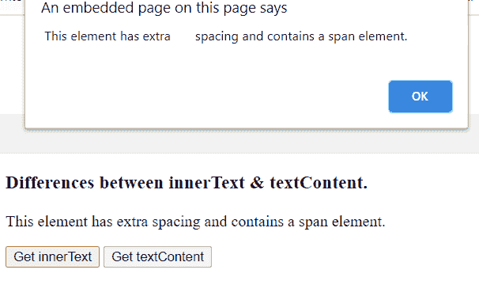

# 文本内容和内部文本的区别

> 原文:[https://www . geeksforgeeks . org/text content 和-innertext 之间的差异/](https://www.geeksforgeeks.org/difference-between-textcontent-and-innertext/)

**1。[文本内容:](https://www.geeksforgeeks.org/html-dom-textcontent-property/)**
此属性用于设置或返回所选节点及其所有后代的文本值。设置文本内容属性时，将删除所有子节点。它被包含指定字符串的单个文本节点替换。

**语法:**

*   设置节点的文本–

    ```htmlhtml
    node.textContent = text
    ```

*   返回节点的文本–

    ```htmlhtml
    node.textContent
    ```

**2。 [innerText :](https://www.geeksforgeeks.org/html-dom-innertext-property/)**
该属性还设置或返回所选节点及其所有后代的文本值。但是，使用下面的示例显示了一些差异。

## 超文本标记语言

```htmlhtml
<!DOCTYPE html>
<html>
<head>
  <title>
    Differences between innerText and textContent.
  </title>
</head>
<body>
  <h3>Differences between innerText & textContent.</h3>
  <p id="demo"> This element has extra       spacing and contains 
<span>a span element</span>.</p>

  <button onclick="getInnerText()">Get innerText</button>
  <button onclick="getTextContent()">Get textContent</button>

  <p id="demo"></p>
  <script>
    function getInnerText() {
      alert(document.getElementById("demo").innerText)
    }

    function getTextContent() {
      alert(document.getElementById("demo").textContent)
    }
  </script>
</body>
</html>
```

[/tab bybinding]

**输出:**
**点击任意按钮前:**


**点击内部文本按钮后:**



**点击文本内容按钮后:**



innerText 属性返回不带间距的文本，textContent 属性返回带间距的文本。

**内部文本之间的其他差异:**

| 

**Sl 号**

 | 

**内文**

 | 

文字内容

 |
| 1. | 它返回节点中包含的可见文本。 | 它返回全文。 |
| 2. | 它更加注重性能，因为它需要布局信息来返回结果。 | 与其说它重性能，不如说它不需要布局信息来返回结果。 |
| 3. | 它只为 HTMLElement 对象定义。 | 它是为所有节点对象定义的。 |
| 4. | IE9 和更早版本不支持此属性。 | Internet Explorer 8 和更低版本不支持此属性。 |