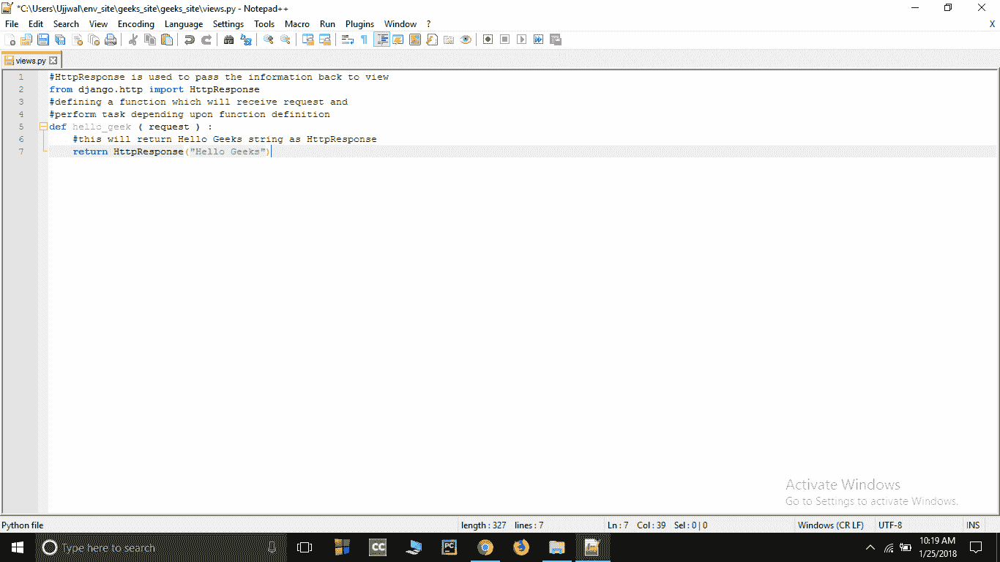
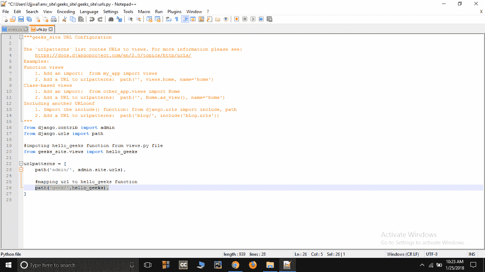

# 姜戈简介|第二集(创建项目)

> 原文:[https://www . geesforgeks . org/django-introduction-set-2-creating-a-project/](https://www.geeksforgeeks.org/django-introduction-set-2-creating-a-project/)

**注-** 本文为[姜戈介绍](https://www.geeksforgeeks.org/django-introduction-and-installation/)的续篇。

**Django 的受欢迎程度**
Django 在很多热门网站上都有使用，比如:Disqus、Instagram、Knight Foundation、MacArthur Foundation、Mozilla、国家地理等。基于 Django 框架的在线网站超过 5000 个。([来源](https://www.djangosites.org/) )
像[热门框架](http://hotframeworks.com/)这样的网站通过统计每个平台的 GitHub 项目和 StackOverflow 问题的数量来评估一个框架的受欢迎程度，这里 Django 排在第 6 位。基于对处理任何特定任务的正确方式的看法，Web 框架经常称自己为“固执己见”或“不固执己见”。Django 有些固执己见，因此在两个世界都传递了(固执己见&不固执己见)。

**姜戈架构**
姜戈基于 MVT(模型-视图-模板)架构。MVT 是一个开发 web 应用程序的软件设计模式。MVT 有以下三个部分

*   **模型-** 模型将作为你的数据的接口。它负责维护数据。
*   **视图-** 视图将是用户看到的界面。
*   **模板–**模板由所需 HTML 输出的静态部分以及一些描述如何插入动态内容的特殊语法组成。

**项目结构-** 在 geeks_site 文件夹(项目文件夹)里面会有以下文件-

**manage.py-** 该文件用于通过命令行与您的项目进行交互(启动服务器、同步数据库等)。要获取可由 manage 执行的命令的完整列表，请在命令窗口中键入以下代码–

```html
python manage.py help
```

**文件夹(geeks _ site)–**这个文件夹包含你项目的所有包。最初，它包含四个文件–

*   **_init_。py–**是一个 python 包。
*   **settings . py–**顾名思义，它包含了所有的网站设置。在这个文件中，我们注册我们创建的任何应用程序、静态文件的位置、数据库配置细节等。
*   **URL . py–**在这个文件中，我们存储了项目的所有链接和要调用的函数。
*   **wsgi . py–**这个文件用于在 WSGI 中部署项目。它用于帮助您的 Django 应用程序与 web 服务器进行通信。


**创建一个项目**
假设你已经完成了[这篇](https://www.geeksforgeeks.org/django-introduction-and-installation/)的文章，并且已经成功设置了 django。

在存储 settings.py、urls.py 和其他文件的项目文件夹内创建一个新文件**view . py**，并在其中保存以下代码-

## 蟒蛇 3

```html
# HttpResponse is used to
# pass the information
# back to view
from django.http import HttpResponse

# Defining a function which
# will receive request and
# perform task depending
# upon function definition
def hello_geek (request) :

    # This will return Hello Geeks
    # string as HttpResponse
    return HttpResponse("Hello Geeks")
```

**附上述代码截图–**



打开项目文件夹(geeks_site)内的**URL . py**，添加你的条目-

```html
from geeks_site.views import hello_geeks
```


在 url 模式内的 url 字段中添加一个条目-

```html
path('geek/',hello_geek),
```



现在要运行服务器，请按照以下步骤操作-

打开命令提示符，通过此命令将目录更改为 env _ site-

```html
$ cd env_site
```

转到 env_site 内的脚本目录并激活虚拟环境-

```html
$ cd Script
```

```html
$ activate
```

返回 env_site 目录，转到项目目录-

```html
$ cd ..
```

```html
$ cd geeks_site
```

**启动服务器-** 在 cmd 中键入以下命令启动服务器-

```html
$ python manage.py runserver
```

**检查–**打开浏览器，输入该网址-

```html
http://127.0.0.1:8000/geek/
```

