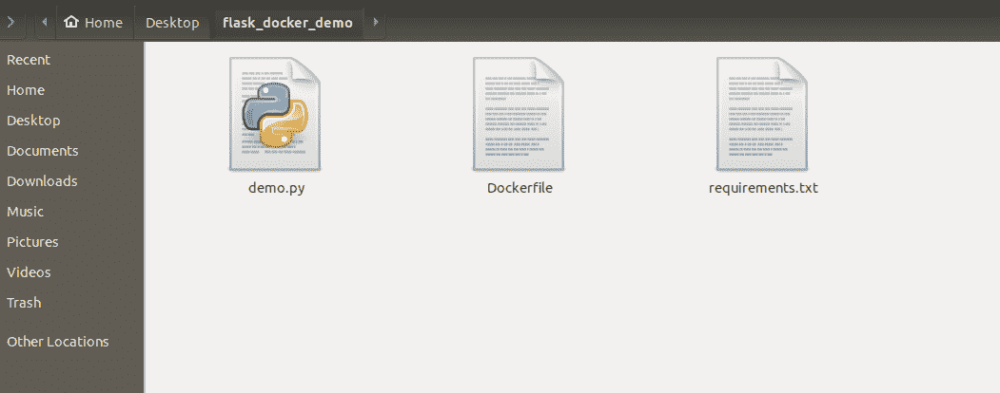
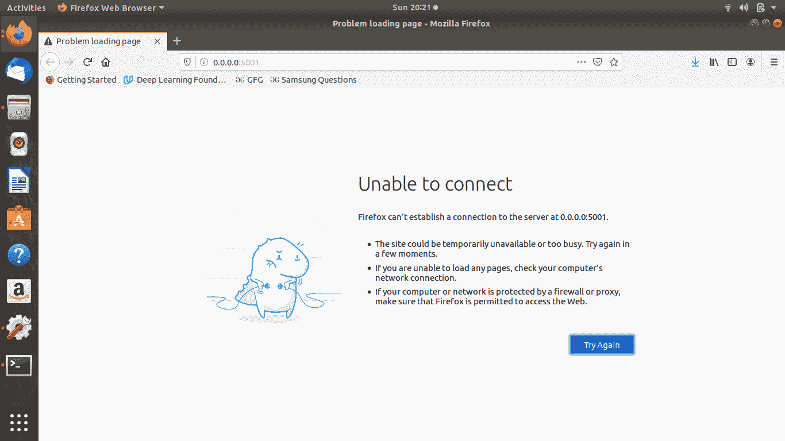
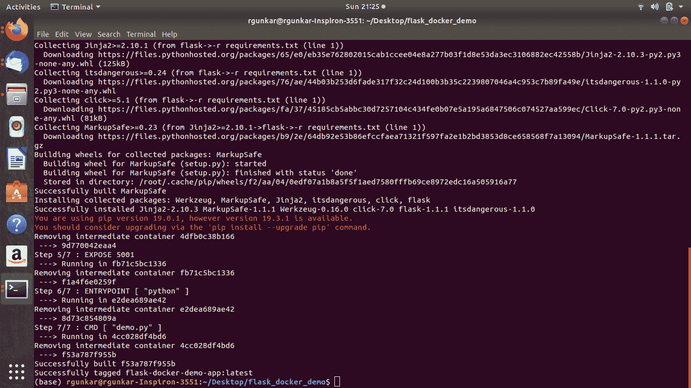
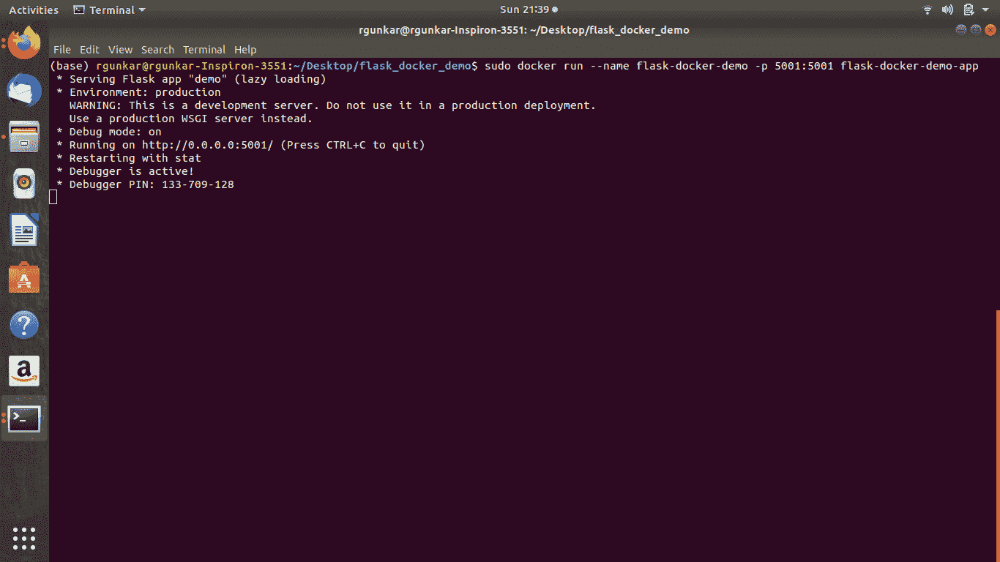
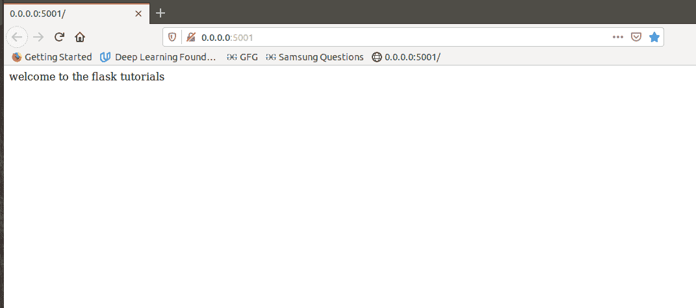

# 整理你的烧瓶应用程序

> 原文:[https://www.geeksforgeeks.org/dockerize-your-flask-app/](https://www.geeksforgeeks.org/dockerize-your-flask-app/)

Python 提供了许多分发 python 项目的方法。其中一种方法是使用一种叫做 Docker 的重要技术。Docker 是一个开源应用程序，允许管理员使用容器创建、管理、部署和复制应用程序。它基本上是一个平台，使开发人员能够通过将他们的应用程序放入容器中来使其可移植。您可以使用它使您的 python 项目可移植。Docker 容器通过用系统隔离您的项目来消除依赖问题。为您的项目创建的 Docker 映像可以移植到任何地方。[码头工人官方文件](https://docs.docker.com/get-started/)。在本文中，我们将看到一个例子，其中我们将把我们的 Flask 应用程序转换成 docker 图像，并看到 docker 的一些基本命令。Flask 是一个用于构建小型 web 应用程序的微型框架。我们只是把它作为 Python 项目的一个例子。可以用同样的方式使用任何其他 python 项目。欲了解更多关于烧瓶的信息，请访问[。](https://flask.palletsprojects.com/en/1.1.x/tutorial/)

### 设置烧瓶和文件

*   #### 制作项目文件夹

    打开你的终端，为你的 flask 应用程序创建一个文件夹，比如说“flask _ docker _ demo”
    ，通过执行以下命令:

    ```html
    $mkdir flask_docker_demo
    $cd flask_docker_demo #to change the directory
    ```

    您也可以手动创建文件夹和以上文件。如果您没有安装 Gedit，那么您可以使用任何代码编辑器。
    在终端输入以下内容

    ```html
    $gedit demo.py
    ```

    将以下代码粘贴到“demo.py”中。

    ```html
    from flask import Flask
    app = Flask(__name__)

    @app.route('/')
    def hello():
        return "welcome to the flask tutorials"

    if __name__ == "__main__":
        app.run(host ='0.0.0.0', port = 5001, debug = True) 
    ```

*   #### 将以下代码插入到之前创建的 Dockerfile 中

    如果您还没有使用 gedit 创建新文件，请添加一个新文件并将其命名为“Dockerfile”。**不要给任何延期。**
    粘贴以下代码到里面

    ```html
    FROM python:alpine3.7
    COPY . /app
    WORKDIR /app
    RUN pip install -r requirements.txt
    EXPOSE 5001
    ENTRYPOINT [ "python" ]
    CMD [ "demo.py" ]
    ```

    让我们看看我们的 Dockerfile 是做什么的。来自 python:alpine3.7 从 docker hub 中提取 python 3.7 的图像， **COPY** 命令将 flask app 复制到容器中， **WORKDIR** 命令设置工作目录。**“运行 pip install-r requirements.txt”**该命令将在主机系统上逐个安装写在“requirements . txt”文件中的每个需求。 **EXPOSE** 正如名字所说的，EXPOSE 将 Flask 应用程序将使用的端口 5001 暴露给容器，以便以后它可以与系统的端口进行映射。Entrypoint 和 CMD 一起执行运行这个文件的命令“python demo.py”。

*   #### 将以下内容复制到“requirements.txt”文件中

    如果您还没有使用 gedit 创建需求. txt，请手动创建它，并在其中添加以下行

    ```html
    flask
    ```

*   We should have the following structure right now.

    

*   #### 测试烧瓶应用程序

    进入根文件夹**“flask-docker-demo”**如果你还不在这个目录中，运行下面的命令“python demo . py”
    它应该会启动我们的开发服务器，该服务器带有“http://0.0.0.0:5001/”上的 flask。
    见下图截图。
    

    我们应该在浏览器
    中有以下输出

*   #### 按 CTRL + C
    关闭服务器

    再次刷新浏览器，它应该会给出一个错误，因为服务器已经关闭。
    

### 创建项目的 docker 映像以及如何运行它

*   #### 建立码头工人形象

    确保您在项目的根目录中，并运行以下命令。

    ```html
    sudo docker build --tag flask-docker-demo-app .
    ```

    上面的命令将创建一个标签为 flask-docker-demo-app 的应用程序。
    注意:如有需要请输入密码。

    参考下面的截图。

    

*   #### 运行我们刚刚创建的 docker 映像。

    运行以下命令:

    ```html
    sudo docker run --name flask-docker-demo-app -p 5001:5001 flask-docker-demo-app
    ```

    
    在上面的命令中，-name 参数为容器赋予名称，-p 参数将主机(在本例中是我的笔记本电脑)的端口 5001 映射到容器的端口 5001，因为容器是隔离的，我们需要映射它，以便从外部环境访问它。最后“flask-docker-demo-app”引用要运行的映像。

*   #### 再次测试。

    刷新浏览器
    

*   通过运行“ **docker stop** ”命令关闭图像。要知道集装箱 id，输入“**码头工人 ps** ”命令。它显示了所有正在运行的容器。访问 docker 的网站了解更多 Docker 命令，如“**将图像保存为 tar 文件**”并将其导出到另一个系统。