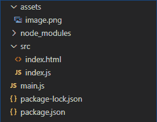
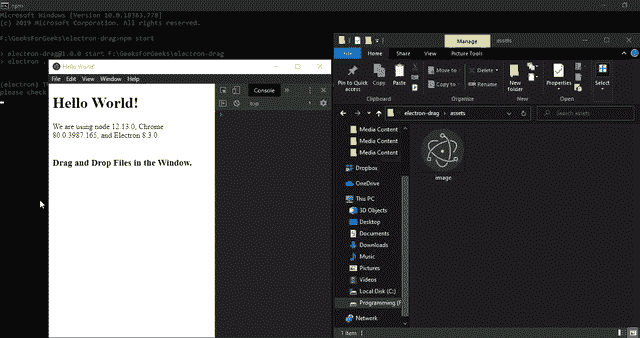

# 在电子文档中拖放文件

> 原文:[https://www . geesforgeks . org/拖放文件-in-electronijs/](https://www.geeksforgeeks.org/drag-and-drop-files-in-electronjs/)

**[electronijs](https://www.geeksforgeeks.org/introduction-to-electronjs/)**是一个开源框架，用于使用能够在 Windows、macOS 和 Linux 操作系统上运行的 HTML、CSS 和 JavaScript 等网络技术构建跨平台的本机桌面应用程序。它将铬引擎和**T5 节点 T7】结合成一个单一的运行时。**

传统网络应用中的**拖放**操作和电子之间有几个区别。主要区别之一是，电子应用程序在操作系统环境中使用本机文件系统。因此，我们需要从用户机器上的本地文件对话框中获取任何拖到电子应用程序上的文件的绝对文件路径。一旦我们获得了文件路径，我们就可以使用 NodeJS **[fs](https://www.w3schools.com/nodejs/nodejs_filesystem.asp)** 模块执行文件操作，或者将文件上传到服务器。电子利用 HTML5 **文件**应用编程接口处理本地文件系统中的文件。本教程将演示如何在电子应用程序中为本机文件实现**拖放**功能。

我们假设您熟悉上述链接中介绍的先决条件。电子要工作， **[节点](https://www.geeksforgeeks.org/introduction-to-nodejs/)** 和 **[npm](https://www.geeksforgeeks.org/node-js-npm-node-package-manager/)** 需要预装在系统中。

*   **项目结构:**
    

**示例:**我们将按照给定的步骤开始构建基本的电子应用程序。

*   **Step 1:** Navigate to an Empty Directory to setup the project, and run the following command,

    ```
    npm init
    ```

    生成**包. json** 文件。安装 **[电子](https://www.geeksforgeeks.org/introduction-to-electronjs/)** 如果没有安装，使用 npm。

    ```
    npm install electron --save
    ```

    该命令还将创建**包-lock.json** 文件，并安装所需的**节点 _ 模块**依赖项。一旦电子安装成功，打开**包. json** 文件，并在**脚本**键下执行必要的更改。根据项目结构创建**资产**文件夹。将您选择的任何图像文件复制到**资源**文件夹中，并将其命名为**image.png**。在本教程中，我们将使用电子标志作为**image.png**文件。该图像文件将被拖放到电子应用程序的**浏览器窗口**中。
    **package.json:**

    ```
    {
      "name": "electron-drag",
      "version": "1.0.0",
      "description": "File Drag and Drop in Electron",
      "main": "main.js",
      "scripts": {
        "start": "electron ."
      },
      "keywords": [
        "electron"
      ],
      "author": "Radhesh Khanna",
      "license": "ISC",
      "dependencies": {
        "electron": "^8.3.0"
      }
    }

    ```

*   **Step 2:** Create a **main.js** file according to the project structure. This file is the **Main Process** and acts as an entry point into the application. Copy the Boilerplate code for the **main.js** file as given in the following [link](https://www.electronjs.org/docs/tutorial/first-app#electron-development-in-a-nutshell). We have modified the code to suit our project needs.

    **main.js:**

    ```
    const { app, BrowserWindow } = require('electron')

    function createWindow () {
      // Create the browser window.
      const win = new BrowserWindow({
        width: 800,
        height: 600,
        webPreferences: {
          nodeIntegration: true
        }
      })

      // Load the index.html of the app.
      win.loadFile('src/index.html')

      // Open the DevTools.
      win.webContents.openDevTools()
    }

    // This method will be called when Electron has finished
    // initialization and is ready to create browser windows.
    // Some APIs can only be used after this event occurs.
    // This method is equivalent to 'app.on('ready', function())'
    app.whenReady().then(createWindow)

    // Quit when all windows are closed.
    app.on('window-all-closed', () => {
      // On macOS it is common for applications and their menu bar
      // to stay active until the user quits explicitly with Cmd + Q
      if (process.platform !== 'darwin') {
        app.quit()
      }
    })

    app.on('activate', () => {
        // On macOS it's common to re-create a window in the 
        // app when the dock icon is clicked and there are no 
        // other windows open.
      if (BrowserWindow.getAllWindows().length === 0) {
        createWindow()
      }
    })

    // In this file, you can include the rest of your 
    // app's specific main process code. You can also 
    // put them in separate files and require them here.
    ```

*   **Step 3:** Create the **index.html** file and **index.js** file within the **src** directory according to project structure. We will also copy the Boilerplate code for the **index.html** file from the above-mentioned link. We have modified the code to suit our project needs.

    **index.html:**

    ```
    <!DOCTYPE html>
    <html>
      <head>
        <meta charset="UTF-8">
        <title>Hello World!</title>
        <!-- https://electronjs.org/docs/tutorial
                               /security#csp-meta-tag -->
        <meta http-equiv="Content-Security-Policy" 
              content="script-src 'self' 'unsafe-inline';" />
      </head>
      <body>
        <h1>Hello World!</h1>
        We are using node 
        <script>
            document.write(process.versions.node)
        </script>, Chrome 
        <script>
            document.write(process.versions.chrome)
        </script>, and Electron 
        <script>
            document.write(process.versions.electron)
        </script>.

        <br><br>
        <h3>Drag and Drop Files in the Window.</h3>

        <!-- Adding Individual Renderer Process JS File -->
        <script src="index.js"></script>
      </body>
    </html>
    ```

*   **Output:** At this point, our basic Electron Application is set up. To launch the Electron Application, run the Command:

    ```
    npm start
    ```

    

使用 HTML5 **文件** API，用户可以直接使用系统 OS 环境中的原生文件。这是可能的，因为 DOM 的文件接口为底层的本地文件系统提供了一个抽象。电子通过增加一个**路径**属性来增强 DOM 的文件界面。该**路径**属性显示文件系统上文件的绝对文件路径。我们将利用这个功能来获得拖放文件到电子应用程序的绝对文件路径。更多详细信息，请参考[链接](https://www.electronjs.org/docs/api/file-object#file-object)。

拖放操作的所有实例事件都属于**拖动事件**界面。这个事件是一个 **DOM 事件**，表示从头到尾的拖放操作。该界面还继承了**T5【鼠标事件】T6**和全局**T9【事件】T10**界面的属性。它有特定的数据传输实例属性，**全局事件处理程序**和我们在代码中使用的实例事件。更多详细信息，请参考[链接](https://developer.mozilla.org/en-US/docs/Web/API/DragEvent)。

**index.js:** 在该文件中添加以下代码片段。

```
document.addEventListener('drop', (event) => {
    event.preventDefault();
    event.stopPropagation();

    for (const f of event.dataTransfer.files) {
        // Using the path attribute to get absolute file path
        console.log('File Path of dragged files: ', f.path)
      }
});

document.addEventListener('dragover', (e) => {
    e.preventDefault();
    e.stopPropagation();
  });

document.addEventListener('dragenter', (event) => {
    console.log('File is in the Drop Space');
});

document.addEventListener('dragleave', (event) => {
    console.log('File has left the Drop Space');
});
```

代码中使用的 HTML5 **文件**应用编程接口的所有实例事件和属性的详细解释如下。**drageevent**界面的所有实例事件都将在全局**文档**对象上触发，不能直接在特定的 DOM 元素上触发。

*   **事件.数据传输**该实例属性用于表示拖放操作期间正在传输的数据。在我们的例子中，正在传输的数据是一个**文件**，因此我们使用了**事件.数据传输.文件**，并使用电子提供的**路径**属性获取了绝对文件路径。我们还可以一次拖放多个文件。在数据是文本选择的情况下，我们可以在启动拖动操作时简单地使用**event . datatransfer . setdata(key，text)** 方法。该方法为正在传输的文本数据设置唯一的**键**。要检索拖放操作上的文本选择，我们可以简单地使用**event . datatransfer . getdata(key)**方法。该方法将返回使用提供的唯一**键**设置的任何数据。
*   **拖动:事件**当一个元素或文本选择被**拖动到**一个有效的放置目标(每隔几百毫秒)如另一个 DOM 元素上时，该事件被触发。此事件的触发模式取决于鼠标指针的移动。默认情况下，当鼠标指针没有在有效的放置目标上移动时，该事件每 50 毫秒触发一次，否则大约在 5 毫秒到 1 毫秒之间会快得多，但这种行为会有所不同。该事件的事件处理程序属性为上的**。默认情况下，一个元素或文本选择不能放在其他 DOM 元素中。为了允许删除，我们必须防止元素的默认处理。为此，我们使用了 **event.preventDefault()** 方法。元素的默认处理方式是在浏览器中以链接形式打开。**
*   **放置:事件**当一个元素或文本选择被**放置在一个有效的放置目标(如另一个 DOM 元素)上时，该事件被触发。该事件的事件处理程序属性为 **ondrop** 。我们需要防止这个事件中元素的默认处理，就像**拖动**事件一样。**
*   **拖动:事件**当被拖动的元素或文本选择**进入**一个有效的放置目标(如另一个 DOM 元素)时，触发该事件。该事件的事件处理程序属性为**ondrageter**。
*   **拖动:事件**当被拖动的元素或文本选择**离开**一个有效的放置目标(如另一个 DOM 元素)时，触发该事件。该事件的事件处理程序属性为**on drive**。

在此特定代码示例中，**拖动开始**、**拖动**、**拖动结束**和**拖动退出**实例事件不会被触发，因此已被排除在外。所有这些实例事件都在拖动目标上触发，在这种情况下，拖动目标在应用程序中不存在。文件的拖动操作是从应用程序外部的本机文件系统对话框中启动的。上述代码中使用的所有实例事件都是在位于应用程序中的删除目标上触发的。

**注意:****事件. stopperpagation()**方法防止同一事件的传播被调用。传播意味着向上传递到父 DOM 元素或者向下传递到子 DOM 元素。

**输出:**
