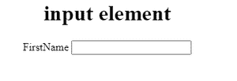
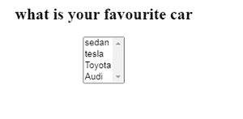
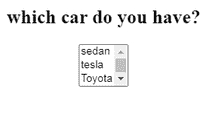
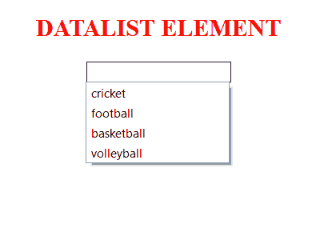

# 表单标签的元素

> 原文:[https://www.geeksforgeeks.org/elements-of-a-form-tag/](https://www.geeksforgeeks.org/elements-of-a-form-tag/)

表单用于接受用户的输入。它可以用于注册、登录网站或在网站上创建您的个人资料等。可以从表单中收集的信息可以是各种类型的。表单数据由后端处理。我们可以使用各种表单元素，如文本字段、文本区域、下拉列表、选择、复选框、单选按钮等。

我们用来创建这个表单的标签是

<form>标签，它有我们必须遵循的语法:</form>

```htmlhtml
<form action="form-url" method="form-method">
 // various the form elements
</form>
```

以下 HTML 元素可以与表单元素一起使用:

**1。输入:**这是最常用的表单元素之一。根据我们要定义的字段类型，它有几种使用方式。

**示例:**

## 超文本标记语言

```htmlhtml
<!DOCTYPE html>
<html>
<body>
  <h1 style="text-align:center;">
    input element
  </h1>
  <form style="text-align:center;">
    <label for="fname">
      FirstName
    </label>
    <input type="text"
           id="fname"
           name="fname">
  </form>
</body>
</html>
```

**输出:**



**2。标签:**用于为我们定义的字段定义标签。当用户试图聚焦于**输入**元素时，这是有用的。所以我们使用**标签**元素和**输入**元素，因为**标签**元素的“for”属性等于**输入**元素的“id”属性。

**示例:**

## 超文本标记语言

```htmlhtml
<!DOCTYPE html>
<html>
<body>
  <h1 style="text-align:center;">
    label element
  </h1>
  <form style="text-align:center;">
    <label for="fname">
      FirstName
    </label>
    <input type="text"
           id="fname"
           name="fname">
  </form>
</body>
</html>
```

**输出:**


这里我们可以看到标签是如何定义我们使用**输入**元素创建的文本字段的。

**3。选择:**用于创建下拉列表。这允许用户选择任意多的选项。当我们使用这个元素创建一个下拉列表时，可以根据情况改变属性的行为。

这些属性包括:

1.  **多个:**该属性用于让用户选择一个或多个选项。根据此特定属性，我们可以将其与单选按钮(允许用户一次选择一个选项)和复选框(允许用户选择多个选项)进行比较。
2.  **大小:**该属性用于显示列表中存在的值的数量。例如，在一个列表中，有超过 5 个选项可用。因此，如果我们想使选项可见，那么我们可以使用 size 属性。

**示例 1:** 使用没有属性的选择元素

## 超文本标记语言

```htmlhtml
<!DOCTYPE html>
<html>
<body>
  <form style="text-align:center;">
    <h2 style="text-align:center;">
      select what would you like to do
    </h2>
    <select>
      <option>cars</option>
      <option>Malls</option>
      <option>center</option>
      </select>
  </form>
</body>
</html>
```

**输出:**


**示例 2:** 使用具有多个属性的选择元素

## 超文本标记语言

```htmlhtml
<!DOCTYPE html>
<html>
<body>
  <h2 style="text-align:center;">
    what is your favourite car
  </h2>
  <form style="text-align:center;">
    <select id="cars"
            name="cars"
            multiple>
     <option>sedan</option>
     <option>tesla</option>
     <option>Toyota</option>
     <option>Audi</option>
    </select>
  </form>
</body>
</html>
```

**输出:**



**示例 3:** 使用选择元素中的大小属性

## 超文本标记语言

```htmlhtml
<!DOCTYPE html>
<html>
<body>
  <h2 style="text-align:center;">
    which car do you have?
  </h2>
  <form style="text-align:center;">
    <select id="cars" name="cars" 
            size="3" multiple>
      <option>sedan</option>
      <option>tesla</option>
      <option>Toyota</option>
      <option>Audi</option>
    </select>
  </form>
</body>
</html>
```

**输出:**



**4。textarea:** 用于创建多行文本字段。这主要是用一种形式，来收集评论和意见。文本区域的大小可以由列和行这样的属性来指定。所以 cols 属性用来指定宽度，row 属性用来指定文本区域的行数。

**示例:**

## 超文本标记语言

```htmlhtml
<!DOCTYPE html>
<html>
  <body>
  <h2 style="text-align:center;">
    textarea
  </h2>
  <form style="text-align:center;">
    <textarea row="4" cols="50">
    </textarea>
  </form>
</body>
</html>
```

**输出:**


**5。按钮:**用于创建可点击的按钮。它有一个属性，即“type”属性。该属性用于根据情况指定将在页面上使用的按钮。不同的浏览器可能有默认的按钮样式。

**示例:**

## 超文本标记语言

```htmlhtml
<!DOCTYPE html>
<html>
<body>
  <h2 style="color:blue;">button</h2>
  <button type="submit">submit</button>
</body>
</html>
```

**输出:**


**6。fieldset** 和**图例:**这些元素一般一起使用。用例如下:

*   **字段集:**用于将表单中相互关联的数据分组。
*   **图例:**用于定义 fieldset 元素的标题。

**示例:**

## 超文本标记语言

```htmlhtml
<!DOCTYPE html>
<html>
<body>
  <h2 style="text-align:center;">
    FIELDSET AND LEGEND ELEMENTS
  </h2>
  <form style="color:red;">
    <fieldset>
      <legend>
        the personal informations
      </legend>
      <label for ="name">name
      </label>
      <input type="text" id="name" name="name"
             placeholder="enter your name"
             required>
    </fieldset>
  </form>
</body>
</html>
```

**输出:**


**7。数据列表:**用于在列表中创建一些预定义的选项。当用户输入数据时，用户会看到这些可以选择的选项。输入元素中的 list 属性必须引用 datalist 元素的 id。

## 超文本标记语言

```htmlhtml
<!DOCTYPE html>
<html>
<body>
  <h2 style="text-align:center;color:red;">
    DATALIST ELEMENT
  </h2>
  <form style="text-align:center;">
    <input list="games">
    <datalist id="games">
      <option value="cricket">
      <option value="football">
      <option value="basketball">
      <option value="volleyball">
    </datalist>
  </form>
</body>
</html>
```

**输出:**



**支持的浏览器:**

*   谷歌 Chrome 6.0 及以上版本
*   Internet Explorer 9.0 及以上版本
*   Mozilla 4.0 及以上版本
*   Opera 11.1 及以上
*   Safari 5.0 及以上版本