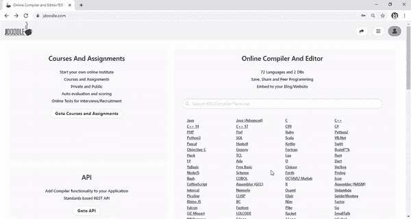
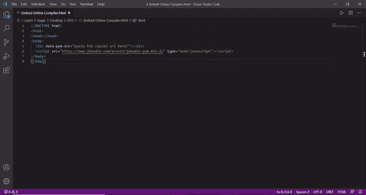
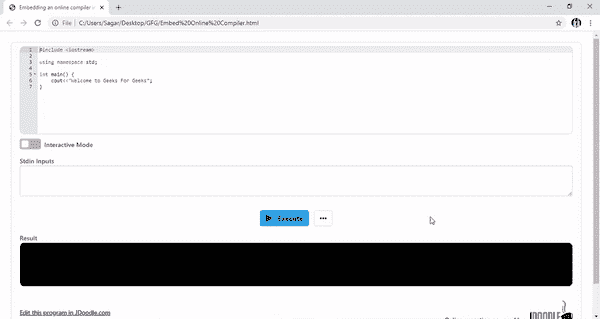

# 将在线编译器嵌入网站

> 原文:[https://www . geesforgeks . org/embedding-an-online-compiler-in-a-网站/](https://www.geeksforgeeks.org/embedding-an-online-compiler-into-a-website/)

**如何将一个** [**JDoodle**](https://www.jdoodle.com/) **编译器添加到网站中？**

使用 **JDoodle** 编译器，我们可以用 C、C++、Java 和更多编程语言编写代码，然后我们可以通过提供标准输入在网页中嵌入并轻松运行该程序，我们还可以提供命令行参数。

**后续步骤:**

**第一步:**打开网站[JDoodle.com](https://www.jdoodle.com/)登录，如果你没有账号那么你必须先注册。

[](https://www.jdoodle.com/)

**第二步:**选择任意一种编程语言，编写代码并保存。点击可编辑共享，复制嵌入网址。



**第三步:**在你的网页上插入*分区*和*脚本*标签如下:

下面的代码将创建一个分部，并将编译器嵌入到网站页面中。

```html
<div data-pym-src="paste copied URL here."></div>
```

下面的代码将包含来自 JDoodle 的 JavaScript 代码。在网站页面底部包含以下代码。



**示例:**下面是嵌入 C++编译器的示例。

## 超文本标记语言

```html
<!DOCTYPE html>
<html>

<head>
    <title>
        Embedding an online compiler 
        into a website
    </title>
</head>

<body>
    <!-- It will create a division for 
        compiler and embed that into 
        web page-->
    <div data-pym-src=
"https://www.jdoodle.com/embed/v0/2IhG?stdin=1&arg=0">
    </div>

    <!-- This script tag contains the 
        javascript code in the written URL -->
    <script src=
"https://www.jdoodle.com/assets/jdoodle-pym.min.js"
        type="text/javascript">
    </script>
</body>

</html>
```

**输出:**



**注意:**我们还可以通过放 ***来隐藏 *stdin* 输入和命令行参数？stdin=0 & arg=0*** 在 **< div >** 标签中的 URL 末尾。这里 **stdin=0** 是隐藏 *stdin* 输入， **arg=0** 是隐藏命令行参数。要启用它，只需将“0”更改为“1”。