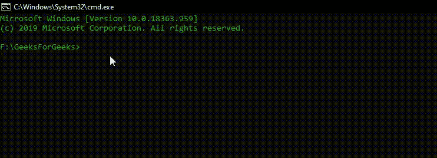

# 电子表格中的环境变量

> 原文:[https://www . geesforgeks . org/environment-variables-in-electronijs/](https://www.geeksforgeeks.org/environment-variables-in-electronjs/)

[**electronijs**](https://www.geeksforgeeks.org/introduction-to-electronjs/)是一个开源框架，用于使用能够在 Windows、macOS 和 Linux 操作系统上运行的 HTML、CSS 和 JavaScript 等网络技术构建跨平台的本机桌面应用程序。它将铬引擎和[T5 节点 T7】结合成一个单一的运行时。](https://www.geeksforgeeks.org/introduction-to-nodejs/)

我们已经在电子文档 中讨论了 [**命令行参数。命令行参数很重要，因为它们可以用来控制应用程序的行为。我们可以在启动时从应用程序外部将命令行参数传递给 Electron，或者我们可以简单地在应用程序中硬编码这些值。**电子中的环境变量**也控制应用程序的配置和行为，而不改变代码。Electron 中的一些特定行为是由环境变量而不是命令行参数控制的，因为它们比命令行标志和应用程序的主函数代码更早初始化。在本教程中，我们将了解 Electron 使用的不同环境变量及其各自的分类。**](https://www.geeksforgeeks.org/command-line-arguments-in-electronjs/)

我们假设您熟悉上述链接中介绍的先决条件。电子要工作， [**节点**](https://www.geeksforgeeks.org/introduction-to-nodejs/) 和 [**npm**](https://www.geeksforgeeks.org/node-js-npm-node-package-manager/) 需要预装在系统中。

如上所述，如果我们在应用程序中硬编码命令行标志，我们需要导入**应用程序**模块的**命令行**属性，但是我们不需要任何额外的代码更改来设置电子中的环境变量。然而，由于电子也支持全局**过程**对象，我们也可以通过代码设置环境变量。例如:

```
process.env.GOOGLE_API_KEY = 'YOUR_KEY_HERE'
```

关于**流程**对象的更多细节，请关注 [**流程对象中的**](https://www.geeksforgeeks.org/process-object-in-electronjs/) 。电子公司提供两种主要的环境变量:

*   **发展变量**
*   **生产变量**

**开发环境变量**顾名思义，主要用于应用程序中的开发和调试目的。

*   **electronic _ ENABLE _ LOGGING:**此环境变量设置为 **true** ，将 Chromium 的内部日志打印到应用程序的控制台。
*   **ELECTRON_LOG_ASAR_READS:** 当 ELECTRON 从 ASAR 文件读取时，如果该环境变量设置为 **true** ，则将读取的偏移量和文件路径记录到系统 **tmpdir** 。生成的文件可以提供给 ASAR 模块，以优化文件排序，从而提高电子应用程序的性能，并减少系统资源的负载。一个 **ASAR** 档案是一个简单的焦油状格式，将文件连接成一个单一的文件。电子可以从其中读取任意文件，而无需打开整个文件。这个环境变量是在电子的后期版本中引入的。
*   **ELECTRON _ ENABLE _ STACK _ DUMPING:**此环境变量设置为 **true** ，然后在 ELECTRON 应用程序崩溃时将错误堆栈跟踪打印到控制台。如果启动**故障报告程序**，该环境变量将不起作用。电子中的 **crashReporter** 模块负责向远程服务器提交崩溃报告。有关**故障报告器**模块的更多详细信息。
*   **ELECTRON _ DEFAULT _ ERROR _ MODE:**此环境变量仅在 *Windows* 操作系统中受支持。该环境变量设置为**真**，当电子应用程序崩溃时，显示窗口的操作系统崩溃对话框。就像**electronic _ ENABLE _ STACK _ DUMPING**一样，如果 **crashReporter** 启动，这个环境变量将不起作用。
*   **electronic _ OVERRIDE _ DIST _ PATH:**在开发环境中从打包文件运行应用程序时，此环境变量告诉 electronic 使用指定版本的 electronic，而不是由 **npm install** 下载的版本。这个环境变量接受一个字符串文件路径，其中电子的特定版本存储在本地系统上。当我们对原始下载的电子包的源代码进行了自己的更改时，这尤其有用。

**生产环境变量**顾名思义，主要用于打包的电子应用程序的运行时。当将打包的电子应用程序部署到生产环境中的不同服务器时，这些环境变量特别有用。

*   **NODE_OPTIONS:** 由于 Electron 将 NodeJS 和 Chromium 合并到了一个单一的运行时中，因此 Electron 包括了对 NodeJS 子集 [**NODE_OPTIONS**](https://nodejs.org/api/cli.html#cli_node_options_options) 环境变量的支持。除了与铬使用**硼化硅**相冲突的选项之外，电子支持所提供的大多数选项。 **BoringSSL** 是 **OpenSSL** 的一个分叉，是为了满足谷歌的需求而设计的。 **OpenSSL** 是一个健壮的、商业级的、功能齐全的工具包，用于 HTTP 中的传输层安全性(TLS)和安全套接字层(SSL)协议。它也是一个通用的密码库。
    我们可以为 **NODE_OPTIONS** 环境变量提供多个选项。不支持的选项有:
    *   **–使用捆绑卡**
    *   **–force-FIPS**
    *   **–使能-fips**
    *   **–打开-配置**
    *   **–使用-openssl-ca**
    *   **–最大 http 头大小**
    *   **–http 解析器**
*   **GOOGLE_API_KEY:** 许多 GOOGLE 服务需要为特定用户的特定项目生成一个 **API_KEY** ，以便从应用程序中访问服务。例如，电子中的地理定位支持需要使用谷歌云平台的地理定位网络服务。要启用此功能，我们需要获取一个谷歌应用编程接口密钥。该密钥通常被硬编码在电子应用程序中，并且由于该应用编程接口密钥包含在每个有效会话的每个电子版本中，所以它经常超过其使用配额。为了防止这种情况，我们需要添加应用编程接口密钥作为环境的一部分。我们可以这样做，在打开任何会发出谷歌服务请求的应用程序窗口或功能之前，将以下代码放在主进程文件中:

```
process.env.GOOGLE_API_KEY = 'YOUR_KEY_HERE'
```

*   我们还可以从应用程序外部设置这个环境变量，以便它对每个新的谷歌服务请求会话有效，直到它过期。
*   **ELECTRON_RUN_AS_NODE:** 该环境变量设置为 **true** ，启动 ELECTRON 进程作为正常的 **NodeJS** 进程。
*   **ELECTRON_NO_ASAR:** 此环境变量设置为 **true** ，禁用 ASAR 对 ELECTRON 应用程序的支持。该变量仅在**分叉的**子进程和**衍生的**子进程中受支持，这些子进程也设置了**电子 _ 运行 _AS_NODE** 环境变量。
*   **ELECTRON _ NO _ ATTACH _ CONSOLE:**此环境变量仅在 Windows 操作系统中受支持。该环境变量设置为**真**，不将控制台日志附加到当前控制台会话。因此，不会在应用程序中打印日志。
*   **ELECTRON _ FORCE _ WINDOW _ MENU _ BAR:**此环境变量仅在 Linux 操作系统中受支持。该环境变量设置为**真**，不使用电子应用的 Linux 平台上的全局菜单栏。
*   **ELECTRON_TRASH:** 这个环境变量只在 Linux 操作系统中支持。这个环境变量设置了 Linux 平台上的垃圾桶实现。该环境变量的默认值为 **gio** 。它可以保存以下值:
    *   gvfs-trash
    *   **垃圾桶-cli**
    *   **kioclient5**
    *   **kioclient**

除了**生产**和**开发**环境变量外，还有一些变量是运行时在原生系统环境中由 Electron 自己设置的。

*   **ORIGINAL _ XDG _ CURRENT _ DESKTOP:**该变量被设置为应用程序最初启动时使用的 **XDG_CURRENT_DESKTOP** 的值。电子有时会修改**XDG _ 电流 _ 桌面**的值，以影响铬内的其他逻辑。因此，如果我们想要访问原始值，我们应该查找这个环境变量。**XDG _ 当前 _ 桌面**环境变量通知您当前正在使用的桌面环境。此变量因不同的操作系统和不同的平台而异。除了电子之外，其他过程和应用程序也使用这个变量，它是一个系统环境变量。

在中设置电子环境变量的用法示例

*   **视窗控制台**:

```
~$ set ELECTRON_ENABLE_LOGGING=true
```

*   **POSIX 外壳**:

```
~$ export ELECTRON_ENABLE_LOGGING=true
```

**输出:**

[](https://media.geeksforgeeks.org/wp-content/uploads/20200720231803/Output-1-GIF16.gif)

**注意:**这些环境变量都是重置的，需要我们每次重启电脑时重新设置。如果我们想避免这样做，我们需要将这些环境变量及其各自的值添加到**中。bashrc** 文件。**。bashrc** 是一个 shell 脚本， **Bash** 无论何时交互启动都会运行。它初始化一个交互式 shell 会话。我们可以将任何可以在命令提示符下键入的命令放入该文件中，它们不会被重置，例如在这种情况下，电子的环境变量。