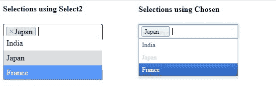
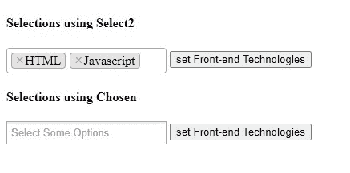
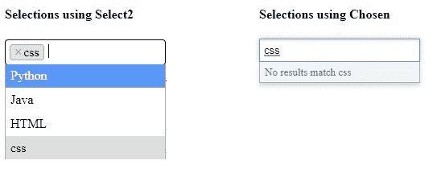
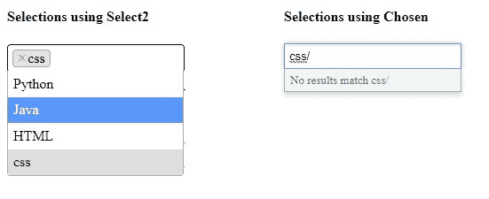

# 用例子解释选择和选择 2

> 原文:[https://www . geesforgeks . org/explain-selected-selected-2-with-examples/](https://www.geeksforgeeks.org/explain-chosen-and-select2-with-examples/)

两个 jQuery 插件“选择”和“选择 2”用于设置选择框的样式。它改善了选择框的外观，增强了它的行为，从而使它们更加用户友好。它们可以用于单个选择框和多个选择框。

需要添加这些 jQuery 库:

*   select2.min.js
*   选择 2.min.css
*   choose . jquery . min . js
*   choose . min . CSS

激活选择框上的插件:

*   ```
     $(“.chosen-select”).chosen()
    ```

*   ```
     $(“.chosen-select”).select2()
    ```

**选择 2 和选择的区别:**

*   **选择和取消选择**

    选择 2 只需从下拉列表中单击所选选项，即可取消选择之前选择的选项。但是所选选项褪色时，所选选项没有此功能。

    ```
    <!DOCTYPE html>
    <html>
        <head>
            <script src=
    "https://ajax.googleapis.com/ajax/libs/jquery/3.5.1/jquery.min.js">
          </script>

            <!--These jQuery libraries for 
               chosen need to be included-->
            <script src=
    "https://cdnjs.cloudflare.com/ajax/libs/chosen/1.8.7/chosen.jquery.min.js">
            </script>
            <link rel="stylesheet" 
                  href=
    "https://cdnjs.cloudflare.com/ajax/libs/chosen/1.4.2/chosen.min.css" />

            <!--These jQuery libraries for select2 
                need to be included-->
            <script src=
    "https://cdnjs.cloudflare.com/ajax/libs/select2/4.0.1/js/select2.min.js">
           </script>
            <link rel="stylesheet" 
                  href=
    "https://cdnjs.cloudflare.com/ajax/libs/select2/4.0.1/css/select2.min.css" />
            <script>
                $(document).ready(function () {
                    //Select2
                    $(".country").select2({
                        maximumSelectionLength: 2,
                    });
                    //Chosen
                    $(".country1").chosen({
                        max_selected_options: 2,
                    });
                });
            </script>
        </head>
        <body>
            <form>
                <h4>Selections using Select2</h4>
                <select class="country"
                        multiple="true"
                        style="width: 200px;">
                    <option value="1">India</option>
                    <option value="2">Japan</option>
                    <option value="3">France</option>
                </select>
                <h4>Selections using Chosen</h4>
                <select class="country1" 
                        multiple="true" 
                        style="width: 200px;">
                    <option value="1">India</option>
                    <option value="2">Japan</option>
                    <option value="3">France</option>
                </select>
            </form>
        </body>
    </html>
    ```

    **输出:**

    

*   **编程访问**

    如果某些选项相互之间有一些链接，并且这些链接的选项很有可能被选中，则可以使用选择 2 单击完成。它在多重选择中非常有用。而选择不能执行这种逻辑链接。

    ```
    <!DOCTYPE html>
    <html>
        <head>
            <script src=
    "https://ajax.googleapis.com/ajax/libs/jquery/3.5.1/jquery.min.js">
           </script>

            <!--These jQuery libraries for chosen 
                need to be included-->
            <script src=
    "https://cdnjs.cloudflare.com/ajax/libs/chosen/1.8.7/chosen.jquery.min.js">
           </script>
            <link rel="stylesheet"
                  href=
    "https://cdnjs.cloudflare.com/ajax/libs/chosen/1.4.2/chosen.min.css" />

            <!--These jQuery libraries for 
                select2 need to be included-->
            <script src=
    "https://cdnjs.cloudflare.com/ajax/libs/select2/4.0.1/js/select2.min.js">
          </script>
            <link rel="stylesheet"
                  href=
    "https://cdnjs.cloudflare.com/ajax/libs/select2/4.0.1/css/select2.min.css" />
            <script>
                $(document).ready(function () {
                    //Select2
                    var $prog = $(".progLang").select2();
                    $(".Front-end").on("click", function () {
                        $prog.val(["ht", "js"]).trigger("change");
                    });
                    //Chosen
                    var $prog1 = $(".progLang1").chosen();
                    $(".Front-end1").on("click", function () {
                        $prog1.val(["ht", "js"]).trigger("change");
                    });
                });
            </script>
        </head>
        <body>
            <form>
                <h4>Selections using Select2</h4>
                <select class="progLang" 
                        multiple="true"
                        style="width: 200px;">
                    <option value="py">Python</option>
                    <option value="ja">Java</option>
                    <option value="ht">HTML</option>
                    <option value="js">Javascript</option>
                    <option value="c">C++</option>
                </select>
                <input type="button"
                       class="Front-end" 
                       value="set Front-end Technologies" />
                <h4>Selections using Chosen</h4>
                <select class="progLang1" 
                        multiple="true" 
                        style="width: 200px;">
                    <option value="py">Python</option>
                    <option value="ja">Java</option>
                    <option value="ht">HTML</option>
                    <option value="js">Javascript</option>
                    <option value="c">C++</option>
                </select>
                <input type="button" 
                       class="Front-end1"
                       value="set Front-end Technologies" />
            </form>
        </body>
    </html>
    ```

    **输出:**

    **点击**后设置前端技术**按钮:**
    

*   **标记**

    当您有广泛的选择，并且您不能包括所有的选择，那么启用标签选项。这将使用户添加一个新的选项，如果还没有出现在选项中。这可以通过将标签选项设置为*“真”*来实现。

    此选项在选择 2 中可用，而在选择中用户不能向列表中添加新选项。

    ```
    <!DOCTYPE html>
    <html>
        <head>
            <script src=
    "https://ajax.googleapis.com/ajax/libs/jquery/3.5.1/jquery.min.js">
          </script>

            <!--These jQuery libraries for 
                chosen need to be included-->
            <script src=
    "https://cdnjs.cloudflare.com/ajax/libs/chosen/1.8.7/chosen.jquery.min.js">
           </script>
            <link rel="stylesheet"
                  href=
    "https://cdnjs.cloudflare.com/ajax/libs/chosen/1.4.2/chosen.min.css" />

            <!--These jQuery libraries for select2
                 need to be included-->
            <script src=
    "https://cdnjs.cloudflare.com/ajax/libs/select2/4.0.1/js/select2.min.js">
           </script>
            <link rel="stylesheet"
                  href=
    "https://cdnjs.cloudflare.com/ajax/libs/select2/4.0.1/css/select2.min.css" />
            <script>
                $(document).ready(function () {
                    //Select2
                    $(".progLang").select2({
                        tags: true,
                    });
                    //Chosen
                    $(".progLang1").chosen({
                        tags: true,
                    });
                });
            </script>
        </head>
        <body>
            <form>
                <h4>Selections using Select2</h4>
                <select class="progLang" 
                        multiple="true" 
                        style="width: 200px; position: relative;">
                    <option value="py">Python</option>
                    <option value="ja">Java</option>
                    <option value="ht">HTML</option>
                </select>
                <h4>Selections using Chosen</h4>
                <select class="progLang1"
                        multiple="true" 
                        style="width: 200px;">
                    <option value="py">Python</option>
                    <option value="ja">Java</option>
                    <option value="ht">HTML</option>
                </select>
            </form>
        </body>
    </html>
    ```

    **输出:**

    

*   **令牌化**

    标记化在标记选项设置为“真”后使用。它提供了标记分隔符，用作创建标记的快捷方式。这可以通过在标签名称后面键入列表中指定的任何标记分隔符来完成。在选择 2 的帮助下，可以创建任何字符作为标记分隔符。

    如前所述，由于所选内容没有标记功能，因此标记化功能也不可用。

    ```
    <!DOCTYPE html>
    <html>
        <head>
            <script src=
    "https://ajax.googleapis.com/ajax/libs/jquery/3.5.1/jquery.min.js">
          </script>

            <!--These jQuery libraries for 
                chosen need to be included-->
            <script src=
    "https://cdnjs.cloudflare.com/ajax/libs/chosen/1.8.7/chosen.jquery.min.js">
          </script>
            <link rel="stylesheet"
                  href=
    "https://cdnjs.cloudflare.com/ajax/libs/chosen/1.4.2/chosen.min.css" />

            <!--These jQuery libraries for 
                select2 need to be included-->
            <script src=
    "https://cdnjs.cloudflare.com/ajax/libs/select2/4.0.1/js/select2.min.js">
          </script>
            <link rel="stylesheet"
                  href=
    "https://cdnjs.cloudflare.com/ajax/libs/select2/4.0.1/css/select2.min.css" />
            <script>
                $(document).ready(function () {
                    //Select2
                    $(".progLang").select2({
                     tags: true,
                     maximumSelectionLength: 2,
                     tokenSeparators: [
                         "/", ", ", ";", " ", "#"],
                    });
                    //Chosen
                    $(".progLang1").chosen({
                        tags: true,
                        max_selected_options: 2,
                        tokenSeparators: [
                          "/", ", ", ";", " ", "#"],
                    });
                });
            </script>
        </head>
        <body>
            <form>
                <h4>Selections using Select2</h4>
                <select class="progLang" 
                        multiple="true"
                        style="width: 200px;">
                    <option value="py">Python</option>
                    <option value="ja">Java</option>
                    <option value="ht">HTML</option>
                </select>
                <h4>Selections using Chosen</h4>
                <select class="progLang1"
                        multiple="true"
                        style="width: 200px;">
                    <option value="py">Python</option>
                    <option value="ja">Java</option>
                    <option value="ht">HTML</option>
                </select>
            </form>
        </body>
    </html>
    ```

    **输出:**

    