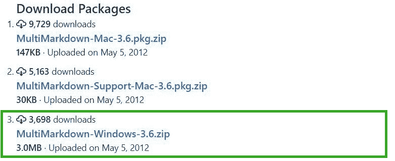

# 解释多重降价及其用法？

> 原文:[https://www . geesforgeks . org/explain-multi-markdown-and-it-usage/](https://www.geeksforgeeks.org/explain-multi-markdown-and-its-usage/)

MultiMarkdown 是 **[Markdown](https://www.geeksforgeeks.org/introduction-to-markdown/)** 语法的扩展形式，是一个文本到 HTML 的转换语法工具，允许 web 编写人员编写易于阅读和编写的纯文本文档，然后将其转换为 HTML(或，XHTML)文档。Markdown 语法的设计目标是通过格式化标签和属性使代码尽可能易读。

如上所述，MultiMarkdown 是 Markdown 的超集，因为它添加了多种语法功能，如表格、脚注、引文等，以及可以将文档转换为各种其他格式的工具，如–HTML、PDF(通过 LaTeX)、OPML 或 OpenDocument(具体来说，平面 OpenDocument 或)。fodt '，可以进一步转换为 RTF、微软 Word 或几乎任何其他文字处理格式)。MultiMarkdown 是以 Perl 脚本的形式编写的。它简化了编写的代码，并使其可读。它不同于 Markdown，因为它可以将文档转换成各种文件格式，并提供编写代码的简单性。

在 **HTML** 中写粗体字相对于在**多标记**中

*   **HTML:**

    ```htmlhtml
    This will make the <strong>'word'</strong> bold.
    ```

*   **多品牌-ed:**t0]

在 **HTML** 中书写斜体字与在**多标记**中书写斜体字相比

*   **HTML:**

    ```htmlhtml
    This will make the <em>'word'</em> appear in italics.
    ```

*   **多品牌-ed:**t0]

用 html 编写无序列表与多标记相比

*   **HTML:**

    ```htmlhtml
    <ul>
      <li>HTML is the skeliton</li>
      <li>CSS is the skin</li>
    </ul>
    ```

*   **多品牌-ed:**t0]

在 html 中插入超链接与在多标记中插入超链接

*   **HTML:**

    ```htmlhtml
    <p> Read this page about MultiMarkdown, click 
    <a href="https://fletcherpenney.net/multimarkdown/index.html"> [here]</a>
    ```

*   **多指标类集调查-ed:**

    ```htmlhtml
    Read this page about MultiMarkdown, click 
    [here](https://fletcherpenney.net/multimarkdown/index.html)
    ```

**安装:**要下载 MultiMarkdown，请参考此[链接](https://fletcherpenney.net/multimarkdown/download/)

1.  **MacOS:** 只需从[页面](https://github.com/fletcher/peg-multimarkdown/downloads)下载安装程序 MultiMarkdown-Mac 即可。解压缩并运行安装程序。
2.  **Windows:** Install MMD on Windows by downloading MultiMarkdown-Windows installer from this [page](https://github.com/fletcher/peg-multimarkdown/downloads) and run it.
    *   单击 windows 安装程序。
    *   解压安装程序并点击。exe 安装程序文件，并继续正常步骤“下一步”,接受条款和条件。

    **Linux:** 逐一运行以下命令。

    *   ```htmlhtml
        sudo apt install libtext-multimarkdown-perl
        ```

<stropng>通过命令行选项使用:</stropng>

1.  从**文本文件到**XHTML 文件的转换

    ```htmlhtml
     multimarkdown file.txt
    ```

2.  从**文本文件到**HTML 文件的转换

    ```htmlhtml
     multimarkdown file.txt>file.html 
    ```

3.  从**文本文件到**LaTex 文件

    ```htmlhtml
     multimarkdown -t latex file.txt 
    ```

    的转换
4.  从**文本文件转换到 OPML**

    ```htmlhtml
     multimarkdown -t opml file.txt 
    ```

5.  从**文本文件到**开放文档文件

    ```htmlhtml
    multimarkdown -t opf file.txt
    ```

    的转换
6.  从**文本文件到平面打开文档文件**

    ```htmlhtml
    multimarkdown -t fopt file.txt
    ```

    的转换

**创建多标记向下文档:**这是通过使用元数据-键、值对来实现的。MultiMarkdown 文档的顶部可以包含特殊的元数据，然后可以用来定义 MultiMarkdown 之后如何处理文档。这种元数据可以是任何东西，如标题、作者、引文、链接等。

**语法规则:**

*   它必须从文档的顶部开始，前面不能有空行。
*   它由两部分组成——键及其值(就像 Python 字典一样)。
*   它必须以字母或数字开头，然后接下来的字符可以是任何东西——字母、数字、空格、连字符或下划线字符。
*   它的形式应该是–“键”:“值”
*   不区分大小写。
*   完成后，一个空行会触发并指示文档其余部分的开始。
*   HTML 文档必须完整，以便包含元数据，如果不包含元数据，它也可以只是一个“片段”。

“片段”只是 HTML(或 LaTeX)的一部分，它不包含标题和正文信息。没有进一步的命令是无法用 LaTeX 编译成 PDF 的。

**MultiMarkdown 拖放:**由于它很难通过命令行脚本使用，因此有必要缓解其使用的复杂性。这个问题的第一个解决方案是通过使用鸭嘴兽创建拖放应用程序来解决的。在这种情况下，可以在应用程序图标上放置一个 MultiMarkdown 文本文件，然后它们会给出一个. xhtml。pdf，。rtf 或。结果是特克斯文件。

*   **下载链接:**