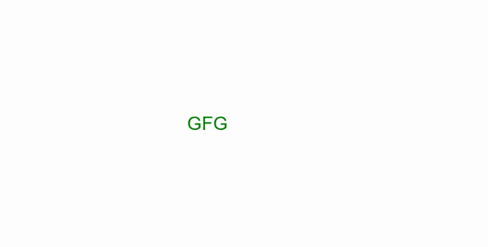

# 画布中的爆炸动画

> 原文:[https://www . geesforgeks . org/exploit-animation-in-canvas/](https://www.geeksforgeeks.org/explosion-animation-in-canvas/)

可以使用 HTML 中的画布创建爆炸动画。

**方法:**首先，我们要在 HTML 中创建一个画布元素，并在 JavaScript 中获取它的引用。所有的元素和动画都是用 JavaScript 函数控制的。需要的一些步骤是:

*   使用画布方法获取画布和上下文。
*   决定文本和粒子对象的颜色、图案和渐变。
*   决定并绘制动画或帧渲染的形状
*   清除上一个画布。
*   转换为原始状态后保存画布
*   在绘制新帧之前恢复画布
    我们可以创建许多粒子，并在随机方向上设置它们的动画，这些粒子在一段时间后会淡出。

**HTML 代码:**

## 超文本标记语言

```htmlhtml
<!DOCTYPE html>
<html>

<head>
    <style>
        * {
            padding: 0;
            margin: 0;
            box-sizing: border-box;
            ;
        }

        body {
            overflow: hidden;
        }
    </style>
</head>

<body>

    <canvas id="myCanvas"></canvas>

    <script>

        /* Get the canvas  */
        var canvas = document.getElementById("myCanvas");

        /* Get the height and width of the window */
        canvas.height = window.innerHeight;
        canvas.width = window.innerWidth;

        /* Get the 2D context of the canvas  */
        var ctx = canvas.getContext("2d");

        /* Fills or sets the color,gradient,pattern */
        ctx.fillStyle = "white";
        ctx.fillRect(0, 0, canvas.width, canvas.height);
        ctx.font = "50px Arial";
        ctx.fillStyle = "green";

        /* Writes the required text  */
        ctx.fillText("GFG", 500, 350)
        let particles = [];

        /* Initialize particle object  */
        class Particle {
            constructor(x, y, radius, dx, dy) {
                this.x = x;
                this.y = y;
                this.radius = radius;
                this.dx = dx;
                this.dy = dy;
                this.alpha = 1;
            }
            draw() {
                ctx.save();
                ctx.globalAlpha = this.alpha;
                ctx.fillStyle = 'green';

                /* Begins or reset the path for 
                   the arc created */
                ctx.beginPath();

                /* Some curve is created*/
                ctx.arc(this.x, this.y, this.radius, 
                        0, Math.PI * 2, false);

                ctx.fill();

                /* Restore the recent canvas context*/
                ctx.restore();
            }
            update() {
                this.draw();
                this.alpha -= 0.01;
                this.x += this.dx;
                this.y += this.dy;
            }
        }

        /* Timer is set for particle push 
            execution in intervals*/
        setTimeout(() => {
            for (i = 0; i <= 150; i++) {
                let dx = (Math.random() - 0.5) * (Math.random() * 6);
                let dy = (Math.random() - 0.5) * (Math.random() * 6);
                let radius = Math.random() * 3;
                let particle = new Particle(575, 375, radius, dx, dy);

                /* Adds new items like particle*/
                particles.push(particle);
            }
            explode();
        }, 3000);

        /* Particle explosion function */
        function explode() {

            /* Clears the given pixels in the rectangle */
            ctx.clearRect(0, 0, canvas.width, canvas.height);
            ctx.fillStyle = "white";
            ctx.fillRect(0, 0, canvas.width, canvas.height);
            particles.forEach((particle, i) => {
                    if (particle.alpha <= 0) {
                        particles.splice(i, 1);
                    } else particle.update()
                })

                /* Performs a animation after request*/
            requestAnimationFrame(explode);
        }
    </script>
</body>

</html>        
```

**输出:**



爆炸动画