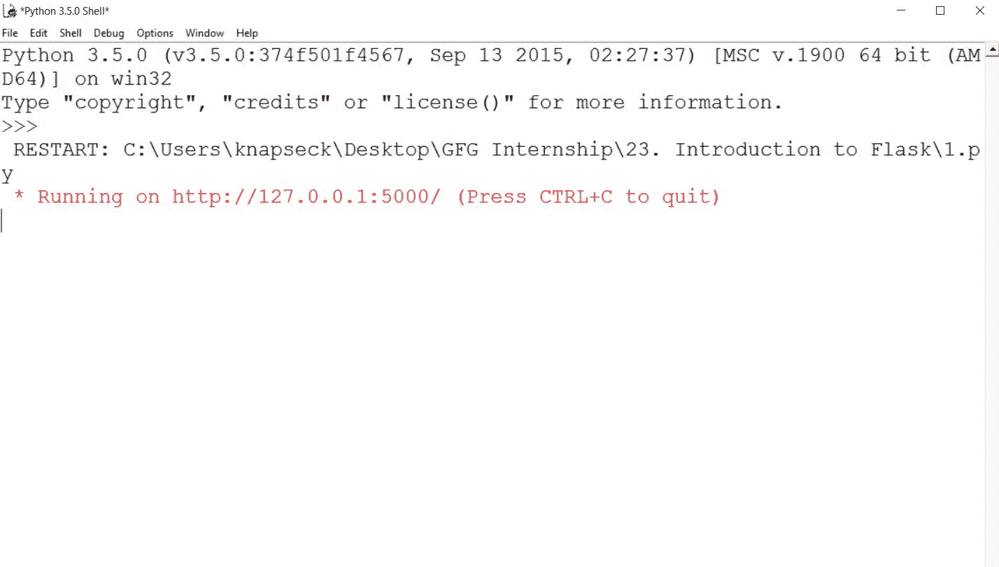
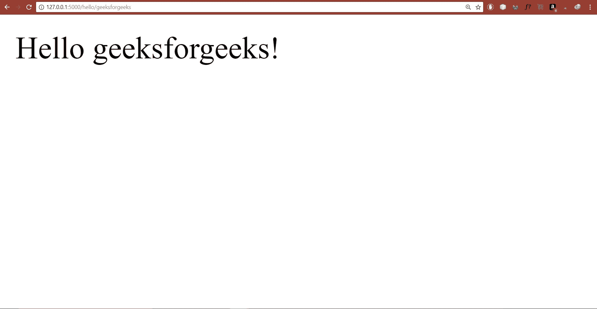
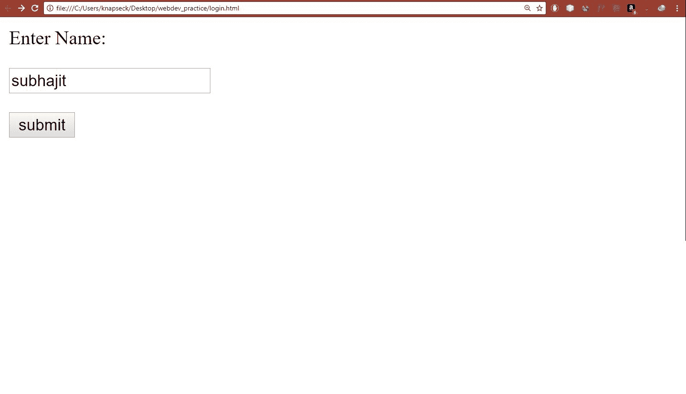
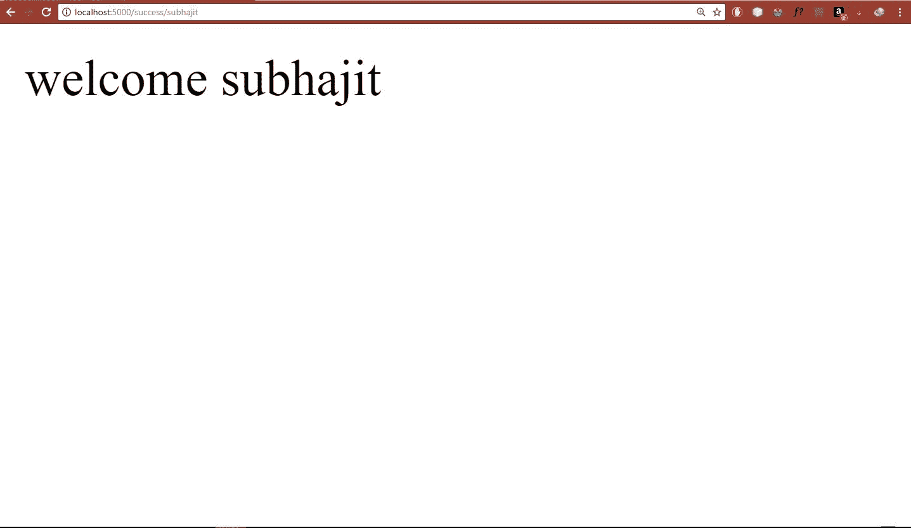

# 烧瓶–(创建第一个简单的应用程序)

> 原文:[https://www . geesforgeks . org/flask-creating-first-simple-application/](https://www.geeksforgeeks.org/flask-creating-first-simple-application/)

**使用 python 构建网页。**

有许多模块或框架允许使用 python 构建网页，如瓶子、Django、flask 等。但真正受欢迎的是 Flask 和 Django。与 Flask 相比，Django 易于使用，但 Flask 为您提供了编程的多功能性。
要理解 Flask 是什么，你必须理解几个通用术语。

1.  **WSGI** Web 服务器网关接口(WSGI)已经被采用为 Python web 应用程序开发的标准。WSGI 是 web 服务器和 web 应用程序之间通用接口的规范。
2.  **Werkzeug** 它是一个 WSGI 工具包，实现请求、响应对象和其他实用功能。这使得能够在它的基础上构建一个 web 框架。Flask 框架使用 Werkzeug 作为其基础之一。
3.  **jinja2** jinja2 是一个流行的 Python 模板引擎。网页模板系统将模板与特定的数据源相结合来呈现动态网页。

### [](https://en.wikipedia.org/wiki/Flask_(web_framework))****:****

**Flask 是一个用 Python 编写的网络应用框架。Flask 基于 Werkzeug WSGI 工具包和 Jinja2 模板引擎。两者都是 Pocco 项目。**

****安装:****

**我们需要两个软件包来设置您的环境。 *virtualenv* 供用户并排创建多个 Python 环境。因此，它可以避免不同版本库之间的兼容性问题，下一个版本将是 *Flask* 本身。** 

*   ****virtualenv****

```html
pip install virtualenv
```

*   ****烧瓶****

```html
pip install Flask
```

**完成软件包的安装后，让我们掌握代码。**

## **蟒蛇 3**

```html
# Importing flask module in the project is mandatory
# An object of Flask class is our WSGI application.
from flask import Flask

# Flask constructor takes the name of
# current module (__name__) as argument.
app = Flask(__name__)

# The route() function of the Flask class is a decorator,
# which tells the application which URL should call
# the associated function.
@app.route('/')
# ‘/’ URL is bound with hello_world() function.
def hello_world():
    return 'Hello World'

# main driver function
if __name__ == '__main__':

    # run() method of Flask class runs the application
    # on the local development server.
    app.run()
```

**将它保存在一个文件中，然后运行脚本，我们将得到这样的输出。**

****

**然后转到给定的网址，你会看到你的第一个网页在你的本地服务器上显示你好世界。
深入到上下文中，Flask 中的**路由()**装饰器用于将 URL 绑定到函数。现在，为了扩展这一功能，我们的小 web 应用程序还配备了另一种方法 **add_url_rule()** 这是一个应用程序对象的函数，也可用于将 url 与一个函数绑定，如上面的示例中，使用了 route()。** 

****示例:****

```html
def gfg():
   return ‘geeksforgeeks’
app.add_url_rule(‘/’, ‘g2g’, gfg)
```

****输出:****

```html
geeksforgeeks
```

**你也可以在你的网络应用程序中添加变量，你可能会想它会如何帮助你，它会帮助你动态地建立一个网址。让我们用一个例子来解决这个问题。**

## **蟒蛇 3**

```html
from flask import Flask
app = Flask(__name__)

@app.route('/hello/<name>')
def hello_name(name):
   return 'Hello %s!' % name

if __name__ == '__main__':
   app.run()
```

**并前往网址*http://127 . 0 . 0 . 1:5000/hello/geeksforgeeks*它会给你以下输出。**

****

**我们也可以在 Flask 中使用 HTTP 方法让我们看看如何做到
HTTP 协议是万维网数据通信的基础。该协议定义了从指定网址检索数据的不同方法。这些方法描述如下。**

> ****GET :** 以简单或未加密的形式向服务器发送数据。
> **HEAD :** 以简单或未加密的形式向服务器发送无正文的数据。
> **HEAD :** 向服务器发送表单数据。数据未缓存。
> **PUT :** 用更新后的内容替换目标资源。
> **删除:**删除作为网址提供的目标资源。**

**默认情况下，Flask 路由响应 GET 请求。但是，可以通过向 route()装饰器提供方法参数来改变这种偏好。
为了演示 POST 方法在 URL 路由中的使用，首先让我们创建一个 HTML 表单，并使用 POST 方法将表单数据发送到一个 URL。
现在让我们创建一个 html 登录页面。
以下是该文件的源代码**

## **超文本标记语言**

```html
<html>
   <body>     
      <form action = "http://localhost:5000/login" method = "post">

<p>Enter Name:</p>

<p><input type = "text" name = "nm" /></p>

<p><input type = "submit" value = "submit" /></p>

      </form>     
   </body>
</html>
```

**现在将这个文件保存为 html，尝试这个 python 脚本来创建服务器。**

## **蟒蛇 3**

```html
from flask import Flask, redirect, url_for, request
app = Flask(__name__)

@app.route('/success/<name>')
def success(name):
   return 'welcome %s' % name

@app.route('/login',methods = ['POST', 'GET'])
def login():
   if request.method == 'POST':
      user = request.form['nm']
      return redirect(url_for('success',name = user))
   else:
      user = request.args.get('nm')
      return redirect(url_for('success',name = user))

if __name__ == '__main__':
   app.run(debug = True)
```

**开发服务器开始运行后，在浏览器中打开 login.html，在文本栏中输入名称，点击*提交*按钮。输出如下。**

****

**结果会是这样的**

****

**而 Flask 还有比这更多的东西。如果你对 Python 的这个网络框架感兴趣，你可以深入到下面提供的链接中获取更多信息。**

****参考链接:**
1)[http://flask.pocoo.org/](http://flask.pocoo.org/)T5】2)[http://flask.pocoo.org/docs/0.12/](http://flask.pocoo.org/docs/0.12/)T8】3)[图图点–烧瓶](https://www.tutorialspoint.com/flask/)**

**本文由 [**Subhajit Saha**](https://www.linkedin.com/in/subhajit-saha-06aa29131/) 供稿。如果你喜欢 GeeksforGeeks 并想投稿，你也可以使用[write.geeksforgeeks.org](https://write.geeksforgeeks.org)写一篇文章或者把你的文章邮寄到 review-team@geeksforgeeks.org。看到你的文章出现在极客博客主页上，帮助其他极客。
如果发现有不正确的地方，或者想分享更多关于上述话题的信息，请写评论。**