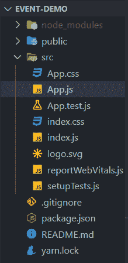
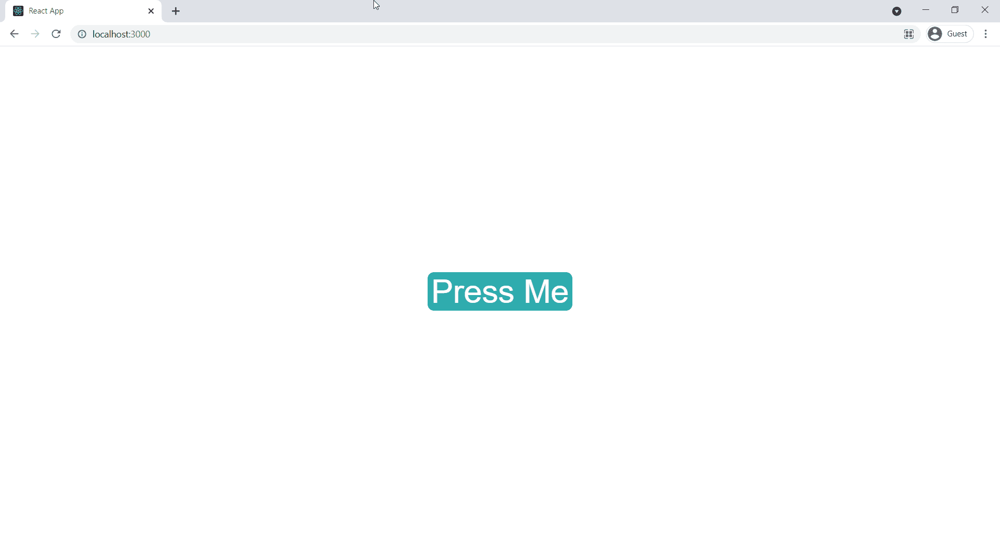

# 举例说明使用事件

> 原文:[https://www . geeksforgeeks . org/举一个使用事件的例子/](https://www.geeksforgeeks.org/give-an-example-of-using-events/)

[React](https://www.geeksforgeeks.org/react-js-introduction-working/) 是一个 Javascript 前端库，用于构建单页应用程序(SPA)。React 提供了自己的跨浏览器兼容的合成事件，这些事件是本机浏览器事件的包装。这些事件使用 camelCase 惯例命名。我们需要将一个处理函数传递给这些事件道具，当事件被触发时执行。我们可以使用下面显示的语法将处理函数传递给事件道具。

```
const handleClick = () => {
    console.log("Hello");
}
<div onClick={handleClick}>Hello</div>
```

在本文中，我们将讨论一个在 React 中使用事件的简单示例。

**创建反应应用程序并安装模块:**

**步骤 1:** 使用以下命令创建一个反应应用程序:

```
npx create-react-app foldername
```

**步骤 2:** 在创建项目文件夹(即文件夹名**)后，使用以下命令将**移动到该文件夹:

```
cd foldername
```

**项目结构:**项目结构如下图。



**方法:**现在在这个项目中，我们已经创建了一个按钮，在这个按钮上我们有一个 onClick 道具。我们已经为这个 onClick 道具分配了一个处理函数。当我们点击这个按钮时，我们的处理函数被执行并显示一个警告窗口。现在接下来，您可以在 App.js 和 App.css 文件中编写以下代码。

下面是上述方法的实现。

**文件名:App.js**

## java 描述语言

```
import './App.css';

const App = () => {
  const handleClick = () => {
    alert('Hello Geek');
  };
  return (
    <div className='container'>
      <button className='btn' onClick={handleClick}>
        Press Me
      </button>
    </div>
  );
};

export default App;
```

**文件名： 应用程序.css**

## 半铸钢ˌ钢性铸铁(Cast Semi-Steel)

```
.container {
  height: 100vh;
  width: 100vw;
  display: flex;
  justify-content: center;
}

.btn {
  align-self: center;
  background-color: rgb(47, 173, 173);
  font-size: 50px;
  color: white;
  border-radius: 10px;
  border: none;
}

.btn:active {
  background-color: rgb(16, 88, 88);
}
```

**运行应用程序的步骤:**在命令行中使用以下命令启动应用程序。

```
npm start
```

**输出:**我们可以通过访问浏览器上的 **http://localhost:3000** 来使用我们的 React app。

