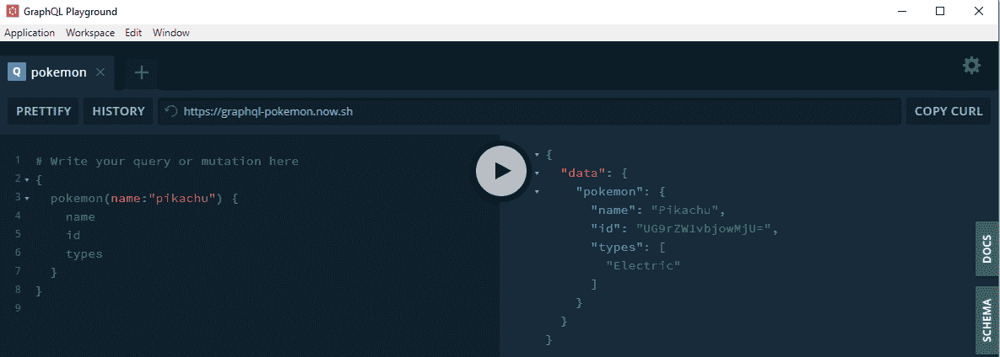
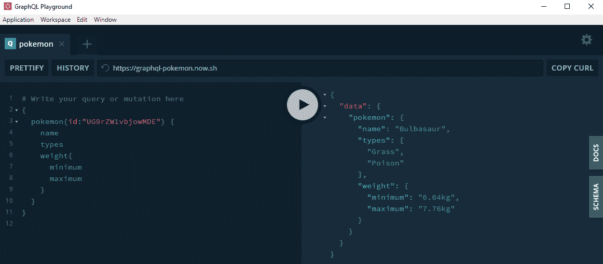
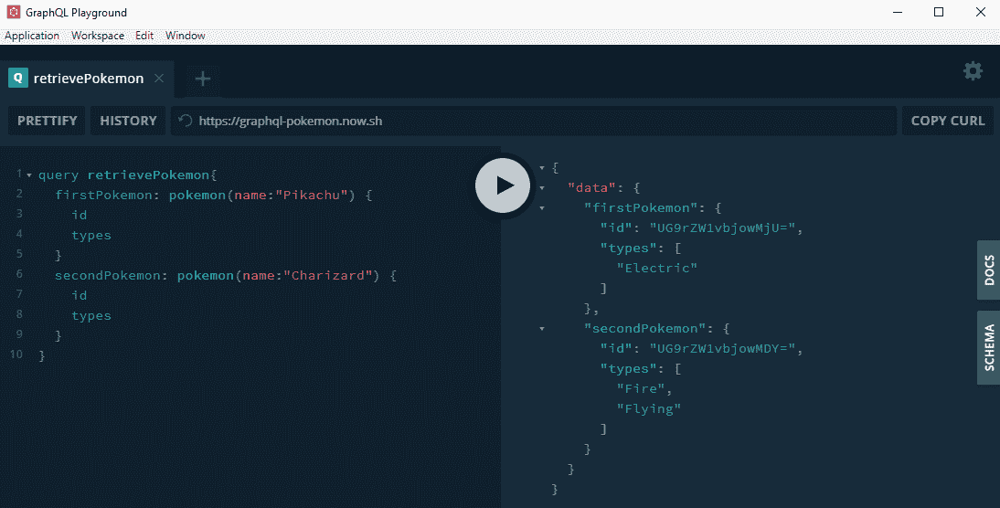
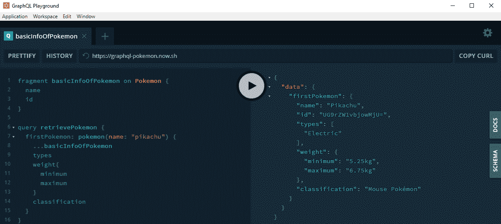
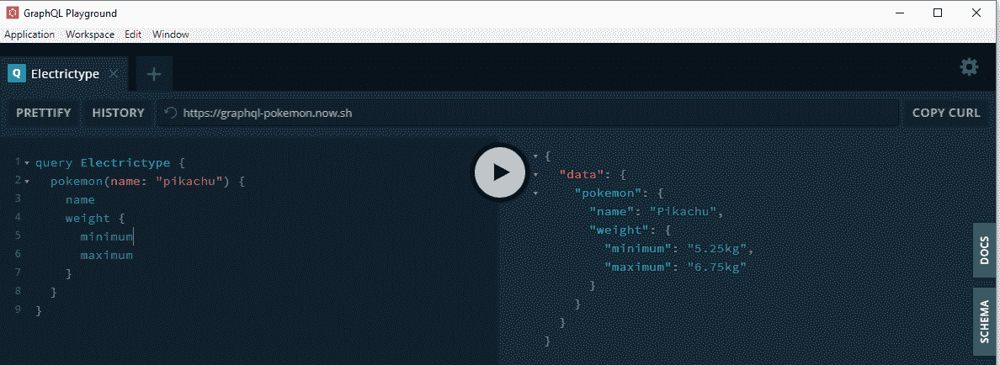
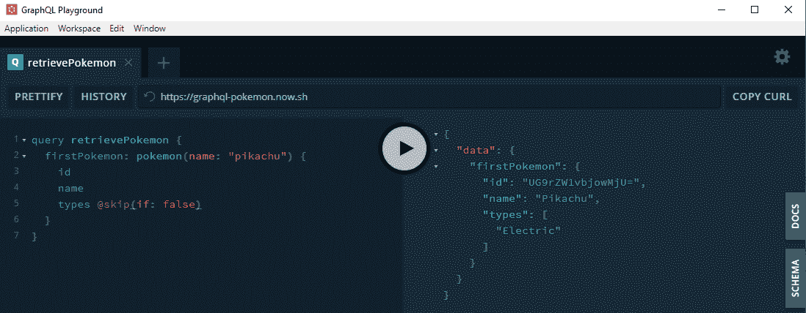
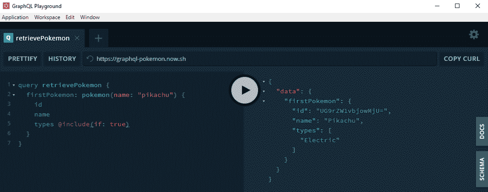

# 图 QL |查询

> 原文:[https://www.geeksforgeeks.org/graphql-query/](https://www.geeksforgeeks.org/graphql-query/)

我们将使用 GraphQL API 进行演示。GraphQL 是一种用于 API 的开源数据查询和操作语言，也是用现有数据实现查询的运行时。它既不是架构模式，也不是 web 服务。GraphQL 由脸书在 2012 年内部开发，2015 年公开发布。

**术语:**我们先来定义基本术语。作为参考，考虑以下示例操作。
T3】

**GraphQL Operations:** 作为一个基本定义，任何命中服务器的东西都称为‘查询’。但是形式上**运营**、**查询**只是其中一种，另外两种是**突变**、**订阅**。字符串是用 GraphQL 语言编写的，它定义了一个或多个操作和片段。我们将在本文中使用口袋妖怪模式的现成例子，您也可以创建自己的模式。

**GraphQL 查询:**graph QL 查询用于**读取或获取**值。它被交给 GraphQL 服务器执行，并返回一个结果。

*   **字段:**将作为查询响应的一部分返回的数据单元被称为字段，即使它们是嵌套的。查询结构和查询结构的结果将与下图所示相同。
    T3】查询:

```html
{
  pokemon(name:"pikachu") {
    name
    id
    types
  }
}
```

**输出:**


*   **Arguments:** Arguments help to **resolve** a query on the server-side in a specific way. It is a **key:value** pair supplied with a field. It can be a literal or a variable as well in the fields example we already used arguments on pokemon by providing specific name.
    **Query:**

    ```html
    {
      pokemon(id:"UG9rZW1vbjowMDE") {
        name
        types
      }
    }
    ```

    **输出:**
    

    *   **Aliases:** In case two individual queries on the same fields are to be done, we can use ‘aliases’ to distinguish both the queries. These aliases are added like prefixes to the query. For example, if we want to retrieve two pokemon and name them as **‘firstPokemon’** and **‘secondPPokemon’**.

    **查询:**

    ```html
    query retrievePokemon{
      firstPokemon: pokemon(name:"Pikachu") {
        id
        types
      }
      secondPokemon: pokemon(name:"Charizard") {
        id
        types
      }
    }
    ```

    **输出:** 

    *   **Fragments:** GraphQL provides the power to make a sub-type of query fields that can be used again and again using an identifier attached to it. It is known as a **fragment** and is supplied as **…fragmentName**. Getting multiple objects, each with possibly different fields
    **Syntax:**

    ```html
    fragment basicInfoOfPokemon on Pokemon {
      name
      id
    }

    query retrievePokemon {
      firstPokemon: pokemon(name: "pikachu") {
        ...basicInfoOfPokemon
        types
        weight{
          minimum
          maximum
        }
        classification
      }
    }
    ```

    **输出:** 

    *   **Operation Name:** Till now we are using shorthand syntax, we can also omit query keyword and name. In this example, we add a query keyword as an operation type and **Electrictype** as operation name.
    **Syntax:**

    ```html
    query Electrictype {
      pokemon(name: "pikachu") {
        name
        weight {
          minimum
          maximum
        }
      }
    }
    ```

    **输出:**
    

    *   **Directives:** The ‘directives’ influence the results that come back. The common one is **‘skip’** and **‘include’** combined with an ‘if’.

    **@skip:** 如果你想在特定的‘If’条件下**‘skip’**特定的字段，你可以使用。
    **语法:**

    ```html
    fieldName @skip (if: booleanCondition) {
      name
    }
    # The @skip acts like a default inclusion of 
    # The field, unless the 'if' is valid.
    ```

    **输出:**
    
    

    **@include** 如果要在特定的‘If’条件下‘包含’特定的字段，可以使用。
    **语法:**

    ```html
    fieldName @include (if: booleanCondition) {
      name
    }
    # The @include acts like a default exclusion of 
    # The field, unless the 'if' is valid.

    ```

    **输出:**
    
    