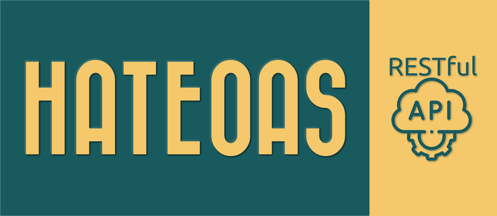

# HATEOAS 以及为什么 RESTful API 需要它？

> 原文:[https://www . geesforgeks . org/hateoas-and-why-it-in-restful-API/](https://www.geeksforgeeks.org/hateoas-and-why-its-needed-in-restful-api/)

HATEOAS 代表**超媒体作为应用状态的引擎**，是 RESTful API 架构和设计的一个组成部分。使用 HATEOAS，客户端只需要最少的关于如何与服务器交互的知识。这是通过使用超媒体，用动态生成的信息响应客户请求的网络应用程序实现的。



当通过浏览器访问网页时，用户能够通过使用按钮、输入、点击链接等与网页进行交互。然而，传统的应用编程接口响应没有这样的功能来允许应用程序通过响应与服务器交互。HATEOAS 是解决这个问题的一种方式。HATEOAS 请求不仅允许您发送数据，还可以指定相关的操作。

### 通过 HATEOAS 改变应用程序状态

当使用 HATEOAS 架构时，客户端将能够通过简单的静态 RESTful URL 调用来访问网络应用程序的 API。现在，客户端可能希望采取的任何进一步的操作都将由服务器在原始调用中返回的数据来启用。这将使客户端能够通过与服务器响应中包含的细节进行交互，从一个应用程序状态转移到下一个应用程序状态。

响应中能够实现这种状态变化的“数据”是简单的超媒体链接。这就是 HATEOAS 如何通过超媒体管理应用程序状态的变化。

### 演示 HATEOAS 的使用

例如，考虑一个客户端想要与网络应用程序交互，以获取组织内员工工资单的详细信息。启用此功能的 RESTful 调用如下:

```html
GET /payroll/employee_123 HTTP/1.1

```

服务器将以包含所需细节的 JSON 进行响应。此外，响应将包含超媒体链接，允许客户端采取进一步的行动。例如，考虑服务器的响应如下。

```html
HTTP/1.1 200 OK
Content-Type: application/+json
Content-Length: ...
{
   "payroll": {
       "employee_number": "employee_123",
       "salary" : 1000,
       "links": {
           "increment": "/payroll/employee_123/increment",
           "decrement": "/payroll/employee_123/decrement",
           "close": "/payroll/employee_123/close"
       }
   }
}

```

我们可以观察到，除了在响应中接收到的预期信息之外，附加信息以 RESTful 超媒体调用的形式呈现在“链接”标题下。这些链接允许通过增加或减少工资或关闭账户来进一步与服务器交互。可以注意到，这些链接对应于相应的应用编程接口端点，以增加、减少和关闭工资账户。此外，这些链接预先填充了员工标识符。这意味着这种内容是动态生成的。

下面是如何动态生成这些超媒体链接的另一个例子:

假设对于给定的员工，帐户已经关闭。因此，增量和减量方法与这样的帐户无关。因此，点击此类员工的工资单端点将导致如下响应:

```html
HTTP/1.1 200 OK
Content-Type: application/+json
Content-Length: ...
{
  "payroll": {
      "employee_number": "employee_123"
      "links": {
          "start": "/payroll/employee_123/start"
      }
  }
}

```

在这种情况下，链接已更改为仅包含与当前状态相关的功能。因此，唯一可用的操作是“启动”此类员工的工资单。

### 需要 HATEOAS

对于传统的、非基于 HATEOAS 的应用编程接口系统，应用编程接口端点需要在客户端应用程序中进行硬编码。对此端点的任何更改都将导致客户端应用程序系统崩溃。因此，需要在每个客户端的应用程序中更新这些更改。因此，这个系统是紧密耦合的。

有了 HATEOAS，系统变得松散耦合，因为网址不需要硬编码。相反，URL 是在服务器端动态生成的，并通过 JSON 响应提供给客户端。客户端现在可以使用响应中的这些网址，并确保这些网址是最新版本。