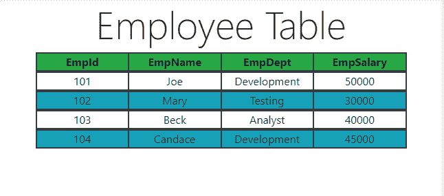

# 如何不用

创建表格 tag ?

> 原文:[https://www . geesforgeks . org/how-create-table-无需使用 table-tag/](https://www.geeksforgeeks.org/how-create-table-without-using-table-tag/)

超文本标记语言是用来创建网页的标准标记语言。HTML 允许使用

标签创建表格。但是，也可以借助级联样式表(CSS)在不使用

标签的情况下用 HTML 创建表格。CSS 是一种为普通的 HTML 网页添加样式(例如字体、颜色、填充和其他装饰特征)的机制。有各种各样的 CSS 框架可用，如 BootStrap、Foundation、Pure、布尔玛、UI 工具包、物化 CSS、语义 UI、Spectre 等等。Bootstrap 是应用最广泛的 CSS 框架。Bootstrap 是一个免费的开源 CSS 框架，它为前端开发人员提供了大型库，这使得它在开发人员中很受欢迎。BootStrap 的当前版本是 Bootstrap 4。Bootstrap 的网格系统使用一系列容器、行和列来布局和对齐内容，这些内容可用于构建满足用户需求的表。Bootstrap 还附带了内置的实用程序类，可以用来快速设置元素的样式，而无需使用任何 CSS 代码。Bootstrap 的网格系统有一个内置的 flexbox，并且完全响应。Flexbox 是一个一维布局模型，它提供了界面中项目之间的空间分布和强大的对齐功能。下面的代码演示了使用 CSS 的 BootStrap 框架创建表。

**说明:**

*   **Bootstrap CDN** 是一个公共内容交付网络，用户可以从其服务器远程加载 CSS、JavaScript 和图像。BootStrap CDN 链接到代码来访问内置的 CSS 库类。
*   **容器**用于对实际内容进行居中和水平填充。
*   **行**封装列。
*   **列**是行的直接子列。内容必须放在列中。没有指定宽度的列会自动显示为等宽列。我们可以明确指定列宽，也可以为不同的屏幕尺寸指定不同的宽度。我们可以使用预定义的实用程序类(如 bg-success、bg-info、bg-danger、bg-warning)、样式表或内嵌样式为不同的行或列指定背景颜色。
*   **边框**是 BootStrap 中的一个预定义类，在单元格周围创建边框。此外，还有几个边框实用程序类(如边框-深色、边框-浅色、边框-危险、边框-成功、边框-警告)可用于通过赋予颜色或边框宽度来进一步增强外观。

**示例:**

```htmlhtml
<!DOCTYPE html>
<html>

<head>
    <title>Table Creation</title>

    <!--Linking the BootStrap CDN-->
    <link rel="stylesheet" href=
"https://stackpath.bootstrapcdn.com/bootstrap/4.4.1/css/bootstrap.min.css"
        integrity=
"sha384-Vkoo8x4CGsO3+Hhxv8T/Q5PaXtkKtu6ug5TOeNV6gBiFeWPGFN9MuhOf23Q9Ifjh"
        crossorigin="anonymous">

    <style type="text/css">
        div {
            text-align: center;
        }

        #heading {
            font-weight: 700;
        }
    </style>
</head>

<body>
    <div class="container">
        <h1 class="text-center display-4">Employee Table</h1>

        <div class="row border border-dark bg-success" id="heading">
            <div class="col-3 border border-dark">EmpId</div>
            <div class="col-3 border border-dark">EmpName</div>
            <div class="col-3 border border-dark">EmpDept</div>
            <div class="col-3 border border-dark">EmpSalary</div>
        </div>

        <div class="row border border-dark">
            <div class="col border border-dark">101</div>
            <div class="col border border-dark">Joe</div>
            <div class="col border border-dark">Development</div>
            <div class="col border border-dark">50000</div>
        </div>

        <div class="row border border-dark bg-info">
            <div class="col border border-dark">102</div>
            <div class="col border border-dark">Mary</div>
            <div class="col border border-dark">Testing</div>
            <div class="col border border-dark">30000</div>
        </div>

        <div class="row border border-dark">
            <div class="col border border-dark">103</div>
            <div class="col border border-dark">Beck</div>
            <div class="col border border-dark">Analyst</div>
            <div class="col border border-dark">40000</div>
        </div>

        <div class="row border border-dark bg-info">
            <div class="col border border-dark">104</div>
            <div class="col border border-dark">Candace</div>
            <div class="col border border-dark">Development</div>
            <div class="col border border-dark">45000</div>
        </div>
    </div>
</body>

</html>
```

**输出:**
