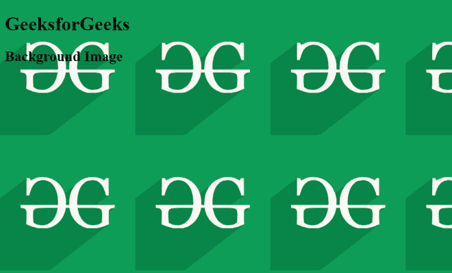
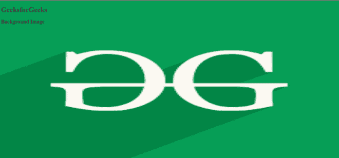

# 如何添加图片作为网页的背景图片？

> 原文:[https://www . geesforgeks . org/如何添加图片作为网页背景图片/](https://www.geeksforgeeks.org/how-to-add-an-image-as-background-image-of-a-web-page/)

在本文中，我们将添加一个图像作为网页的背景图像。背景图片用于使网站更具互动性和吸引力。它可以应用于许多风格。

**进场:**

*   在[正文](https://www.geeksforgeeks.org/html-body-tag/)标签中，通过传递图像的 URL 或位置路径，在[背景属性](https://www.geeksforgeeks.org/html-body-background-attribute/)中指定一个背景图像。
*   添加 [CSS](https://www.geeksforgeeks.org/css-tutorials/) 样式属性。

**语法:**

```html
<body background = "URL or path" > Website Body </body>
```

**示例 1:** 在本例中，我们将使用上述方法添加背景图像。

## 超文本标记语言

```html
<!DOCTYPE html>
<html lang="en">

<head>
    <title>Website</title>
</head>

<body background=
"https://media.geeksforgeeks.org/wp-content/cdn-uploads/20190710102234/download3.png">
    <h1>GeeksforGeeks</h1>
    <h2>Background Image</h2>
</body>

</html>
```

**输出:**



图像 1

**示例 2:** 在本例中，我们将使用[背景图像](https://www.geeksforgeeks.org/css-background-image-property/)属性在 CSS 代码中指定图像的 URL 或路径。

**语法:**

```html
<style>
    body {
        background-image:url(" URL of the image ");
    }
</style>
```

**注意:**我们也可以在[样式标签](https://www.geeksforgeeks.org/html-style-tag/)下添加 CSS 代码，也可以单独创建文件。

## 超文本标记语言

```html
<!DOCTYPE html>
<html lang="en">

<head>
    <title>Website</title>

    <style>
        body{
            background-image:url(
"https://media.geeksforgeeks.org/wp-content/cdn-uploads/20190710102234/download3.png");
        }
    </style>
</head>

<body>
    <h1>GeeksforGeeks</h1>
    <h2>Background Image</h2>
</body>

</html>
```

**注意:**我们将获得与示例 1 中相同的输出。

现在我们将了解如何使用 CSS 属性为背景图像设置样式。

**1。背景-重复:**[背景-重复](https://www.geeksforgeeks.org/css-background-repeat-property/)属性用于在任何方向添加或删除背景图像的重复。

**语法:**

```html
background-repeat: no-repeat;
```

**示例:**

## 超文本标记语言

```html
<!DOCTYPE html>
<html lang="en">

<head>
    <title>Website</title>

    <style>
        body{
            background-image:url(
"https://media.geeksforgeeks.org/wp-content/cdn-uploads/20190710102234/download3.png");
            background-repeat: no-repeat;
        }
    </style>
</head>

<body>
    <h1>GeeksforGeeks</h1>
    <h2>Background Image</h2>
</body>

</html>
```

**输出:**


图像 2

**2。背景-附件和大小:**[背景-附件](https://www.geeksforgeeks.org/css-background-attachment-property/)属性用于指定背景图像相对于其容器的附件类型。[背景尺寸](https://www.geeksforgeeks.org/css-background-size-property/)属性用于设置背景图像的尺寸。

**语法:**

```html
background-attachment: fixed; 
background-size: cover;
```

**示例:**我们指定修复此问题，因为我们不希望背景图像随着页面滚动。我们设置背景尺寸为 100%的高度和 100%的宽度，以覆盖整个屏幕。

## 超文本标记语言

```html
<!DOCTYPE html>
<html lang="en">

<head>
    <title>Website</title>

    <style>
        body{
            background-image:url(
"https://media.geeksforgeeks.org/wp-content/cdn-uploads/20190710102234/download3.png");
            background-repeat: no-repeat;
            background-attachment: fixed; 
            background-size: 100% 100%;
        }
    </style>
</head>

<body>
    <h1>GeeksforGeeks</h1>
    <h2>Background Image</h2>
</body>

</html>
```

**输出:**



图像 3

**注意:**如发现有不正确的地方，或者想分享更多讨论话题的信息，请写评论。