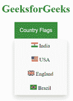
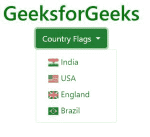

# 如何将图片添加到每个项目的下拉列表中？

> 原文:[https://www . geesforgeks . org/如何将图像添加到每个项目的下拉列表中/](https://www.geeksforgeeks.org/how-to-add-image-into-dropdown-list-for-each-items/)

程序员可以通过下面提到的两种方法将图像添加到每个项目的下拉列表中。

**方法一:使用 CSS****。下拉**类使用**位置:相对；当用户需要在下拉按钮下设置内容时使用**(使用**位置完成:绝对**)。

**。下拉内容**类保存实际的下拉内容。请注意，“最小宽度”是 160 像素。程序员可以根据需要进行设置。在下拉内容中添加 **< img >** 标签，将图片插入每个项目的下拉列表中。

**注意:**如果用户需要内容的宽度与下拉按钮一样宽，请将宽度设置为 100%(设置**溢出:自动**在小屏幕上滚动)。我们没有使用**边框**，而是使用了 CSS **框影**属性来创建像“卡片”一样的下拉菜单。**:悬停**选择器用于当用户将鼠标移动到下拉按钮上时显示下拉菜单。

**示例:**

## 超文本标记语言

```html
<!DOCTYPE html>
<html>

<head>
    <title>Adding image to dropdown list</title>
    <style>
        .dropbtn {
            background-color: #4CAF50;
            color: white;
            padding: 16px;
            font-size: 16px;
            border: none;
            cursor: pointer;
        }

        .dropdown {
            position: relative;
            display: inline-block;
        }

        .dropdown-content {
            display: none;
            position: absolute;
            background-color: #f9f9f9;
            min-width: 160px;
            box-shadow: 0px 8px 16px 
                0px rgba(0, 0, 0, 0.2);
            z-index: 1;
        }

        .dropdown-content a {
            color: black;
            padding: 12px 16px;
            text-decoration: none;
            display: block;
        }

        .dropdown-content a:hover {
            background-color: #f1f1f1
        }

        .dropdown:hover .dropdown-content {
            display: block;
        }

        .dropdown:hover .dropbtn {
            background-color: #3e8e41;
        }
    </style>
</head>

<body>
    <center>
        <h1 style="color: green">
            GeeksforGeeks
        </h1>

        <div class="dropdown">
            <button class="dropbtn">
                Country Flags
            </button>

            <div class="dropdown-content">
                <a href="#">
                     India</a>

                <a href="#">
                     USA</a>
                <a href="#">
                     England</a>
                <a href="#">
                     Brazil</a>
            </div>
        </div>
    </center>
</body>

</html>
```

**输出:**



在上例中，您需要将鼠标指针“悬停”在按钮上以查看下拉列表。

**方法二:使用 Bootstrap:** 下拉可以从 **< a >** 或 **<按钮>** 组件实现。要显示记录或列表，切换上下文覆盖并使用引导下拉插件。

**示例:**

## 超文本标记语言

```html
<!DOCTYPE html>
<html lang="en">

<head>
    <!-- Required meta tags -->
    <meta charset="utf-8">
    <meta name="viewport" content=
            "width=device-width, initial-scale=1,
            shrink-to-fit=no">

    <!-- Bootstrap CSS -->
    <link rel="stylesheet" href=
"https://stackpath.bootstrapcdn.com/bootstrap/4.5.0/css/bootstrap.min.css"
        integrity=
"sha384-9aIt2nRpC12Uk9gS9baDl411NQApFmC26EwAOH8WgZl5MYYxFfc+NcPb1dKGj7Sk"
        crossorigin="anonymous">

    <!-- Optional JavaScript -->
    <!-- jQuery first, then Popper.js, 
        then Bootstrap JS -->
    <script src="https://code.jquery.com/jquery-3.5.1.slim.min.js"
        integrity=
"sha384-DfXdz2htPH0lsSSs5nCTpuj/zy4C+OGpamoFVy38MVBnE+IbbVYUew+OrCXaRkfj"
        crossorigin="anonymous">
    </script>

    <script src=
"https://cdn.jsdelivr.net/npm/popper.js@1.16.0/dist/umd/popper.min.js"
        integrity=
"sha384-Q6E9RHvbIyZFJoft+2mJbHaEWldlvI9IOYy5n3zV9zzTtmI3UksdQRVvoxMfooAo"
        crossorigin="anonymous">
    </script>

    <script src=
"https://stackpath.bootstrapcdn.com/bootstrap/4.5.0/js/bootstrap.min.js"
        integrity=
"sha384-OgVRvuATP1z7JjHLkuOU7Xw704+h835Lr+6QL9UvYjZE3Ipu6Tp75j7Bh/kR0JKI"
        crossorigin="anonymous">
    </script>
</head>

<body>
    <center>
        <h1 style="color: green">
            GeeksforGeeks
        </h1>

        <div class="dropdown">
            <button class="btn btn-success 
                    dropdown-toggle" type="button" 
                    id="dropdownMenuButton" 
                    data-toggle="dropdown"
                    aria-haspopup="true" 
                    aria-expanded="false">
                Country Flags
            </button>

            <ul class="dropdown-menu" 
                aria-labelledby="dropdownMenuButton">
                <li class="dropdown-item">
                     India</li>
                <li class="dropdown-item">
                     USA</li>
                <li class="dropdown-item">
                     England</li>
                <li class="dropdown-item">
                     Brazil</li>
            </ul>
        </div>
    </center>
</body>

</html>
```

**输出:**



在上面的例子中，您可以切换(点击开和关)按钮来查看下拉列表。

**注意:**可以用 **< div >** 标记代替 **< ul >** 标记和 **< a >** 标记代替上例中的 **< li >** 标记。

HTML 是网页的基础，通过构建网站和网络应用程序用于网页开发。您可以通过以下 [HTML 教程](https://www.geeksforgeeks.org/html-tutorials/)和 [HTML 示例](https://www.geeksforgeeks.org/html-examples/)从头开始学习 HTML。

CSS 是网页的基础，通过设计网站和网络应用程序用于网页开发。你可以通过以下 [CSS 教程](https://www.geeksforgeeks.org/css-tutorials/)和 [CSS 示例](https://www.geeksforgeeks.org/css-examples/)从头开始学习 CSS。