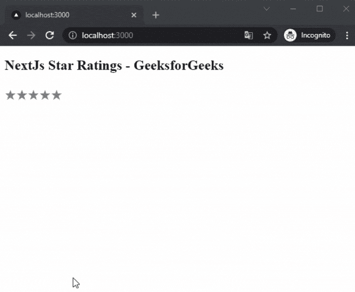

# 如何在 NextJS 中添加星级？

> 原文:[https://www . geesforgeks . org/how-add-star-rating-in-nextjs/](https://www.geeksforgeeks.org/how-to-add-star-rating-in-nextjs/)

在本文中，我们将学习如何在 NextJs 中添加星级。NextJS 是一个基于 React 的框架。它有能力为不同的平台开发漂亮的网络应用程序，如视窗、Linux 和 mac。

**方法:**要添加我们的评级，我们将使用反应星包。react-stars 包帮助我们整合不同类型的评级。首先，我们将安装 react-stars 包，然后我们将在主页上添加星级。

**创建 NextJS 应用程序:**您可以使用以下命令创建一个新的 NextJs 项目:

```html
npx create-next-app gfg
```

**安装所需的软件包:**现在我们将使用以下命令安装 react-star 软件包:

```html
npm i react-stars
```

**项目结构:**会是这样的。


**添加星级:**安装完套装后，我们可以在 app 中轻松添加评级。对于这个例子，我们将在我们的主页上添加星级。

## index.js

```html
import React from 'react';
import ReactStars from 'react-stars'

export default function SkeletonLoading(){
  return (
    <div>
      <h2>NextJs Star Ratings - GeeksforGeeks</h2>
      <ReactStars
        count={5}
        size={24}
        color2={'#ffd700'} />
    </div>
  )
}
```

**解释:**首先在上面的例子中，我们从已安装的包中导入我们的 ReactStars 组件。之后，我们使用组件并设置数量、大小和颜色。然后我们将展示星级评定。

**运行应用的步骤:**在终端运行下面的命令运行应用。

```html
npm run dev
```

**输出:** 