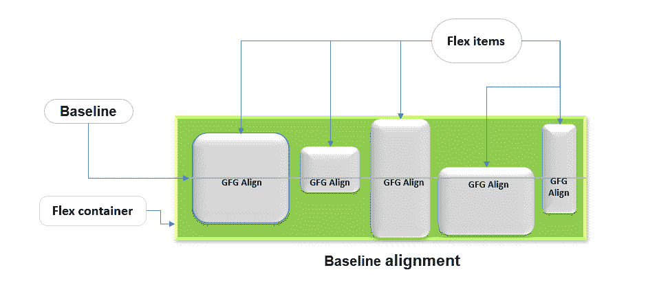
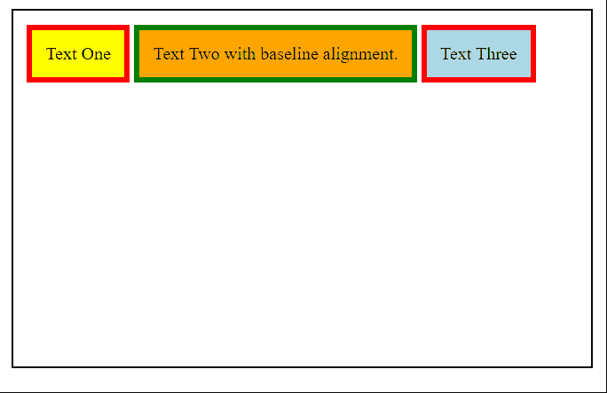
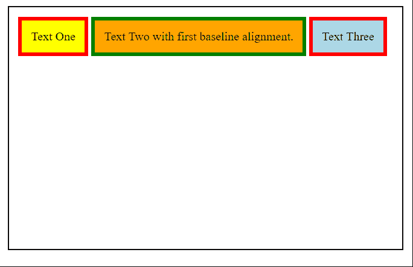
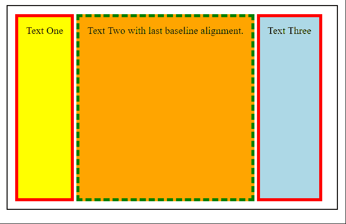

# 如何对齐容器的项目基线？

> 原文:[https://www . geesforgeks . org/如何对齐物品-容器基线/](https://www.geeksforgeeks.org/how-to-align-item-baseline-of-the-container/)

在本文中，我们将学习如何将项目与容器的基线对齐。CSS 中有三种类型的对齐方式:基线对齐、位置对齐和分布式对齐。基线对齐用于跨一组对齐主题对齐框的基线。它们可以用作与**对齐/对齐内容**的内容对齐值，也可以用作与**对齐/对齐自身**的自对齐值。



**语法:**有三个关键词可以用来设置容器中项目的基线对齐，如下语法所示。

```
.container {
  align-items: baseline | first baseline | last baseline;
}
```

以下示例演示了这种方法:

**示例 1:** 在此示例中，项目与容器的基线对齐。

## 超文本标记语言

```
<html>
<head>
  <style>
    div {
      padding: 12px;
      margin: 2px;
    }

    /* The container element */
    #container {
      width: 500px;
      height: 300px;
      padding: 10px;
      border: 2px solid black;
      display: flex;
      align-items: baseline;
    }

    /* Item elements in the container*/
    #item1 {
      color: bold black;
      border: 5px solid red;
      background-color: yellow;
    }

    #item2 {
      color: bold red;
      border: 5px solid green;
      background-color: orange;
    }

    #item3 {
      color: bold red;
      border: 5px solid red;
      background-color: lightblue;
    }
  </style>
</head>
<body>
  <div id="container">
    <div id="item1">Text One</div>
    <div id="item2">Text Two with
      baseline alignment.</div>
    <div id="item3">Text Three</div>
  </div>
</body>
```

**输出:**



**示例 2:** 在此示例中，项目与容器的第一条基线对齐。

## 超文本标记语言

```
<html>
<head>
  <style>
    div {
      padding: 12px;
      margin: 2px;
    }

    /* The container element */
    #container {
      width: 500px;
      height: 300px;
      padding: 10px;
      border: 2px solid black;
      display: flex;
      align-items: first baseline;
    }

    /* Item elements in the container*/
    #item1 {
      color: bold black;
      border: 5px solid red;
      background-color: yellow;
    }

    #item2 {
      color: bold red;
      border: 5px solid green;
      background-color: orange;
    }

    #item3 {
      color: bold red;
      border: 5px solid red;
      background-color: lightblue;
    }
  </style>
</head>
<body>
  <div id="container">
    <div id="item1">Text One</div>
    <div id="item2">
      Text Two with first 
      baseline alignment.
    </div>
    <div id="item3">Text Three</div>
  </div>
</body>
```

**输出:**



**示例 3:** 在此示例中，项目与容器的最后一条基线对齐。

## 超文本标记语言

```
<html>
<head>
  <style>
    div {
      padding: 12px;
      margin: 2px;
    }

    /* The container element */
    #container {
      width: 500px;
      height: 300px;
      padding: 10px;
      border: 2px solid black;
      display: flex;
      align-items: last baseline;
    }

    /* Item elements in the container*/
    #item1 {
      color: bold black;
      border: 5px solid red;
      background-color: yellow;
    }

    #item2 {
      color: bold red;
      border: 5px dashed green;
      background-color: orange;
    }

    #item3 {
      color: bold red;
      border: 5px solid red;
      background-color: lightblue;
    }
  </style>
</head>
<body>
  <div id="container">
    <div id="item1">Text One</div>
    <div id="item2">
      Text Two with last
      baseline alignment.
    </div>
    <div id="item3">Text Three</div>
  </div>
</body>
```

**输出:**

