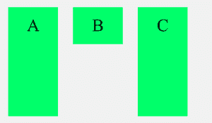

# 如何对齐位于容器基线的自元素？

> 原文:[https://www . geeksforgeeks . org/如何对齐位于容器基线的自元素/](https://www.geeksforgeeks.org/how-to-align-self-element-positioned-at-the-baseline-of-the-container/)

在本文中，我们将学习如何在容器的基线处自动对齐元素。这可以使用 CSS **自对齐**属性来实现。该属性是 Flexbox 模块的子部分，有助于覆盖容器定义的特定 flex 项的对齐方式。*基线*属性可用于在容器的基线处对齐元素。使用相同的方法也可以进行任何其他对准。

**示例:**

## 超文本标记语言

```
<html>
  <head>
    <style>
      #flex-container {
        display: flex;
        background-color: #f1f1f1;
        width: 50%;
        height: 250px;
      }

      #flex-container > div {
        background-color: rgb(33, 246, 107);
        color: "#000000";
        width: 100px;
        margin: 15px;
        text-align: center;
        line-height: 75px;
        font-size: 35px;
      }
    </style>
  </head>
  <body>
    <div id="flex-container">
      <div>A</div>

      <!-- Self align the div to baseline -->
      <div style="align-self: baseline">B</div>
      <div>C</div>
    </div>
  </body>
</html>
```

**输出:**

