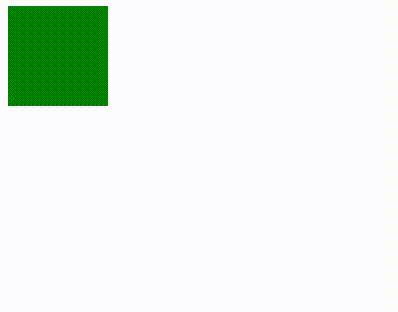

# 如何在网页上制作绘图动画？

> 原文:[https://www . geesforgeks . org/如何在网页上绘制动画/](https://www.geeksforgeeks.org/how-to-animate-the-drawing-on-a-web-page/)

CSS 允许在不使用 JavaScript 的情况下动画化 HTML 元素。

动画让一个元素从一种风格逐渐变成另一种风格。您可以根据需要随时更改任意多的 CSS 资产。要使用 CSS 动画，您必须首先为动画指定一些关键帧。关键帧捕捉元素在给定时间的样式。

**[CSS | @关键帧规则](https://www.geeksforgeeks.org/css-keyframes-rule/)**

@关键帧规则用于指定动画规则。动画是通过使用可变的 CSS 样式创建的。在动画 CSS 期间，属性可以多次更改。

**语法:**

```htmlhtml
@keyframes animation-name {keyframes-selector {css-styles;}}

```

**属性值:**该参数接受上面提到的和下面描述的三个值:

*   **动画名称:**动画名称是必需的，它定义了动画名称。
*   **关键帧选择器:**关键帧选择器定义动画的百分比。介于 0%到 100%之间。一个动画可以包含许多选择器。
*   **css 样式:**css 样式定义了一个或多个合法或适用的 CSS 样式属性。

要定义动画，必须从@关键帧规则开始。@关键帧规则由关键字“@关键帧”组成，后跟一个给动画命名的标识符(将使用动画名称引用)，后跟一组样式规则(用大括号分隔)。然后，通过将标识符用作动画名称属性的值，将动画应用于元素。

以下是我们将使用的@规则:

```htmlhtml
/* define the animation */
@keyframes your-animation-name {
    /* style rules */
}

/* apply it to an element */
.element {
    animation-name: your-animation-name;

    /* OR using the animation shorthand property */
    animation: your-animation-name 1s ...
}

```

**实施例 1:**

```htmlhtml
<!DOCTYPE html>
<html>
<head>
<style> 
div {
  width: 100px;
  height: 100px;
  background-color: green;
  position: relative;
  animation-name: example;
  animation-duration: 4s;
}

@keyframes example {
  0%   {background-color:black; left:0px; top:0px;}
  25%  {background-color:yellow; left:200px; top:0px;}
  50%  {background-color:blue; left:200px; top:200px;}
  75%  {background-color:green; left:0px; top:200px;}
  100% {background-color:black; left:0px; top:0px;}
}
</style>
</head>
<body>

<div></div>

</body>
</html>
```

**输出:**


**实施例 2:**

```htmlhtml
<!DOCTYPE html>
<html>
<head>
<style> 
@keyframes fadein_left {
  from {
    left: 0;
  }
  to {
    left: 40%;
  }
}

#start:before {
  content: '';
  position: absolute;
  top: 0;
  left: 0;
  right: 0%;
  opacity: 0.7;
  height: 25px;
  background: #fff;
  animation: fadein_left 5s;
}
</style>
</head>
<body>

<div id="start">
  <b>geeksforgeeks geeksforgeeks geeksforgeeks
      geeksforgeeks geeksforgeeks
geeksforgeeks</b>
</div>

</body>
</html>
```

**输出:**
