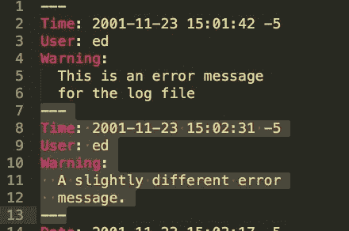
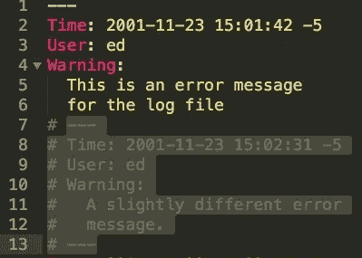

# 如何屏蔽 YAML 评论？

> 原文:[https://www . geesforgeks . org/how-block-comments-in-YAML/](https://www.geeksforgeeks.org/how-to-block-comments-in-yaml/)

YAML 是所有编程语言的人性化数据序列化标准。它通常用于配置文件和存储或传输数据的应用程序。

在 YAML，正常的注释方式是带“#”符号的内嵌注释，但是，如果您想要注释块，我们有一个方法列表。

**第一步:**选择块

**第二步:**在 Mac 上按 **cmd** 加 **/** 或者在 Linux & Windows 上按 **ctrl** 加 **/** 。

**注意:**该方法适用于以下编辑器–

*   崇高文本编辑器
*   原子编辑器
*   Eclipse(带有 YEdit 插件)
*   喷气大脑第一部:鲁比明和高格兰
*   Visual Studio 代码

在代码的任何级别，您都可以添加一个名为“描述”、“注释”或“注释”的新块文本，或者任何您想要的内容

**示例:**

```
Instead of
# This comment
# is too long

use
Description: >
This comment
is too long

or
Comment: >
This comment is also too long
and newlines survive from parsing!
```

**优势:**

*   如果注释变得太大、太复杂并且有很多重复模式，您可能希望将它们从纯文本块提升到对象。
*   您的应用程序将来可能需要阅读/更新评论。
*   这个方法非常方便，尤其是如果有人希望这些注释出现在 JSON 或 XML 中，如果要从 YAML 转换到这两个的话。