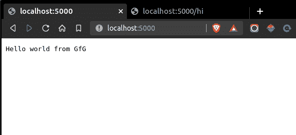
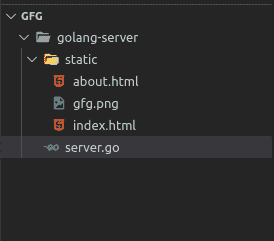

# 如何用 Golang 搭建一个简单的 Web 服务器？

> 原文:[https://www . geesforgeks . org/如何用 golang 构建一个简单的网络服务器/](https://www.geeksforgeeks.org/how-to-build-a-simple-web-server-with-golang/)

[Golang](https://www.geeksforgeeks.org/go-programming-language-introduction/) 是一种过程编程语言，非常适合构建简单、可靠、高效的软件。

### 使用 Golang 创建网络服务器:

### 初始化项目

创建一个包含. go 文件的项目文件夹，例如*服务器. go.*

**目录结构:**


**文件:**

## **去**

```html
package main

import (
    "fmt"
    "log"
    "net/http"
)

func main() {

    // API routes
    http.HandleFunc("/", func(w http.ResponseWriter, r *http.Request) {
        fmt.Fprintf(w, "Hello world from GfG")
    })
    http.HandleFunc("/hi", func(w http.ResponseWriter, r *http.Request) {
        fmt.Fprintf(w, "Hi")
    })

    port := ":5000"
    fmt.Println("Server is running on port" + port)

    // Start server on port specified above
    log.Fatal(http.ListenAndServe(port, nil))
}
```

**使用以下命令运行服务器(确保您在项目目录中):**

```html
go run server.go
```

****注意:**每当 server.go 文件发生变化时，您必须使用 Ctrl + C 停止服务器，并通过相同的命令重新启动。** 

****控制台:****

****

**打开所需的 web 浏览器和这些 URL 中的任何一个，以验证服务器是否正在运行:**

```html
[http://localhost:5000/](http://localhost:5000/) or [http://localhost:5000/hi](http://localhost:5000/hi)
```

****输出:****

** **

### **服务静态文件:**

**用所有静态文件创建一个静态文件夹。
示例目录结构:**

****

### **静态文件示例:**

*   **[GfG 标志](https://media.geeksforgeeks.org/wp-content/uploads/20200921155935/gfglogo-300x39.png)**
*   **index.html 文件**

## **超文本标记语言**

```html
<html>
  <head>
    <title>Home</title>
  </head>
  <body>
    <h2>Home page</h2>
  </body>
</html>
```

*   **about.html 文件**

## **超文本标记语言**

```html
<html>
  <head>
    <title>About</title>
  </head>
  <body>
    <h2>about page!</h2>
  </body>
</html>
```

**现在编辑 ***服务器文件:*****

## **去**

```html
package main

import (
    "fmt"
    "log"
    "net/http"
)

func main() {

    // API routes

    // Serve files from static folder
    http.Handle("/", http.FileServer(http.Dir("./static")))

    // Serve api /hi
    http.HandleFunc("/hi", func(w http.ResponseWriter, r *http.Request) {
        fmt.Fprintf(w, "Hi")
    })

    port := ":5000"
    fmt.Println("Server is running on port" + port)

    // Start server on port specified above
    log.Fatal(http.ListenAndServe(port, nil))

}
```

****验证是否提供静态文件:****

**  **