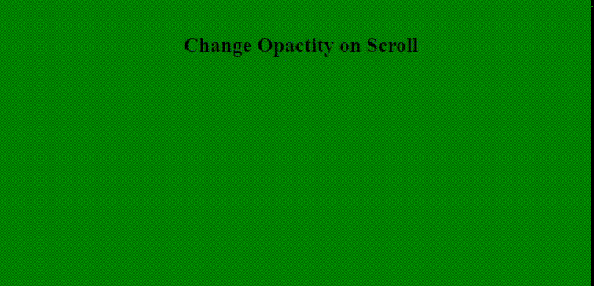

# 滚动页面时如何改变不透明度？

> 原文:[https://www . geesforgeks . org/如何更改-滚动页面时的不透明度/](https://www.geeksforgeeks.org/how-to-change-opacity-while-scrolling-the-page/)

jQuery 用于控制和改变网页滚动过程中的不透明度。创建一个网页来改变滚动页面时的不透明度。jQuery 滚动功能用于滚动网页和设置文本内容的不透明度。
**例:**

```htmlhtml
<!-- HTML code to change the opacity of web
    page when scrolling it -->
<!DOCTYPE html>
<html>

<head>
    <title>
        Change the opacity during scroll
    </title>

    <style>

        /* Margin and Padding is set to zero 
        so the body can occupy the full 
        screen page */
        body {
            margin: 0;
            padding: 0;
            background: green;
        }

        /* To put the header in the center of 
        the page we used justify-content and 
        align-items and set their value as
        center, You can add any background image */
        .header-bg {
            position: fixed;
            top:0;
            left:0;
            width: 100%;
            height: 300px;
            justify-content: center;
            align-items: center;
            display: flex;
        }

        /* Box shadow provides shadow effect 
        to the element */
        .header-bg h2 {
            margin: 0;
            padding: 0;
            color: #000;
            text-align: center;
            padding: 20px;
            max-width: 80%;
        }

        /* Set "position:relative" then section can move
        from its original position, by using position:relative,
        the position of the section is not dependent on the
        container. The box-sizing property is used to include
        the padding and border in an element */
        section {
            position: relative;
            top:100vh;
            padding: 100px;
            width: 100%;
            min-height: 100vh;
            box-sizing: border-box;
        }
        section h2 {
            text-align:center;
            margin: 0 0 50px;
            padding: 0;
            font-size: 40px;
            color: #fff; 
        }
        section p {
            text-align:center;
            color: #fff;
            font-size: 1.3em;
        }
    </style>
</head>

<body>
    <div class="header-bg">
        <h2>Change Opactity on Scroll</h2>
    </div>

    <section>
        <h2>GeeksforGeeks</h2>

        <p>
            A computer science portal for geeks
        </p>
    </section>

    <script src=
"https://ajax.googleapis.com/ajax/libs/jquery/3.3.1/jquery.min.js">
    </script>

    <!-- Script to change opacity when scrolling the web page -->
    <script>
         $(document).ready(function(){
            $(window).scroll(function(){
                $('.header-bg').css("opacity", 1- $(window).scrollTop() / 700)
            })
        })
    </script>
</body>

</html>                    
```

**输出:**
